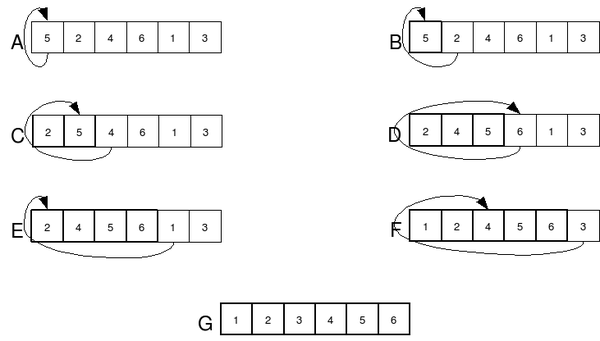
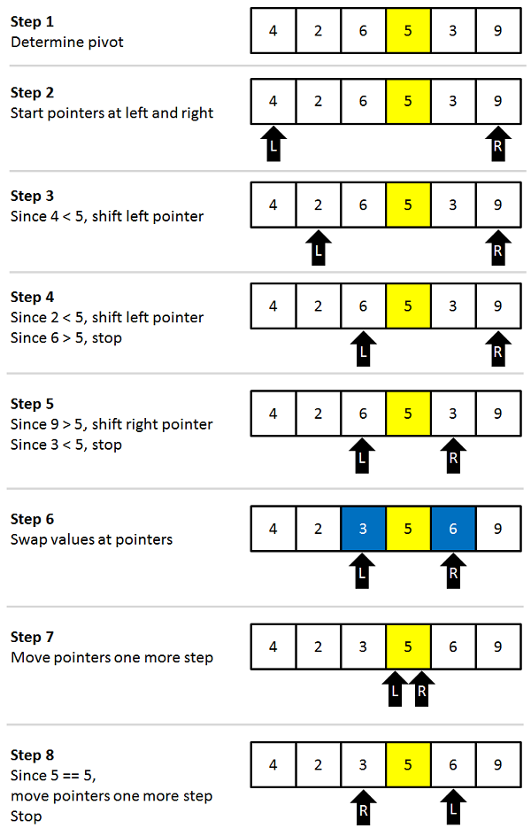
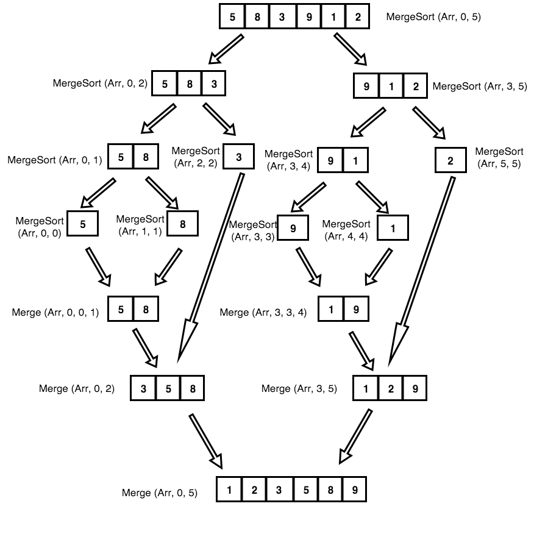
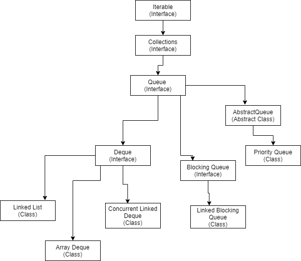

<h0><b>НАВИГАЦИЯ</b></h0>  

* [COMMON QUESTIONS](#common_questions)
    * [DOCKER](#docker)
    * [MESSAGING](#messaging)
    * [LINUX](#linux)
    * [ALGORITHMS](#algorithms)
      * [ALGORITHMS COMPLEXITIES](#algo_complexities)
      * [SORTING ALGORITHMS](#sorting_algos)
    * [JAVA LOGGING, SLF4J](#java_logging)
* [JAVA COLLECTIONS, DATA STRUCTURES](#java_collections)
* [CORE JAVA](#core_java)
    * [OBJECT CLASS METHODS](#object_class_methods)
    * [OOP PRINCIPLES](#oop_principles)
    * [MUTABLE VS IMMUTABLE OBJECTS](#mutable_immutable_objects)
    * [JAVA MEMORY MODEL & GARBAGE COLLECTOR](#javamemory_gc)
    * [EXCEPTION TYPES](#exceptions)
    * [CLASS ENUM](#enums)
* [STREAM API](#stream_api)
* [GENERICS](#generics)
* [MULTITHREADING](#multithreading)
* [REFLECTIONS](#reflections)
* [JAVA ENTERPRICE EDITION](#java_ee)
* [SPRING, SPRING BOOT](#spring)
    * [Data: JDBC, JPA, DATA JPA](#spring-data)
    * [Transactions](#spring-transactions)
* [TESTING](#testing)
* [MAVEN](#maven_introduction)
* [DESIGN PATTERNS](#design_patterns)

---

# 

<h1>*** Common Questions</h1>

---
<h2>* Что такое WebService?</h2>

* https://semantica.in/blog/chto-takoe-veb-servis.html

Веб-сервисы (или веб-службы) — это технология. Это программа, которая организовывает взаимодействие между сайтами.
Информация с одного портала передается на другой. 
Например, есть авиакомпания. У нее много рейсов, соответственно, много билетов. Информацию через веб-службу она передает
сайту-агрегатору тур-путешествий. Пользователь, который заходит на агрегатор, сможет прямо там купить билеты этой
авиакомпании. 
Другой пример веб-сервисов — это сайт отслеживания погоды, который содержит сведения о метеоусловиях в конкретном городе
или по стране в целом. Данная информация также часто используется сторонними приложениями. 

Можно определить 3 инстанции, которые взаимодействуют между собой: каталог, исполнитель и заказчик. После создания
сервиса, исполнитель регистрирует его в каталоге, а там сервис находит заказчик.

Механизм обмена данными формируется в описании Web Services Description. Это спецификация, охватывающая форматы
пересылки, типы контента, транспортные протоколы, которые применяются в процессе обмена сведениями между заказчиком и
транспортировщиком услуг. Сегодня чаще всего используются несколько технологий для реализации различных веб-сервисов:

 * TCP/IP – протокол, который понимается практически любым сетевым оборудованием, от мэйнфреймов до портативных
устройств и PDA.
 * HTML - универсальный язык разметки, используемый для демонстрации контента устройствами потребителей.
 * XML – универсальное средство для обработки всех разновидностей данных. На его базе могут работать и прочие
протоколы обмена информацией: SOAP и WSDL.
 * UDDI – универсальный источник распознавания, интеграции и описания. Работает, как правило, в частных сетях и пока
не нашел достаточного распространения.

# 
---
<h2>* Что такое Docker?</h2>
Полезные ресурсы: 

* https://docs.docker.com/get-docker/
* https://www.youtube.com/watch?v=FlSup_eelYE
* https://www.youtube.com/watch?v=3c-iBn73dDE&t=4364s

container - running environment of an image.

<b>Команды:</b>

### Создание Docker Image

* docker build -t test-app . - создание Docker-Image используя команды из DockerFile
* docker build -f Dockerfile -t test-app . - создание Docker-Image с указанием названия Dockerfile

### Основные команды для запуска/остановки контейнеров

* docker pull redis - скачать redis image из публичного репозитория Docker-Hub.

* docker run redis (docker pull+start) - запуск redis-контейнера
* docker run -d redis - запуск redis-контейнера в detached режиме
* docker run -p6000:6379 redis - запуск redis-контейнера в указанием портов, 6000-порт нашей машины, 6379-порт
  контейнера, то есть порт 6000 нашего хоста будет слушать порт 6370 redis-контейнера.
* docker run --name my_container redis - запуск redis-контейнера с именем "my_container"

* docker images - показать список всех images
* docker ps - показать список работающих контейнеров
* docker ps -a - показать список работающих/остановленных контейнеров

* docker stop ff7b935a34ad - остановить работу койтейнера с id = ff7b935a34ad
* docker start ff7b935a34ad - запустить койтейнер с id = ff7b935a34ad

### troubleshooting

* docker logs ff7b935a34ad - показать историю логов контейнера с id = ff7b935a34ad
* docker logs frosty_moser - показать историю логов контейнера с name = frosty_moser
* docker logs -f ff7b935a34ad - показать логи контейнера с id = ff7b935a34ad и постоянно добавлять логи в конец

* docker exec -it ff7b935a34ad - зайти внутрь контейнера и посмотреть что там есть

### additional options

* '--rm' - эта опция заставляет Docker автоматически после остановки убирать Контейнер
* '-it' - интерактивный мод, то есть при запуске заходим в Контейнер

# 
---
<h2>* Java Messaging. RabbitMQ?</h2>

* https://www.rabbitmq.com/download.html (инструкция по установке)
* https://www.youtube.com/watch?v=o4qCdBR4gUM (пример Spring-boot приложения с использованием RabbitMQ)
* https://github.com/Azatick94/springboot-rabbitmq-example (пример простого Spring-Boot приложения с использованием
  RabbitMQ брокера сообщений)
* https://docs.spring.io/spring-amqp/docs/current/reference/html/ (Spring документация по протоколу AMQP)
* https://github.com/Azatick94/Rabbit_Tutorial (тут ссылка на пример приложения с несколькими Queue, Entity и Bindings
  между ними)

* https://habr.com/ru/post/262069/ (Очень полезная ссылка с примерами RabbitMQ приложений, а также с деталями как
  деплоить в Heroku)

Существуют 3 основных протоколов общения:

* STOMP (Simple Text-Oriented Messaging Protocol)
* MQTT (Message Queue Telemetry Transport) - publish-subscribe messaging
* AMQP (Advanced Message Queuing Protocol)

RabbitMq - это брокер сообщений, который имплементирует AMQP (Advance Message Queuing Protocol).

 
AMQP - Advanced Message Queuing Protocol - это открытый протокол для передачи сообщений между компонентами системы. RabbitMQ использует AMQP протокол для обмена сообщениями.  
RabbitMQ один из самых популярных имплементаций AMQP протокола. 

Архитектура RabbitMQ брокера
----------------------------

 

<b>Основные термины:</b>

* <b>Producer</b>: Отправитель сообщений
* <b>Exchange</b>: маршрутизатор, получать сообщения и распространять сообщения на основе RoutingKey
* <b>Binding (RoutingKey)</b>: правила маршрутизации
* <b>Queue</b>: непосредственно сама очередь
* <b>Topics</b>: можно сказать составная часть письма-message, в котором в том числе хранится инфа по RoutingKey
* <b>Consumer</b>: Потребитель сообщений

<b>Основные виды Exchange: <a href="https://www.rabbitmq.com/tutorials/amqp-concepts.html">Ссылка на статью</a></b>

* Direct Exchange (Прямой Обмен - подходит для одноадресного пересылания сообщений, через Exchange сообщение
  пересылается конкретному Queue используя конкретный RoutingKey)
* Fanout Exchange (В этом обмене использование RoutingKey игнорируется, все подписанные Queue получают сообщение от
  Exchange )
* Topic Exchange (Используется в многоадресной передаче сообщений)
* Headers Exchange (Для отправки сообщений вместо RoutingKey используется Headers с необходимой информацией)

<b>Основные параметры Queue:</b>

* Name - наименование очереди
* Durable - долговременные очереди или нет (boolean)
* Excludive - удалить очередь если больше не используется
* Auto-Delete - удалить очередь если подписчик отпишется

<b>Ответ на вопрос как создать несколько потоков в SpringBoot:</b>

* https://stackoverflow.com/questions/41210688/multiple-rabbitmq-queues-with-spring-boot

<b>Динамическое создание Потоков (Queue):</b>

* https://stackoverflow.com/questions/57870894/how-to-create-dynamic-queues-in-rabbit-mq-using-spring-boot

---
<h2>JMS - Java Messaging Service? Особенности</h2>

* https://docs.jboss.org/jbossas/docs/Server_Configuration_Guide/4/html/Messaging_on_JBoss.html  
* https://spring.io/guides/gs/messaging-jms/  

JMS API - Java Message Service Application Programming Interface.  

В основном JMS поддерживает две модели обмена сообщениями или домены: Point to Point (P2P)  и Publisher-Subscriber. P2P
использует очередь queue, а Publisher-Subscriber использует тему topic. Основное различие между queue и topic
заключается в том, что queue — это промежуточное программное обеспечение, ориентированное на сообщения, используемое в
домене сообщений P2P, а topic — это промежуточное программное обеспечение, ориентированное на сообщения, используемое в
домене сообщений Publisher-Subscriber.

# 
---
<h2>Команды Linux, основные команды. </h2>

### ВВЕДЕНИЕ

* "pwd" (print working directory) - вывести текущую директорию
* "ls" (list directory content) - вывести содержимое директории
* "man команда" - справка о команде (для выхода: Q)
* "fastqc --help" - справка как работает программа либо "help fastqc"
* "clear" - очистить экран терминала
* "exit" - закрыть терминал

* "mkdir путь_до_директории" - создать директорию
* "mkdir -p путь_до_директории" - создать директорию и ее родителей
* "touch путь_до_файла" - создать файл

* "rm путь_до_файла" - удалить файл
* "rm -r путь_до_директории" - удалить директорию
* "rm -rf путь_до_директории" - удалить директорию (без вопросов)

* "cp путь_до_файла1 путь_до_файла" - скопировать файл1 в файл2
* "cp -r путь_до_дир1 путь_до_дир2" - скопировать дир1 в дир2
* "mv путь1 путь2" - переместить директорию или файл

### Добавление прав файлу

* "chmod +x current_date_and_time.py"  - $ chmod опции права /путь/к/файлу, добавление каких-либо прав файлу

<b>виды прав:</b>

* r - чтение
* w - запись
* x - выполнение
* s - выполнение от имени суперпользователя

"+" - включить  
"-" - выключить

### Специальные символы:

* "." - текущая директория
* ".." - директория на уровень выше
* "~" - домашная директория
* "*" - любое кол-во любых символов
* "?" - ровно один любой символ

### Спец. команды:

* "Ctrl + c" - прервать выполнение
* "Ctrl + z" - приостановить выполнение (заморозить программу)
* "fg" - продолжить выполнение программы (foreground)
* "bg" - продолжить в фоновом режиме (background)
* "Ctrl + Shift + T" - открыть новую вкладку в терминале
* "Alt + <цифра>" - перейти в указанную вкладку
* "Ctrl + Shift + W" - закрыть текущую вкладку

### Чтение и редактирование файлов

* "cat файл" - вывести содержимое файла на экран
* "less файл" - открыть файл на чтение (q - выход; - поиск; g - в начало; G - в конец)
* "nano файл" - редактировать файл, Ctrl+X выход.

### Stdin, Stdout

* "Программа < файл" - брать stdin из файла
* "Программа > файл" - выводить stdout в файл (при вызове создает новый файл - перезапись)
* "Программа >> файл" - аналогично, но с дозаписью в файл (при вызове дописывает в файл без его перезаписи)
* "Программа 2> файл" - выводить stderr в файл
* "Программа 2>> файл" - аналогично, но с дозаписью в файл

Пример:  
./interacter.py >out.txt 2>err.txt (в этом примере запускается питон скрипт и принты записываются в файл out.txt, а
эксепшены записываются в err.txt)

### Конвейеры (pipe)

| - разделитель между командами

### Скачивание из интернета

* wget ссылка - скачать файл поссылке и сохранить в текущей директории
* "wget -P путь_до_директории ссылка" - скачать файл по ссылке и сохранить в директории заданной путем
* "wget -O путь_до_файла ссылка" - скачать файл по ссылке и сохранить под указанным именем
* "wget -c ссылка" - докачать файл по ссылке в случае обрыва связи
* "wget --spider ссылка" - проверить доступность файла по ссылке
* "wget -i текстовый_файл" - скачать несколько файлов по ссылкам из текстового файла
* "wget -r -l глубина ссылка" - рекурсивное скачивание файлов по ссылке на указанную глубину (по умолчанию глубина 5)
* "wget -r -A тип,тип,...,тип ссылка" - рекурсивное скачивание файлов только определнного типа (типов)

Example of downloading all pictures of certain type:  
wget -r -l 1 -A jpg url - скачивае изображений из указанной ссылки

### Распаковка архивов:

* "unzip архив.zip" - распаковать содержимое архива.zip
* "gunzip архив.gz" - распаковать содержимое архива.gz, файл архив.gz удалить.
* "tar -xvf архив.tar" (excract zip file) - распаковать архив.tar
* "tar -xzvf архив.tar.gz" - распаковать архив.tar.gz (с использованием gunzip)

### Создание архивов:

* "zip архив.zip файл1 файл2 ..." - запаковать перечисленные файлы и/или папки в архив.zip
   
  Сжатие через gzip проходит в два этапа:  
* "tar -cvf архив.tar файл1 файл2 ..." - запаковать перечисленные файлы и/или папки в архив.tar (без сжатия)
* "gzip архив.tar" - запаковать архив.tar в архив.tar.gz, исходный архив.tar удалить  
   
  Либо через одну команду
* "tar -zcvf архив.tar.gz файл1 файл2 ..." - запаковать перечисленные файлы и/или папки в архив.tar.gz (c сжатием при
  помощи gzip)

### Поиск файлов

* "find <папка>-name "<имя файла>"" - найти указанный файл в папке
* "find ~/ -name "file.txt"" - найти file.txt в домашней директории
* "find ~/ -name "*.txt"" - найти все текстовые файлы в домашней директории

Примеры:

* "find -name "file1.txt"" - найти файл file1.txt
* "find -name "*.jpg"" - найти все изображения с расширением jpg
* "find -name "image?.jpg"" - найти все изображения начинающие на image

### Поиск текста внутри файлов

* "grep "<строка>" <файла>" - найти строку в файле
* "grep -c "<строка>" <файл>" - посчитать количество вхождений строки
* "grep -r "<строка>" <папка>" - найти строку во всех файлах в папке

Примеры:

* "grep "hello" file.txt" - найти "hello" в файле file.txt
* "grep -c "123" file.txt" - вывести кол-во раз, которое "123" встречается в file.txt
* "grep -r "world" ~/" - найти "world" во всех файлах в домашней директории

---

### РАБОТА НА СЕРВЕРЕ

Для входа на сервер нужно знать: 1) адрес сервера 2) логин и пароль

Пример команды для входа на сервер: 
<b>ssh логин@адрес_сервера -p порт </b>

Чтобы не писать пароль при каждой попытке входа на сервер, нужно создать ключ ssh. 
<b>Этапы создания ключа:</b>

* ssh-keygen - создание ключа
* ssh-add - сообщить системе о ключе
* cat ~/.ssh/id_rsa.pub - просмотр публичного ключа
* nano ~/.ssh/authorised_keys - редактирование авторизованных ключей (на сервере), то есть после того как получили
  публичный ключ, нужно его скопировать и добавить в файл authorised_keys на сервере.

### Обмен сообщениями между клиентом-сервером

Копирование файлов:  

* "scp -P порт логин@адрес_сервера:путь1 путь2" - с сервера (путь1) на клиента (путь2)
* "scp -P порт путь1 логин@адрес_сервера:путь2" - с клиента (путь1) на сервер (путь2)

Либо можно копировать через GUI приложение, например: "filezilla"

### Установка программ через терминал

Установка программ через терминал:

* "sudo apt-get install программа"

Удаление программ через терминал:

* "sudo apt-get remove программа"

Обновление ссылок на пакеты:

* "sudo apt-get update"

Обновление установленных пакетов:

* "sudo apt-get upgrade"

Обновление отдельной программы:

* "sudo apt-get install --only-upgrade программа"

### Запуск приложений на сервере, контроль приложений

* "jobs" - посмотреть запущенные программы
* "fg %<номер>" - продолжить программу с этим номером
* "bg %<номер>" - продолжить программу с этим номером в фоновом режиме
* "ps" - посмотреть ваши процессы
* "top" - отслеживать процессы в реальном времени
* "top -u <имя пользователя>" - отслеживать процессы этого пользователя
* "kill <номер процесса>" - завершить процесс с этим номером
* "kill -9 <номер процесса>" - “убить” процесс с этим номером

### Информация о системе

* "free -g" - Информация об оперативной памяти
* "nproc" - количество ядер процессора
* "lscpu" - детальная инфа о процессоре

---

### ПРОДВИНУТЫЕ ТЕМЫ

### Работа с Vim

Команды Vim:  

* "vim, vim файл, vim файл1 файл2 файл3 ..." - вход в вим
* ":q" - выход из Vim
* ":help" - справка
* ":w" - сохранить изменения
* ":wq" - сохранить и выйти
* "q!" - выйти без сохранения
* "w <файл>" - сохранить изменения в <файл>
  vimtutor - туториал vim.

Поиск и замена в Vim:  

<b>Поиск:</b>

* "/<текст>" — искать <текст> вперед
* "?<текст>" — назад  
  n — следующее вхождение, N — предыдущее

<b>Замена:</b>

* :%s/<что ищем>/<на что меняем>/<флаги>
* флаги: g – много замен в строке, с –
  подтверждение

<b>Отмена/возврат:</b>
u — отменить последнее действие
<Ctrl+r> — вернуть отмененное действие

### Программирование на bash

* "$<имя> или ${<имя>}" - чтение переменной
* "./script.sh arg1 arg2 arg3" - передача аргументов скрипту.

Обработка переданных аргументов внутри скрипта: 
$1 - первый аргумент 
$2 - второй аргумент 

$0 - имя скрипта 
$# - количество аргументов 
$$ - выводит pid (process id) 

### If-Else Основы: 

    Синтаксис:
    if [[ условие ]]
    then
    # действия, если условие истинно
    fi

Или другой вариант:

    if [[ условие1 ]]
    then
    # действия, если условие1 истинно
    elif [[ условие2 ]]
    then
    # действия, если условие1 ложно,
    # но условие2 истинно
    еlse
    # действия, если оба условия ложны
    fi

Или через case:

    case переменная in
    знач1)
    # действия, если переменная==знач1
    ;;
    знач2)
    # действия, если переменная==знач2
    ;;
    *)
    # действия, если переменная
    # не равна ни одному из вариантов
    esac

<b>Условия (строки):</b>

* "-z <строка>" - строка пуста
* "-n <строка>" - строка не пуста
* "<стр1> == <стр2>" - строки равны
* "<стр1> != <стр2>" - строки не равны

<b>Условия [числа (строки)]:  <число/строка> операция <число/строка></b>

* "-eq ==" - равно
* "-ne !=" - не равно
* "-lt <" - меньше
* "-le" - меньше или равно
* "-gt >" - больше
* "-ge" - больше или равно

<b>Условия (файлы):</b>

* "-e <путь>" - путь существует
* "-f <путь>" - это файл
* "-d <путь>" - это директория
* "-s <путь>" - размер файла больше 0
* "-x <путь>" - файл исполняемый

<b>Условия (логические):</b>

* "!" - отрицание логического выражения
* "&&" - логическое «И»
* "||" - логическое «ИЛИ»

### Циклы:

    Синтаксис:
    for переменная in список_значений
    do
    # действия, каждый раз переменная
    # принимает следующее значение
    # из списка
    done
    break прервать выполнение
    сontinue перейти на след. значение

Или реализация через while:

    Синтаксис:
    while [[ условие ]]
    do
    # действия, пока условие истинно
    done

### Операторы BREAK и CONTINUE

break И continue заявления могут быть использованы для управления выполнением цикла While. 

<b>BREAK</b>

break Оператор завершает текущий цикл и передает управление программой к команде, следующей за прерванный цикл. Обычно
используется для завершения цикла при выполнении определенного условия.

    i=0

    while [ $i -lt 5 ]
    do
      echo "Number: $i"
      ((i++))
      if [[ "$i" == '2' ]]; then
        break
      fi
    done

    echo 'All Done!'

<b>CONTINUE</b>

continue Оператор завершает текущую итерацию цикла и передает управление программой к следующей итерации цикла.
В следующем ниже, после того , как текущий итерированным элемент равен 2 по continue исполнению заявления заставит
вернуться к началу цикла и продолжить со следующей итерации.

    i=0

    while [ $i -lt 5 ]
    do
      ((i++))
      if [[ "$i" == '2' ]]; then
        continue
      fi
      echo "Number: $i"
    done
    echo 'All Done!'

### Арифметика

<b>Синтаксис:</b>
let “переменная = выражение”

Пример: 

* let “c = 1 + 1”
* let “c = a + b”

---
<h2>* CI/CD. Что это? Как работает?</h2>

* https://www.atlassian.com/continuous-delivery/principles/continuous-integration-vs-delivery-vs-deployment

Это методика разработки и интеграции приложения. CI/CD - Continuous Integration, Continuous Delivery.   
CI/CD — это комбинация непрерывной интеграции <b>(continuous integration)</b> и непрерывного развертывания <b>(
continuous delivery или continuous deployment)</b> программного обеспечения в процессе разработки

CI позволяет выполнять билды, запускать тесты на эти билды и тем самым позволяет обнаружить потенциальные ошибки к новом
написанном коде. CD это уже следующий шаг после создания билда. Это автоматизация процесса деплоя приложение в
необходимое окружение: <b>test, development, production</b>.

Автоматизированные процессы помогают значительно снизить трудозатраты разных отделов предприятия. Без автоматизации
CI/CD могут всплывать ошибки, вызванные человеческим фактором и необходимостью совершения ручных операций.

---
<h2>* Команды в Git "git pull", "git fetch". Различия.</h2>
Pull содержит в себе две команды: fetch + merge.

---
<h2>* Команда git stash</h2>

* https://www.freecodecamp.org/news/git-stash-explained/#:~:text=Retrieve%20Stashed%20Changes,the%20files%20from%20the%20stash

Представим мы работаем над какой-то проблемой и вдруг нам нужно пока остановить ее и поработать над чем-то другим.

1) git stash save "optional message for yourself" - сохранить изменения в stash
2) git stash list - посмотреть какие есть сохранения в stash
3) git stash apply STASH-NAME - извлечение изменений из stash-а, данные в stash сохраняются
4) git stash pop STASH-NAME - извлечение изменений из stash-а, данные в stash удаляются
5) git stash drop STASH-NAME - удаление stash-а

---
<h2>* Разница между командами git merge vs get rebase</h2>

git merge/rebase преследуют одну цель - они предназначены для интеграции изменений из одной ветку в другую.

<b>git merge (слияние)</b> 
Слияние — обычная практика для разработчиков, использующих системы контроля версий. Независимо от того, созданы ли ветки
для тестирования, исправления ошибок или по другим причинам, слияние фиксирует изменения в другом месте. Слияние
принимает содержимое ветки источника и объединяет их с целевой веткой. В этом процессе изменяется только целевая ветка.
История исходных веток остается неизменной.

<b>git rebase (перемещение)</b> 
Rebase — еще один способ перенести изменения из одной ветки в другую. Rebase сжимает все изменения в один «патч». Затем
он интегрирует патч в целевую ветку.

# 

# 

---
<h2>* Алгоритмы и структуры данных.</h2>

Виды сложностей и как ее рассчитывать:

* Time Complexity (Сколько требуется времени на выполнение алгоритма);
* Space Complexity (Сколько требуется памяти для выполнении алгоритма);

<b>Сложность по времени (Time Complexity)</b> выражается аннотацией Большая O (Big O notation). Big O выражает время
исполнения алгоритма с точки зрения как изменяется время с изменением входного массива (входной массив обозначается
как <b>n</b>).
 Подвиды сложности по времени:

* <b>O(1) (Константный)</b> - вычислительная сложность не зависит от входных данных.
* <b>O(n)</b> - Порядок роста O(n) означает, что сложность алгоритма линейно растет с увеличением входного массива.
* <b>O(log n) - (Логарифмический)</b> Порядок роста O(log n) означает, что время выполнения алгоритма растет
  логарифмически с увеличением размера входного массива. (Прим. пер.: в анализе алгоритмов по умолчанию используется
  логарифм по основанию 2). Большинство алгоритмов, работающих по принципу «деления пополам», имеют логарифмическую
  сложность.
   
  К этой сложности относятся как правило алгоритмы типа "Разделяй и властвуй" ("Divide and Conquer").

* <b>O(n*log n) - (Линеарифметический)</b>. Примеры: сортировка слиянием и быстрая сортировка.
* <b>O(n2) - (Квадратичный)</b>. Время работы алгоритма с порядком роста O(n 2) зависит от квадрата размера входного
  массива. Несмотря на то, что такой ситуации иногда не избежать, квадратичная сложность — повод пересмотреть
  используемые алгоритмы или структуры данных. Проблема в том, что они плохо масштабируются. Например, если массив из
  тысячи элементов потребует. Пример: Пузырьковая сортировка.
* <b>O(2n) - (Экспоненциальная сложность)</b>. Как правило используется в ситуациях когда не известно
  наилучшее решение и приходится перебирать различные способы.  
  Пример этой сложности: Перебор методом <b>Brute-Force</b>.

---
<h2>* Алгоритмы типа "Разделяй и властвуй" (Divide and Conquer). Особенности. </h2>
Последовательность работы алгоритмов типа Divide and Conquer:

* Divide - разделение проблемы на подпроблемы такого же типа.  
* Рекурсивное решение подпроблем.  
* Объединение подответов полученных из подпроблем.  

---
<h2>* Как найти дубликаты в массиве </h2>

* https://stackoverflow.com/questions/7414667/identify-duplicates-in-a-list

  Один из интересных способов - использовать Set. Пример программы:

          Integer[] dateToTest = {1, 2, 2, 4, 4, 5, 6};

          final Set<Integer> setToReturn = new HashSet<>();
          final Set<Integer> set1 = new HashSet<>();

          for (Integer item : dateToTest) {
              boolean added = set1.add(item);
              if (!added) {
                  setToReturn.add(item);
              }
          }
          System.out.println(setToReturn);

--- 
<h2>* Деревья как структура данных. Какие виды деревьев существуют.</h2>

* https://ru.wikipedia.org/wiki/%D0%94%D0%B5%D1%80%D0%B5%D0%B2%D0%BE_(%D1%81%D1%82%D1%80%D1%83%D0%BA%D1%82%D1%83%D1%80%D0%B0_%D0%B4%D0%B0%D0%BD%D0%BD%D1%8B%D1%85)
* https://medium.com/nuances-of-programming/%D0%B2%D1%81%D0%B5-%D1%87%D1%82%D0%BE-%D0%BD%D1%83%D0%B6%D0%BD%D0%BE-%D0%B7%D0%BD%D0%B0%D1%82%D1%8C-%D0%BE-%D0%B4%D1%80%D0%B5%D0%B2%D0%BE%D0%B2%D0%B8%D0%B4%D0%BD%D1%8B%D1%85-%D1%81%D1%82%D1%80%D1%83%D0%BA%D1%82%D1%83%D1%80%D0%B0%D1%85-%D0%B4%D0%B0%D0%BD%D0%BD%D1%8B%D1%85-d750444a77ec

# TODO

Виды:  

* Сбалансированные/Несбалансированные
* Бинарные - иерархическая структура данных, в которой каждый узел имеет не более двух потомков (детей)
* Красно-черные деревья (балансируют себя сами)
* АВЛ-Дерево (AVL tree)
* ДБ-Дерево
* Сплей-Дерево (Splay tree)

# 

---
<h2>* Алгоритмы сортировки</h2>
Алгоритм сортировки сортируют элементы в массиве с применением оператора сравнения. 

Список основных сортировок:
* Selection sort - O(n2)
* Bubble sort - O(n2)
* Insertion sort - O(n2)
* Quick sort - O(n\*log(n))
* Merger sort - O(n\*log(n))

Основные алгоритмы сортировки в деталях:  

* <b>Bubble Sort</b> (Пузырьковая сортировка). Сложность - O(n2)  
  Самый простой алгоритм сортировки. Алгоритм сравниваем соседние элементы в массиве и меняет их местами в соответствии
  с результатом сравнения. Пузырьковая сортировка характеризуется низкой производительностью. 
  https://github.com/Azatick94/Java_Learning/blob/main/Basic_Java/src/main/java/learning_questions_answering/sorting_algorithms/Bubble_Sort.java
   

* <b>Selection Sort</b> (Сортировка методом выбора). Сложность - O(n2)
  Один из простейших способов сортировки. 
  Порядок работы алгоритма:

1) Находим наименьший элемент в массиве и меняем его с первым элементом в массиве.
2) Далее находим следующий наименьший элемент или меняем его со вторым элементом в массиве.
3) Продолжаем процесс до последнего элемента в массиве.
   

* <b>Insertion Sort</b> (Сортировка методом вставки)
  Алгоритм сортировки, в котором элементы входной последовательности просматриваются по одному, и каждый новый
  поступающий элемент размещается в подходящее место среди ранее упорядоченных элементов.

  Сортировка вставками — еще один очень известный алгоритм сортировки, и он работает так, как вы бы сортировали элементы в реальной жизни.
  Он выполняет итерацию по заданному массиву, выясняет, какова правильная позиция каждого элемента, и вставляет каждый элемент на свое место.

   
  https://www.educative.io/answers/what-is-insertion-sort-in-java
   

  

* <b>Quick Sort</b> (Быстрая сортировка). Сложность - 0(n*log(n))  
  Эффективный способ сортировки. Quick Sort - "Divide and Conquer" алгоритм (Разделяй и властвуй). Quick sort использует
  рекурсия для сортировки.
  <a href="https://medium.com/karuna-sehgal/a-quick-explanation-of-quick-sort-7d8e2563629b">Ссылка на статью</a> 

Quick sort Explained.

 

* <b>Merger Sort</b> (Сортировка методом объединения). Сложность - O(n*logn). Алгоритм типа Разделяй и Властвуй.
  Алгоритм каждый раз разбивает массив на два массива. И так на каждом этапе разбивает древовидно до массивов с одним
  элементом. Далее происходит создание массива с упорядоченным порядком элементов.
  

Также существуют много других алгоритмов:

* Heap Sort;
* Counting Sort;
* Radix Sort;
* Bucket Sort;

---
<h2>* Алгоритмы поиска (Searching Algorithms)</h2>

#### * Brute Force (Перебор) линейный поиск - O(n)

Проходимся по каждому элементу один за другим. Когда элемент, который вы ищете, найден, возвращаем его индекс.

#### * Binary Search (Бинарный поиск) - O(log(n))

Ключевая идея проста. Предполагая, что входной массив отсортирован, сравнивается искомый элемент с элементом в середине массива. Если искомый элемент больше, чем элемент в середине массива, рекурсивно проверьте его во второй половине данного массива. В противном случае ищите его в первой половине заданного массива.

---
<h2>* Структура данных - Графы. breadth-first search (BFS). Поиск в ширину.</h2>

* https://en.wikipedia.org/wiki/Breadth-first_search

Поиск в ширину позволяет найти ближайшее расстояние между двумя элементами.
 
Поиск в ширину отвечает на следующие вопросы:

* Если ли путь от ноды A в ноду B
* Какой самый быстрый путь от ноды А в ноду B.

--- 
<h2>* Структура данных - Queue (Очередь)</h2>

Очередь (англ. queue)  — это структура данных, добавление и удаление элементов в которой происходит путём операций push
и pop соответственно. Притом первым из очереди удаляется элемент, который был помещен туда первым, то есть в очереди
реализуется принцип «первым вошел — первым вышел» (англ. first-in, first-out — FIFO). У очереди имеется голова (англ.
head) и хвост (англ. tail). Когда элемент ставится в очередь, он занимает место в её хвосте. Из очереди всегда выводится
элемент, который находится в ее голове.

# 

--- 
<h2>* Java Logging. Что такое Slf4j. Что из себя представляет.</h2>

* http://www.slf4j.org/
* http://www.slf4j.org/manual.html

SLF4J - Simple Logging Facade for Java

SLF4J - представляет из себя абстракцию (фасад) над различными фрейворками логирования. Например над: java.util.logging,
logback, log4j. SLF4J таким образом позволяет пользователю подключать желаемый фреймворт логирования во время
развертывания приложения.

В SLF4J есть такое понятие как Fluent API. Эта сущность упрощает написание логирования с применением аргументов.
Приведем примеры сравнения логирования использую Fluent Api и без него: 

        int newT = 15;
        int oldT = 16;

        // using traditional API
        logger.debug("Temperature set to {}. Old temperature was {}.", newT, oldT);

        // using fluent API, add arguments one by one and then log message
        logger.atDebug().addArgument(newT).addArgument(oldT).log("Temperature set to {}. Old temperature was {}.");

        // using fluent API, log message with arguments
        logger.atDebug().log("Temperature set to {}. Old temperature was {}.", newT, oldT);

Основной зависимостью SLF4J является slf4j-api-${project.version}.jar.  
Также необходимо установить дополнительно Binding (какой фреймворк будет использовать SLF4J), указанный из списка выше.
Например: slf4j-simple-${latest.stable.version}.jar

При работе в Spring-Boot проекте spring-starter по умолчанию подтягивает log-back зависимости:
logback-classic-${logback.version}.jar

SLF4J поставляется с несколькими jar файлами и с помощью SLF4J binding можно выбирать framework который нужен для
использования.
Список возможных jar файлов:

* slf4j-log4j12-${latest.stable.version}.jar - log4j версия 1.2
* slf4j-jdk14-${latest.stable.version}.jar - JDK 1.4 logging
* slf4j-nop-${latest.stable.version}.jar - no operation Logger
* slf4j-simple-${latest.stable.version}.jar - Binding for Simple implementation, which outputs all events to System.err.
  Only messages of level INFO and higher are printed. This binding may be useful in the context of small applications.
* slf4j-jcl-${latest.stable.version}.jar - Jakarta Commons Logging
* logback-classic-${logback.version}.jar (requires logback-core-${logback.version}.jar) - There are also SLF4J bindings
  external to the SLF4J project, e.g. logback which implements SLF4J natively. Logback's ch.qos.logback.classic.Logger
  class is a direct implementation of SLF4J's org.slf4j.Logger interface. Thus, using SLF4J in conjunction with logback
  involves strictly zero memory and computational overhead.

---

# 

<h1>*** Что такое Java Collections. Иерархия интерфейсов.</h1>

Java Collections Framework - это иерархия интерфейсов и их реализаций, которая является частью JDK и позволяет
разработчику пользоваться большим количеством структур данных из под коробки.

 

На вершине иерархии располагаются 2 интерфейса: <b>Collection, Map.</b> 
Эти интерфейсы разделяют все коллекции, входящие во фреймворк на две части по типу хранения данных: простые
последовательные наборы элементов и наборы пар "ключ - значение" (словари).
 

<b>Интерфейс Collection</b> - определяет основные методы работы с простыми наборами элементов, которые будут общими для
всех его реализаций. Методы: size(), isEmpty(), add(E e) и др). С приходом стримов еще добавились методы stream(),
parallelStream, removeIf();
 Все эти методы реализованы в интерфейсе как default-методы.

<b>Интерфейс Map</b> - предоставляет базовые методы для работы с данными вида "ключ - значение".

Наследники интерфейса <b>Map</b>:

* HashTable - хэш таблица. Нельзя использовать null в качестве значения или ключа. В этой таблице все методы реализованы
  как synchronized, поэтому есть проблемы с производительностью. Рекомендуется использовать другие реализации интерфейса
  Map.
* HashMap - альтернатива HashTable. Основные отличия от HashTable методы не синхронизованы и HashMap позволяет
  использовать null как в качестве ключа, так и значения.
* LinkedHashMap - это упорядоченная реализация хэш-таблицы. Здесь в отличии от HashMap, порядок итерирования равен
  порядку добавления элементов.
* TreeMap - реализация Map основанная на красно-черных деревьях. Как и LinkedHashMap является упорядоченной.
  По-умолчанию, коллекция сортируется по ключам.
* WeakHashMap - реализация хэш таблицы, которая организована с использованием weak references. Garbage Collector
  автоматически удалит элемент из коллекции при следующей сборке мусора, если на ключ этого элемента нет жестких ссылок.

Наследники интерфейса <b>Set</b> (Сам Set имплементится от Collections interface):

* HashSet - реализация интерфейса Set, базирующаяся на HashMap. Внутри использует объект HashMap для хранения данных. В
  качестве ключа используется добавляемый элемент, а в качестве значения — объект-пустышка (new Object()). Из-за
  особенностей реализации порядок элементов не гарантируется при добавлении.
* LinkedHashSet - отличается от HashSet только тем, что в основе лежит LinkedHashMap вместо HashMap. Благодаря этому
  отличию порядок элементов при обходе коллекции является идентичным порядку добавления элементов.
* TreeSet - аналогично другим классам-реализациям интерфейса Set содержит в себе объект NavigableMap, что и
  обуславливает его поведение. Предоставляет возможность управлять порядком элементов в коллекции при помощи объекта
  Comparator, либо сохраняет элементы с использованием "natural ordering".

Наследники интерфейса <b>Queue</b> (Сам Queue имплементится от Collections interface):
Этот интерфейс описывает коллекции с предопределённым способом вставки и извлечения элементов, а именно — очереди FIFO (
first-in-first-out). Помимо методов, определённых в интерфейсе Collection, определяет дополнительные методы для
извлечения и добавления элементов в очередь.

* PriorityQueue - является единственной прямой реализацией интерфейса Queue,
* ArrayDeque - реализация интерфейса Deque, который расширяет интерфейс Queue методами, позволяющими реализовать
  конструкцию вида LIFO (last-in-first-out). Интерфейс Deque и реализация ArrayDeque были добавлены в Java 1.6. Эта
  коллекция представляет собой реализацию с использованием массивов, подобно ArrayList, но не позволяет обращаться к
  элементам по индексу и хранение null.

---
<h2>* Основные интерфейсы коллекций и их имплементации. </h2>

* Основные интерфейсы: List, Set, Queue; Map к коллекциям не относится, т.к. это совокупность пар ключ-значение.  
   
  <b>List</b>: имеет следующие реализации: ArrayList (удобна в навигации), LinkedList (быстра в вставке и удалению
  элементов), Vector(синхронизован. работает медленнее в одном потоке.);
   
  <b>Set</b>: HashSet (упорядочивание по хэш-ключам), TreeSet (упорядоченный сет), LinkedHashSet (хранит элементы в
  порядке их добавления);
   
  <b>Queue</b>: PriorityQueue;
   
  <b>Map</b>: HashTable (синхронизована, уже устаревшая), HashMap (порядок по хэш ключу), HashTree (порядок в
  отсортированном порядке), LinkedHashMap( в порядке вставки), ConcurrentHashMap (потокобезопасный map).

---
<h2>* ArrayList vs LinkedList</h2>

Оба класса используются для реализации динамических массивов в Java и поддерживают все операции, предоставляемые интерфейсом List, такие как добавление, удаление, получение, установка и т. д. Однако между двумя реализациями есть некоторые важные различия:

Определение:

 В <i>LinkedList</i> элементы фактически представляют собой звенья одной цепи (implemented as doubly-linked list, двухсвязный список). У каждого элемента помимо тех данных, которые он хранит, имеется ссылка на предыдущий и следующий элемент. По этим ссылкам можно переходить от одного элемента к другому. 

Вся работа с ArrayList (по большому счету) сводится к работе с внутренним массивом. Вся работа с LinkedList сводится к
изменению ссылок.

Общие методы: add(), remove(), indexOf(), clear(), contains(), size(). Методы только у LinkedList: addFirst(), addLast()

Важные различия между этими структурами:
* <b>Структура данных</b>: ArrayList реализован как массив с изменяемым размером, а LinkedList реализован как двусвязный список. Это означает, что ArrayList лучше подходит для произвольного доступа (random access), а LinkedList — для последовательного доступа (sequential access).
* <b>Перформанс</b>: ArrayList обеспечивает константное время доступа (constant-time) к элементам на основе их индекса, поэтому он быстрее, чем LinkedList для произвольного доступа. С другой стороны, LinkedList обеспечивает вставку и удаление элементов в любой позиции с постоянным временем, в то время как ArrayList требует времени O(n) для таких операций, где n — количество элементов в списке.
* <b>Использование памяти</b>: LinkedList использует больше памяти, чем ArrayList, потому что ему нужно хранить два указателя для каждого элемента (один для предыдущего элемента и один для следующего элемента), в то время как ArrayList нужно хранить только сами элементы.
* <b>Итерация</b>: итерация по ArrayList с использованием цикла for или итератора выполняется быстрее, чем итерация по LinkedList, потому что ArrayList обеспечивает прямой доступ на основе индекса к своим элементам, в то время как LinkedList требует перехода по ссылкам между узлами для доступа к каждому элементу.

<b>Выводы</b>: «ArrayList следует использовать там, где требуется больше операций поиска, а LinkedList следует использовать там, где требуется больше операций вставки и удаления».

---
<h2>* Vector. Особенности</h2>

* https://javapapers.com/core-java/java-collection/difference-between-vector-and-arraylist-in-java/

<b>Vector - реализует интерфейс List и является динамический массив как и ArrayList.</b> 

У Vector следующие особенности:

* Vector реализует динамически-изменяемый массив как и ArrayList. При этом по-стандарту Vector при изменении массива
  увеличивает его в 2 раза, а ArrayList только на 50%.
* Vector <b>синхронизован</b>. К примеру в ArrayList методы не синхронизованы. Это самое главное отличие от ArrayList
* Vector содержит много устаревших методов
* Рекомендуется использовать класс Vector только в потокобезопасной реализации. Если вам не нужно использовать
  потокобезопасную реализацию, вы должны использовать ArrayList, в этом случае ArrayList будет работать лучше.

---
<h2>* Структура данных - Stack (Стеки)</h2>

* https://www.geeksforgeeks.org/stack-class-in-java/
* https://tproger.ru/translations/stacks-and-queues-for-beginners/

<b>Stack</b> - это класс, который расширяет класс Vector и реализует стандартный стек last-in, first-out (LIFO).
Это значит, что мы будем иметь доступ только к последнему добавленному элементу.

Чаще всего принцип работы стека сравнивают со стопкой тарелок: чтобы взять вторую сверху, нужно снять верхнюю.

#### Особенности Стека:

* реализован по LIFO
* нет доступа к произвольному элементу стека
* можно только добавлять (операция <b>push</b>) или удалять элементы (операция <b>pop</b>)
* последний добавленный элемент в стек называется верхушкой, его можно посмотреть в помощью команды <b>peek</b>

В Stack к дополнению к методам из Vector добавляются следующие методы:  

* boolean empty() - Проверяет, является ли стек пустым. Возвращает true, если стек пустой. Возвращает false, если стек
  содержит элементы.
* Object peek() - Возвращает элемент, находящийся в верхней части стэка, но не удаляет его.
* Object pop() - Возвращает элемент, находящийся в верхней части стэка, удаляя его в процессе.
* Object push(Object element) - Вталкивает элемент в стек. Элемент также возвращается.
* int search(Object element) - Ищет элемент в стеке. Если найден, возвращается его смещение от вершины стека. В
  противном случае возвращается 1.

---
<h2>* Как устроен HashMap.</h2>

* https://habr.com/ru/post/421179/

HashMap состоит из «корзин» (bucket). С технической точки зрения «корзины» — это элементы массива, которые хранят ссылки
на списки элементов. При добавлении новой пары «ключ-значение», вычисляет хэш-код ключа, на основании которого
вычисляется номер корзины (номер ячейки массива), в которую попадет новый элемент. Если корзина пустая, то в нее
сохраняется ссылка на вновь добавляемый элемент, если же там уже есть элемент, то происходит последовательный переход по
ссылкам между элементами в цепочке, в поисках последнего элемента, от которого и ставится ссылка на вновь добавленный
элемент. Если в списке был найден элемент с таким же ключом, то он заменяется.

---
<h2>* Как расчитывается index bucket-а по hashCode?</h2>

* https://facingissuesonit.com/tag/hashmap-index-calculation-formulae/

Используется побитовая операция умножения. Index = hashcode(Key) & (n-1), где n - размер массива.

---
<h2>* ConcurrentHashMap vs HashMap</h2>

ConcurrentHashMap был представлен как альтернатива Hashtable в Java 1.5 как часть пакета многопоточности. C ConcurrentHashMap у вас есть лучший выбор, не только потому, что это безопасно в многопоточном окружении, но так же предоставляет лучшую производительность по сравнению с Hashtable и synchronizedMap. ConcurrentHashMap работает производительнее, потому что блокирует лишь часть Map. Позволяет одновременные операции чтения и в тоже время обеспечивает целостность, синхронизируя операции записи.
ConcurrentHashMap отлично подходит, когда у вас множество читающих потоков и несколько пишущих. 

---
<h2>* Особенности HashSet</h2>

* https://javarush.ru/groups/posts/2147-hashset-v-java

Класс HashSet реализует интерфейс Set, основан на хэш-таблице, а также поддерживается с помощью экземпляра HashMap. В
HashSet элементы не упорядочены, нет никаких гарантий, что элементы будут в том же порядке спустя какое-то время.
Операции добавления, удаления и поиска будут выполняться за константное время при условии, что хэш-функция правильно
распределяет элементы по «корзинам», о чем будет рассказано далее.

Особенности:

* Т.к. класс реализует интерфейс Set, он может хранить только уникальные значения;
* Может хранить NUll - значения;
* Порядок добавления элементов вычисляется с помощью хэш-кода;
* HashSet реализует интерфейсы Serializable и Cloneable;

<HashSet> не является структурой данных с встроенной синхронизацией, поэтому если с ним работают одновременно несколько потоков, и как минимум один из них пытается внести изменения, необходимо обеспечить синхронизированный доступ извне.
Часто это делается за счет другого синхронизируемого объекта, инкапсулирующего HashSet. 
Если такого объекта нет, то лучше всего подойдет метод Collections.synchronizedSet(). 
На данный момент это лучшее средство для предотвращения несинхронизированных операций с HashSet.

---
<h2>* Разница между TreeMap и TreeSet</h2>

* https://www.java67.com/2012/08/difference-between-treemap-and-treeset-java.html#:~:text=TreeSet%20vs%20TreeMap%20in%20Java&text=TreeSet%20stores%20only%20one%20object,later%20implements%20NavigableMap%20in%20Java

Общее:

* Обе структуры имеют сортировку (естественная сортировка либо кастомная сортировка через интерфейс Comparator)
* Общий предок интерфейс Collection;
* Treeset заимлементен через TreeMap;
* Оба интерфейса не синхронизованные;
* Одинаковая сложность алгоритмов O(log(n)) - красно-черные деревья.

Различия:

* TreeMap имплементирует интерфейс Map, TreeSet имплементирует Set;
* TreeMap содержит данные в формате ключ-значение, TreeSet хранит объекты;
* TreeMap имплементирует NavigableMap, Treeset - NavigableSet;
* TreeMap позволяет дубликаты, в Treeset дубликатов не должно быть;

---
<h2>* Иерархия Queue - очередей</h2>

* https://www.geeksforgeeks.org/queue-interface-java/

---
<h2>* Интерфейс Queue</h2>
Интерфейс Queue расширяет Collection и объявляет поведение очередей, которые представляют собой список с дисциплиной "
первый вошел, первый вышел" (FIFO). Существуют разные типы очередей, в которых порядок основан на некотором критерии.
FIFO - First In, First Out;

Интерфейс Queue содержит следующие абстрактные методы:

* boolean add(E e); - добавление элемента в очередь, в случае если элемент не добавляется, то вылетает Exception
* boolean offer(E e); - добавление элемента в очередь, в случае если элемент не добавляется, то возврщается false
* E remove(); - удаляет голову очереди, если головы нет, то вылетает NoSuchElementException
* poll(); - удаляет голову очереди, если головы нет, то возвращается null
* element(); - получает голову очереди, если головы нет, то вылетает Exception
* peek(); - получает голову очереди, если головы нет, то возвращается null

--- 
<h2>* Интерфейс Deque (Double Ended Queue)</h2>

* http://tutorials.jenkov.com/java-collections/deque.html
* https://metanit.com/java/tutorial/5.7.php

Deque - это двухсторонняя очередь, то есть в deque можно добавлять/удалять элементы как в начале, так и в конце очереди.
Т.к. deque двухсторонняя, ее можно использовать одновременно как Queue (FIFO), так и Stack (LIFO).

Помимо существующих методов в Queue, Deque добавляет следующие методы:  

* addFirst, addLast - добавляет элемент в начало очереди / добавляет элемент obj в конец очереди
* getFirst, getLast - получить первый / последний элемент.  
  и т.д.
   
  Интерфейс Deque реализуют LinkedList, а также ArrayDeque.

---
<h2>* Интерфейс BlockingQueue </h2>

* https://docs.oracle.com/javase/7/docs/api/java/util/concurrent/BlockingQueue.html
* https://www.baeldung.com/java-blocking-queue

Интерфейс BlockingQueue наследует свойства интерфейса Queue;
 
Реализацией BlockingQueue является класс LinkedBlockingQueue. Имплементации BlockingQueue являются потокобезопасными.

Реализация данного интерфейса обеспечивает блокировку потока в двух случаях: 
Когда поток пытается получить элемент из пустой очереди, то он переводится в состояние ожидания до тех пор, пока
какой-либо другой поток не разместит элемент в очереди.

Аналогично при попытке положить элемент в полную очередь; поток ставится в ожидание до тех пор, пока другой поток не
заберет элемент из очереди и, таким образом, не освободит место в ней. Естественно, понятие "полная очередь"
подразумевает ограничение размера очереди. BlockingQueue изящно решает проблему передачи собранных одним потоком
элементов для обработки в другой поток без явных хлопот о проблемах синхронизации.

--- 
<h2>* Priority Queue</h2>

* https://www.geeksforgeeks.org/priority-queue-class-in-java-2/

Класс наследующий абстрактный класс AbstractQueue, который имплементирует интерфейс Queue. 

Как известно в Queue объекта находятся в FIFO порядке. Однако в PriorityQueue извлечение объектов из очереди
определяется приоритетом. Элементы в PriorityQueue отсортированы в естественном порядке.

Особенности Priority Queue:  

* PriorityQueue на принимает null
* Объекты в Priority должны быть сравниваемые
* PriorityQueue не поддерживает потокобезопасность, для этих целей использовать PriorityBlockingQueue

# 

<h1>*** CORE JAVA</h1>

---
<h2>* Парадигмы программирования</h2>

* <b>Объектно-ориентированное программирование.</b> Наиболее распространённая на данный момент парадигма. Это подвид императивного программирования — оно основано на последовательных вызовах команд, изменяющих данные, с которыми работает программа. Таким образом она оперирует объектами, и это удобно для многих приложений.

* <b>Функциональное программирование.</b> По распространённости функциональная парадигма программирования занимает второе место после ООП. В ФП код программы состоит из функций, для которых подробно прописано, что должно быть на входе, а что — на выходе. Причём одну функцию вполне можно подать на вход другой в качестве аргумента. Так программа выполняется, запуская нужные функции. Преимущества функционального подхода — в том, что код легко читать, а тестирование упрощается.

* Cуществуют и другие парадигмы, но они менее распространены. Например - <b>Императивное программирование</b> (программирование инструкциями). То есть это машинные коды, языки ассемблера и ранние высокоуровневые языки, вроде Fortran. 

* <b>Структурное программирование</b> - это уже объединение часто используемого императивного кода в шаблоны. 

---
<h2>* Критерии качества кода? </h2>

* https://google.github.io/styleguide/javaguide.html (Гугловская правила написания кода на Java)

* соответствие правилам; 
* сложность кода; 
* дубликаты; 
* комментирование; 
* покрытие тестами. 

1. <b>Соответствие правилам.</b> Java Code Conventions, GCC Coding Conventions, Zends Coding Standard. синтаксические правила — одни из наиболее бесполезных правил (но только на первый взгляд), поскольку совсем никоим образом не виляют на исполнение программы. К ним можно отнести стиль именования переменных (camelCase, через подчеркивание), констант (uppercase), методов, стиль написания фигурных скобок и нужны ли они если в блоке только одна строка кода.  

2. <b>Цикломатическая сложность код.</b> Классы не должны быть слишком длинными, должны быть читаемы. То есть измеряется сложностью метода, класса, файла. 

3. <b>Дубликаты.</b> Важная характеристика, которая отображает насколько легко в будущем (или настоящим) можно будет вносить изменения в код. Метрику можно означить в процентах как соотношение строк дубликатов к всем строкам кода. Чем меньше дубликатов тем легче будет жить с этим кодом.

4. <b>Комментирование.</b> Зависит от по большей части от правил компании, от соглашений программистов. Для маленьких проектов комментирование не столь необходимо, для больших же хорошо проработанные правила очень облегчат сопровождение.  

5. <b>Покрытие тестами.</b> Чем выше покрытие кода тестами тем меньше риск поломать часть системы и оставить это незамеченным.

# 

---
<h2>* Методы Object.</h2>

* <b>getClass</b> - возвращает объект класса Class, который содержит информацию о классе, который был вызван
* <b>hashCode</b> - возвращает адрес объекта в памяти в числовой форме (32-битное число типа int - ограниченное число
  значений от -2,147,483,648 до +2,147,483,647). Для получения хэшкода используется процесс который называется
  хэшированием. Использование хэшей особенно полезна для более быстрой навигации в HashTable. Тут важный термин - это
  Collision (Коллизия). Два одинаковых равных объекта должны иметь одинаковые хэши. Однако неодинаковые объекты в
  результате процесса хэширования могут иметь одинаковые хэши. Это процесс Коллизии.

      public native int hashCode();

  Реализация нативная.

* <b>equals</b> - == - сравнивает ссылки. equals - можно в ней реализовать сравнение значений.

      public boolean equals(Object obj) {
      return (this == obj);
      }  

* <b>clone</b>
* <b>toString</b> - возвращает полное название класса + @ + шестнадцатеричное представление ячейки памяти объекта.
  Пример: com.adammcquistan.object.Person@458ad742

      public String toString() {
      return getClass().getName() + "@" + Integer.toHexString(hashCode());
      }  

* <b>notify</b>
* <b>notifyAll</b>
* <b>wait</b>
* <b>finalize</b>

--- 
<h2>* Метод finalize Класса Object? Что это? Для чего?</h2>

* https://javarush.ru/quests/lectures/questsyntax.level06.lecture03
* https://javarush.ru/quests/lectures/questmultithreading.level01.lecture09
* https://www.informit.com/articles/article.aspx?p=1216151&seqNum=7 (Effective Java - "Creating and Destroying Java
  Objects")

Этот метод вызывается Java-машиной у объекта перед тем, как объект будет уничтожен. В нем можно освобождать ресурсы,
используемые объектом. То есть в основном это используемые внешние не-Java ресурсы: закрыть файлы, потоки ввода-вывода и
т.п.
При том нужно заметить, что этот метод может не всегда вызываться, т.к GC для оптимизации может отложить вызов этого
метода.

Также следует заметить, что метод обернут аннотацией @Deprecated начиная с 9 версии Java.

На замену/как альтернатива метода finalize в Java 7 появилась новая конструкция - "try-with-resources". Это не совсем
замена finalize – скорее альтернативный подход. В отличие от метода finalize(), блок finally из конструкции
try-catch-finally вызывается всегда.

Джошуа Блох в книге Effective Java говорит, что finalize непредсказуем, часто опасен и вообще их не рекомендуется
использовать.
Их использование может вызвать неустойчивое поведение, низкую производительность и проблемы с переносимостью. У
финализаторов есть несколько допустимых применений, которые мы рассмотрим позже в этом пункте, но, как правило, вам
следует избегать финализаторов.

Одним из недостатков финализаторов является то, что нет гарантии, что они будут выполнены быстро. Между моментом, когда
объект становится недоступным, и временем выполнения его финализатора может пройти сколь угодно много времени. <b>Это
означает, что в финализаторе никогда не следует делать ничего критичного по времени.</b> Например, серьезная ошибка -
зависеть от финализатора для закрытия файлов, потому что открытые файловые дескрипторы являются ограниченным ресурсом.
Если многие файлы остаются открытыми, потому что JVM запаздывает с выполнением финализаторов, программа может выйти из
строя, потому что она больше не может открывать файлы из-за нехватки памяти.

И еще один момент: использование финализаторов сильно снижает производительность. На моей машине время создания и
уничтожения простого объекта составляет около 5,6 нс. Добавление финализатора увеличивает время до 2400 нс. Другими
словами, создание и уничтожение объектов с помощью финализаторов примерно в 430 раз медленнее.

---
<h2>* Контракт между equals & hashcode. Какие поля включать в equals?</h2>

* https://javarush.ru/groups/posts/equals-java-sravnenie-strok
* https://javarush.ru/groups/posts/2179-metodih-equals--hashcode-praktika-ispoljhzovanija
* https://habr.com/ru/post/168195/
* http://www.skipy.ru/technics/objCompPr.html#str_equals_vs_eqeq

* В <b>Object</b> equals сравнивает просто ссылки, поэтому при создании класса если мы хотим инстансы классов сравнивать
  не по ссылки, а по атрибутам в классах, то обязательно необходимо переопределить дефолтный метод equals
* При сравнении <b>String</b> equals переопределен, если ссылки на объекты разные, то сравниваться будут значения в
  строках. Также следует заметить что при создании String объекта JVM сначала проверяет это значение в SpringPool (пул
  стрингов) и если этот String там уже существует, то он будет возвращать ссылку на объект из этого пула.
* При сравнении <b>Integer</b> equals по стандарту сравнивает ссылки. Поэтому при сравнении Integer чисел equals будет
  false если числа имеют разные ссылки, кроме Integer значений в диапазоне от -128 до 127. Этот диапазон значений Integer
  для повышения скорости кэширует. Поэтому при создании Integer объектов из этого диапазона, объекты будут ссылаться на
  одинаковую ячейку памяти.
* Сравнение <b>примититов</b> всегда происходит по значениям.

Также следует заметить, что при переопределении equals если класс содержит множество полей (например 50), то ненужно
сравнивать все 50 полей, т.к сравнение 50 полей может быть затратным по времени и ресурсам. Необходимо сравнивать только
по тем полям, которые характеризуют уникальность нашего объекта.

<b>hashcode</b> - также используется для сравнения объектов. Понятное дело, что для этой цели уже есть equals, однако
hashcode позволяет увеличить производительность процесса сравнения. Например, стоит задача определить есть ли объект в
списке из 1 миллиона объектов в Set-е. Если мы будем итерироваться и сравнивать через equals, то процесс будет очень
медленным, проще сравнивать hashcode и в случае если они равны, уже сравнивать их equals. Этот процесс будет более
эффективным.

При переопределении hashcode и equals необходимо использовать одинаковые параметры, т.к привести к проблемам.
Пример. При сравнении объектов по двум параметрам они могут быть равны, а если сравнивать их через hashcode (в котором
сравниваются 3 параметра), то объекты могут быть уже не равны. То есть у двух равных по equals объектов хэш-код
отличается, что не должно быть в принципе.

Подобные ошибки могут привести к самым невероятным последствиям, особенно при работе с коллекциями, использующими хэш.
Поэтому при переопределении equals() и hashCode() правильно будет использовать одни и те же поля.

--- 
<h2>* hashcode, определение, где применяется, хэш-алгоритмы</h2>

* https://habr.com/ru/post/345740/
* https://crosstower.com/insights/what-is-a-hashing-algorithm-and-how-does-it-work/
* https://cryptoperson.ru/cryptography/chto-takoe-hjesh-kod-i-hjesh-funkcija-prakticheskoe-primenenie-obzor-populjarnyh-algoritmov
* http://neerc.ifmo.ru/teaching/disalgo/algo/autumn/hash.pdf
* https://www.kaspersky.ru/blog/the-wonders-of-hashing/3633/
* https://habr.com/ru/post/93226/

Простыми словами, хэширование означает ввод информации любой длины и размера в исходной строке и выдачу результата
фиксированной длины заданной алгоритмом функции хэширования. В контексте криптовалют, таких как Биткоин, транзакции
после хэширования на выходе выглядят как набор символов определённой алгоритмом длины (Биткоин использует SHA-256).

Другая формулировка: 
Хэш-функции – это функции, предназначенные для «сжатия» произвольного сообщения или набора данных, записанных, как
правило, в двоичном алфавите, в некоторую битовую комбинацию фиксированной длины, называемую сверткой.

#### Популярные алгоритмы:

* <b>MD5 (Message Direct)</b> - уже не слишком популярный из-за проблем с коллизией.
* <b>RSA</b> - RSA использует простой метод распространения: человек A использует открытый ключ человека B для
  шифрования сообщения, а человек B использует закрытый ключ, который остается секретным для пользователя, чтобы
  раскрыть его значение. Никакие активные криптовалюты не используют фреймворк RSA.
* <b>Secure Hash Algorithm (SHA) - (SHA-1, SHA-2 и т.д.)</b> - это семейство криптографических хеш-функций, которые
  используются большинством криптовалют.

#### Особенности хэш-функций

* <b>Детерминированние</b> - Это означает, что независимо от того, сколько раз вы анализируете определенный вход через
  хэш-функцию, вы всегда получите тот же результат. Это важно, потому что если вы будете получать разные хэши каждый
  раз, будет невозможно отслеживать ввод.
* <b>Быстрое вычисление</b> - Хэш-функция должна быть способна быстро возвращать хэш-вход. Если процесс не достаточно
  быстрый, система просто не будет эффективна.
* <b>Сложность обратного вычисления - однонаправленность</b> - Сложность обратного вычисления означает, что с учетом H (
  A) невозможно определить A, где A – вводимые данные и H(А) – хэш. Обратите внимание на использование слова
  “невозможно” вместо слова “неосуществимо”. Мы уже знаем, что определить исходные данные по их хэш-значению можно.
* <b>Устойчивость к коллизиям</b>

#### Применение хэш-функций

* скачивание файлов из интернета - у каждого скачиваемого файла есть свой хэш-код, чтобы можно было быстро сравнивать
  файлы (вдруг этот файл уже был скачан)
* для ревизии данных, сравнении/проверки наличии данных
* в базах данных, например, хэш-таблицы, для быстрого доступа к данным
* для безопасного хранения паролей или других конфиденциальных данных
* используется в электронных подписях
* используется в криптоиндустрии
* используется для обнаружения зловредного ПО (хэш-файлы вирусов заносятся в базы)
* защита от нелицензированного распространения контента (медиафайлов)
* используется для защиты от фальсификации передаваемой информации

---
<h2>* Модификаторы доступа</h2>

* private (область действия класса); 
* default, package-default (область действия внутри пакета)  
* protected (область действия внутри пакета + наследники);
* public (доступ везде);

# 

---
<h2>* Принципы ООП. </h2>

* <b>Абстракция</b>  
  Если посмотреть на самый современный и на самый первый телефон, можно сразу выделить самые важные детали, которые
  важны и для устройства конца 19-го века, и для суперсовременного смартфона. Это совершение вызова (набор номера) и
  приём вызова. По сути это то, что делает телефон телефоном, а не чем-то другим. Сейчас мы применили принцип в ООП —
  выделение наиболее важных характеристик и информации об объекте. Этот принцип ООП называется абстракцией. 
* <b>Инкапсуляция</b>  
  Для исключения подобного вмешательства в конструкцию и работу объекта в ООП используют принцип инкапсуляции – еще один
  базовый принцип ООП, при котором атрибуты и поведение объекта объединяются в одном классе, внутренняя реализация
  объекта скрывается от пользователя, а для работы с объектом предоставляется открытый интерфейс.

  public class SomePhone {

        private int year;
        private String company;
        public SomePhone(int year, String company) {
            this.year = year;
            this.company = company;
        }
        private void openConnection(){
            //findComutator
            //openNewConnection...
        }
        public void call() {
            openConnection();
            System.out.println("Вызываю номер");
        }
    
        public void ring() {
            System.out.println("Дзынь-дзынь");
        }

  }

* <b>Наследование</b>  
  В программировании наследование заключается в использовании уже существующих классов для описания новых. Использование
  принципа наследование ООП позволяет значительно уменьшить объем кода, а значит, и облегчить работу программисту. С
  помощью наследования можно расширить функционал уже имеющихся классов за счет добавления нового функционала или
  изменения старого.
* <b>Полиморфизм</b>  
  Принцип в ООП, когда программа может использовать объекты с одинаковым интерфейсом без информации о внутреннем
  устройстве объекта, называется полиморфизмом.
   
  Полиморфизм - "много форм".  
  Преимуществом полиморфизма является то, что он помогает снижать сложность программ, разрешая использование одного и
  того же интерфейса для задания единого набора действий.

  public class User { private String name;

        public User(String name) {
            this.name = name;
        }
    
        public void callAnotherUser(int number, AbstractPhone phone) {
  // вот он полиморфизм - использование в коде абстактного типа AbstractPhone phone!
  phone.call(number); } }

  public class ThomasEdisonPhone extends AbstractPhone {

        public ThomasEdisonPhone(int year) {
            super(year);
        }
    
        @Override
        public void call(int outputNumber) {
            System.out.println("Вращайте ручку");
            System.out.println("Сообщите номер абонента, сэр");
        }
    
        @Override
        public void ring(int inputNumber) {
            System.out.println("Телефон звонит");
        }
  }

  public class Phone extends AbstractPhone {

        public Phone(int year) {
            super(year);
        }
    
        @Override
        public void call(int outputNumber) {
            System.out.println("Вызываю номер" + outputNumber);
        }
    
        @Override
        public void ring(int inputNumber) {
            System.out.println("Телефон звонит");
        }
  }

  public class VideoPhone extends AbstractPhone {

        public VideoPhone(int year) {
            super(year);
        }
    
        @Override
        public void call(int outputNumber) {
            System.out.println("Подключаю видеоканал для абонента " + outputNumber);
        }
    
        @Override
        public void ring(int inputNumber) {
            System.out.println("У вас входящий видеовызов..." + inputNumber);
        }
  }

  Создадим объекты в методе main() и протестируем метод callAnotherUser:

  AbstractPhone firstPhone = new ThomasEdisonPhone(1879); AbstractPhone phone = new Phone(1984); AbstractPhone
  videoPhone=new VideoPhone(2018); User user = new User("Андрей"); user.callAnotherUser(224466,firstPhone); // Вращайте
  ручку //Сообщите номер абонента, сэр user.callAnotherUser(224466,phone); //Вызываю номер 224466 user.callAnotherUser(
  224466,videoPhone); //Подключаю видеоканал для абонента 224466

Используя вызов одного и того же метода объекта user, мы получили различные результаты. Выбор конкретной реализации
метода call внутри метода callAnotherUser производился динамически на основании конкретного типа вызывающего его объекта
в процессе выполнения программы. В этом и заключается основное преимущество полиморфизма – выбор реализации в процессе
выполнения программы.

* Примеры (перегрузка) - когда один метод можно определить несколькими способами в зависимости от типа входных данных.
  Тут принцип один интерфейс - много методов.
* Переопределение при наследовании от родительского класса.  
  Пример: Dancer breakDanceDancer = new BreakDankDancer("Алексей", 19); То есть мы может абстрагироваться как был создан
  наш объект, главное тут что этот объект наследник Класс/Интерфейса Dance и позволяет нам выполнять необходимые нам
  задачи без необходимости копаться в классе наследнике.

--- 
<h2>* Что такое композиция, агрегирование в Java. Разница.</h2>

* https://www.tutorialspoint.com/difference-between-inheritance-and-composition-in-java#:~:text=The%20composition%20is%20a%20design,object%20by%20extending%20a%20class
  .

<b>Композиция (Composition)</b> - это такой подход, когда класс может иметь внутри себя объект другого класса в качестве
поля класса. Композиция имеет "has-a" отношение. К примеру, в наследовании "is-a" отношение.

Пример: 
Двигатель автомобиля. Двигатель является частью автомобиля, но не может быть частью другого автомобиля. В композиция
связь между объектами очень тесная. Один Entity не может существовать без другого Entity. Если удалить автомобиль, но
автоматически двигатель тоже удалится из автомобиля.

<b>Агрегирование</b> - имеет "has-a" отношение как и наследование. Агрегирование имеет однонаправленую связь. Это более
слабая связь чем Композиция. Пример: у факультета могут быть студенты, но студенты не могут иметь факультеты. Объекты в
агрегировании не зависят друг от друга. То есть если одна Entity погибает, то это никак не должно влиять на другую
Entity.

Резюмирую вышесказанное можно отметить что <b>Агрегация</b> имеет более слабую связь между объектами, когда 2 объекта
могут существовать отдельно друг от друга. При <b>Композиции</b> при удалении одного объекта, другой объект существовать
перестает.

---
<h2>* Как запретить наследования для Класса</h2>
Запретить наследование с помощью ключевого слова final.

---
<h2>* Можно ли наследовать множество классов?</h2>
На самом деле если извратиться можно. Например в анонимных классах применить extends.

---
<h2>* Ключевое слово final</h2>

* Класс - для класса это означает что класс не сможет иметь подклассов, т.е запрещено наследование. Для abstract классов
  нельзя использовать модификатор final.
* Метод - этот метод нельзя переопределить в классах наследниках.
* Примитивный тип (int, float etc) - присвоенное значение не может быть изменено.
* Ссылочные переменные (Integer, Float, Double etc) - После присвоения объекта, нельзя изменить ссылку на объект.

# 

---
<h2>* Mutable vs Immutable Objects in Java</h2>

* https://www.interviewcake.com/concept/java/mutable#:~:text=A%20mutable%20object%20can%20be,an%20immutable%20object%20can't.&text=That%20said%2C%20if%20you're,all%20fields%20final%20and%20private.&text=Strings%20are%20immutable%20in%20Java

Mutable - изменяемый тип данных. Может быть изменен после создания.  
Immutable - неизменяемый тип данных. 

Примеры Immutable Классов в Java: String, BigInteger, BigDecimal

### Как Класс сделать Immutable:

* Не предоставляйте методы, которые могут изменить состояние объекта (mutators)
* Нужно убедиться, что нельзя наследоваться от класса. Это предотвращает от вредоносный наследников, которые
  потенциально могут изменить состояние объекта. Для этого используется ключевое слово "final".
* Использовать ключевое слово "final" для всех полей класса.
* Сделать все поля приватными "private"
* Если есть изменяемые (mutable) поля в классе, нужно убедиться, что клиенты не смогут изменить его состояние (можно
  сделать через защитное копирование)

### Преимущества Immutable объектов:

* Они просты в работе
* Они потокобезопасны, не требуется синхронизация
* Просты в доступе своих атрибутов и методов
* Эти объекты служат строительными блоками для других объектов
* Состояние этих объектов никогда не изменяется

### Недостатки Immutable объектов

* Требуется дополнительная память на создание инстанса класса.

- --
<h2>* Почему запрещена множественное наследование в Java. </h2>
<b>Множественное наследование</b> - способность создавать классы с множеством классов-родителей.  
Проблема может быть в том, если наследоваться от нескольких классов и использовать какой-нибудь метод, который определен
в классах-родителях, в этом случае компилятор не знает о том, метод какого именно суперкласса должен быть вызван. В этом
основная причина.

# 

--- 
<h2>* Java Memory Model</h2>

* https://docs.oracle.com/javase/specs/jls/se7/html/jls-17.html
* https://en.wikipedia.org/wiki/Java_memory_model
* http://www.javaspecialist.ru/2011/06/java-memory-model.html

Java Memory Model (JMM) - Модель памяти Java описывает, как потоки в языке программирования Java взаимодействуют через
память. Вместе с описанием однопоточного выполнения кода модель памяти обеспечивает семантику языка программирования
Java.

Основные правила Модели памяти:

1) Однопоточные программы исполняются псевдопоследовательно. Это значит: в реальности процессор может выполнять
   несколько операций за такт, заодно изменив их порядок, однако все зависимости по данным остаются, так что поведение
   не отличается от последовательного.
2) Нет невесть откуда взявшихся значений. Чтение любой переменной (кроме не-volatile long и double, для которых это
   правило может не выполняться) выдаст либо значение по умолчанию (ноль), либо что-то, записанное туда другой командой.
3) Остальные события выполняются по порядку, если связаны отношением строгого частичного порядка «выполняется прежде» (
   англ. happens before)

Модель памяти описывает возможное поведение программы. Реализация может создавать любой код, который ему нравится, при
условии, что все последующие исполнения программы дают результат, который можно предсказать с помощью модели памяти.

Компиляторам разрешено переупорядочивать инструкции в любом потоке, когда это не влияет на выполнение этого потока
изолированно.

В многопоточной среде может возникнуть такое поведение как Data race - Гонка данных.

Data race "Гонка данных" возникает, когда: два или более потока в одном процессе одновременно обращаются к одному и тому
же участку памяти, и по крайней мере, один из доступов предназначен для записи, и потоки не используют никаких
эксклюзивных блокировок для управления своим доступом к этой памяти.

Модель памяти (Java Memory Model) определяет, какие значения могут быть прочитаны в каждой точке программы. Действия
каждого отдельного потока должны вести себя в соответствии с семантикой этого потока, за исключением того, что значения,
видимые при каждом чтении, определяется моделью памяти. Когда мы говорим об этом, мы говорим, что программа подчиняется
внутри-поточной семантике (intra-thread semantics).
Внутрипоточная семантика - это семантика однопоточных программ, позволяющая полностью прогнозировать поведение потока на
основе значений, видимых действиями чтения в потоке.

Чтобы определить, насколько действия потока t при выполнении допустимы, мы просто оцениваем реализацию потока t в
однопоточном контексте.

### Shared Variables

Память, которая может быть разделена между потоками, называется общей памятью или кучей (heap memory).

Локальные переменные, формальные параметры метода и параметры обработчика исключений никогда не распределяются между
потоками и не зависят от модели памяти.
Два доступа к одной и той же переменной (чтение или запись) считаются конфликтующими, если хотя бы один из обращений -
команда записи (write).

### Actions

Java Memory Model спецификация касается только между-поточными действиями. То есть не включает себя внутри-поточные
действия (суммирование локальных переменных и сохранение результата в третью локальную переменную).
Мы обычно называем межпотоковые действия более кратко просто "actions".

### Programs and Program Order

Среди всех межпотоковых действий, выполняемых каждым потоком t, порядок программы of t - это общий порядок, который
отражает порядок, в котором эти действия будут выполняться согласно внутрипотоковой семантике t.

Последовательная согласованность (Sequential Consistency) - это очень надежная гарантия видимости и очередности в
исполнении программы. В рамках последовательно согласованного выполнения есть общий порядок для всех отдельных
действий (actions) (таких как чтение и запись), который
соответствует порядку выполнении программы, и каждое отдельное действие атомарно и сразу видно каждому потоку.

То есть если в программе нет гонки с данными "data races", тогда можно считать что все выполняемые действия программы
являются последовательно согласованными.

### Synchronization Order

### Happens-before Order

Два действия могут быть отсортированы отношением happens-before. Happens-before отношение определяет, как происходит
гонка данных.
Happends-before - этот термин введен Лесли Лэмпортом и означает "физически прежде". Оно значит, что вторая команда будет
«в курсе» изменений, проведённых первой.

Либо другая формулировка happends-before: 

Если операция X связана отношением happens-before с операцией Y, то весь код следуемый за операцией Y, выполняемый в
одном потоке, видит все изменения, сделанные другим потоком, до операции X.

Список операций, которые следуют отношению happens-before:
* В рамках одного поток любая операция happens-before любой операцией следующей за ней в исходном коде
* Освобождение лока (unlock) happens-before захват того же лока (lock)
* Выход из synhronized блока/метода happens-before вход в synhronized блок/метод на том же мониторе
* Запись volatile поля happens-before чтение того же самого volatile поля
* Завершение метода run экземпляра класса Thread happens-before выход из метода join() или возвращение false методом
isAlive() экземпляром того же треда
* Вызов метода start() экземпляра класса Thread happens-before начало метода run() экземпляра того же треда
* Завершение конструктора happens-before начало метода finalize() этого класса
* Вызов метода interrupt() на потоке happens-before когда поток обнаружил, что данный метод был вызван либо путем
выбрасывания исключения InterruptedException, либо с помощью методов isInterrupted() или interrupted()

Отношение happens-before позволяет нам следующеее:

* Еще в отношении happens-before есть очень большой дополнительный бонус: данное отношение дает не только видимость
  volatile полей или результатов операций защищенных монитором или локом, но и видимость вообще всего-всего, что
  делалось до события happens-before.
* Отношение happens-before так же накладывает сильные ограничения на reordering. С точки зрения потока Y все операцие
  произошедшие до точки happens-before в потоке X он может рассматривать как операции свершившиеся в своем собстве

---
<h2>* На какие области делится память JVM</h2>

* http://java-online.ru/garbage-collection.xhtml

* <b>Stack </b> 
  Хранит примитивы, ссылки на объекты, хранит локальные переменные.  
  Из-за простоты распределения памяти, стековая память работает немного быстрее хипа. Размер меньше, чем у Heap.
* <b>Data Heap</b>  
  Динамически распределенная опер. память. RAM. Используется для JRE классов и размещения объектов.
    
  <i>Основные выводы:</i>
* Куча используется всеми частями приложения в то время как стек используется только одним потоком исполнения программы.
* Всякий раз, когда создается объект, он всегда хранится в куче, а в памяти стека содержится ссылка на него. Память
  стека содержит только локальные переменные примитивных типов и ссылки на объекты в куче.
* Объекты в куче доступны с любой точки программы, в то время как стековая память не может быть доступна для других
  потоков.
* Управление памятью в стеке осуществляется по схеме LIFO (Last In First Out).
* Стековая память существует лишь какое-то время работы программы, а память в куче живет с самого начала до конца работы
  программы.
* Мы можем использовать -Xms и -Xmx опции JVM, чтобы определить начальный и максимальный размер памяти в куче. Для стека
  определить размер памяти можно с помощью опции -Xss .
* Если память стека полностью занята, то Java Runtime бросает java.lang.StackOverflowError, а если память кучи
  заполнена, то бросается исключение java.lang.OutOfMemoryError: Java Heap Space.
* Размер памяти стека намного меньше памяти в куче. Из-за простоты распределения памяти (LIFO), стековая память работает
  намного быстрее кучи.

---
<h2>* Garbage Collector - сборщик мусора</h2>

* http://java-online.ru/garbage-collection.xhtml
* https://vectree.ru/text/137/4/0
* https://stackify.com/what-is-java-garbage-collection/
* https://www.baeldung.com/jvm-garbage-collectors
* https://www.youtube.com/watch?v=ZYiQCHxgABI
* https://habr.com/ru/post/269621/

Сборщик мусора - это программа, которая работает на виртуальной машине Java, который избавляется от объектов, которые
больше не используются Java-приложением. Это форма автоматического управления памятью. В таких языках программирования
как C, C++ разработчики имеют возможность управлять памятью, в Java это делается автоматически. 

У Garbage Collector две задачи: 1) обнаружение мусора и 2) очистка мусора.  

### Существует два подхода по обнаружению мусора:

1) <b>Reference counting</b> - учет ссылок
   Суть подхода связана с тем, что по каждому объекту имеется счетчик, который хранит информацию о количестве
   указывающих на него ссылок. При уничтожении ссылки счетчик уменьшается. При нулевом значении счетчика объект можно
   считать мусором.

##### Недостатки:

* Плохо сочетается с многопоточностью
* Недостаток этого подхода яаляется невозможность выявлять циклические зависимости. Два объекта могут ссылаться друг на
  друга, но ни на один из них нет внешней ссылки. Это сопровождается утечками памяти.
* Влияет на производительность - каждый раз, когда мы что-то читаем, записываем ссылку на объект в локальную переменную,
  нам нужно увеличивать счетчик.

2) <b>Tracing</b> - трассировка
   Суть связана с тем, что до "живого" объекта можно добраться из корневых точек (GC Root). Все, что доступно из "
   живого" объекта, также является живым. Если представить все объекты и ссылки между ними как дерево, то необходимо
   пройти от корневых узло по всем узлам. При этом узлы, до которых нельзя добраться, являются мусором.

В Java корневыми точками могут быть:

* локальные переменные
* потоки Java
* Статичес кие переменные
* Ссылки из JNI (java native interfaces)

### Теперь рассмотрим алгоритмы чистки мусора:

1) <b>Copying collectors</b>
   Все объекты создаются в области <b>from-space</b>, по мере заполнения этой области запускается очистка мусора.
   Приложение полностью останавливается - происходит так называемый <b>stop-the-world</b> - в момент начала очистки,
   после чего все "живые" объекты в <b>from-space</b> копируются в <b>to-space</b>.

Плюсы:

* объекты плотно забивают память
* проще определять достижимость объектов, т.к. граф объектов в этот момент замарожен.

Минусы:

* полная остановка приложения

2) <b>Mark-and-Sweep</b>
   Объекты аллоцируются в памяти и в какой-то момент запускается очистка мусора. Приложение полностью останавливается -
   здесь все также, как и в предыдущем случае, без остановки никуда.
   После остановки мы проходим по всем объектам и помечаем(mark) все "живые" объекты, после чего делаем sweep - чистим и
   снимаем все пометки с "живых" объектов.
   Главным минусом подхода является то, что память становится фрагментированной. Так как получаются целые куски
   свободной памяти после sweep.

3) <b>Mark-and-Sweep Compaction</b>
   В отличии от простого Mark-and-sweep мы ищем "мертвые" объекты, помечаем их для переноса и только после этого
   останавливаем приложение для очистки памяти.
   Так как с "мертвыми" объектами наше приложение уже не работает мы можем искать их параллельно работе приложения. Это
   очень эффективно, так как мы теперь не тратим время паузы на поиск, как в предыдущих алгоритмах.
   После завершения процедуры удаления происходит compact - мы дефрагментируем память. Объекты "сдвигаются" на более
   близкие адреса.

### Поколение объектов в Java

Память в Java разделяется по времени жизни объектов в приложении.

Давайте поговорим про <b>слабую гипотезу о поколениях</b>, на которую опираются большинство сборщиков. Гипотеза гласит,
что большинство объектов умирают молодыми. Это локальные объекты внутри методов, возможно параметры методов,
всевозможные временные объекты, например, итераторы и так далее. Большую часть памяти занимают именно они.

На картинке выше показана наглядное представление этой гипотезы. На оси абсцисс отложено количество выделенной памяти
под объект, а на оси ординат общий размер таких объектов. В левой части с большим пиком находятся объекты с небольшим
временем жизни. Однако небольшое кол-во объектов выживает после чистки и их можно увидеть как небольшой пик справа на
картинке.
Можно сделать заключение что большинство объектов умирают молодыми.  

В связи с этим память решили разделить на области, в которых бы хранились объекты разных поколений. А процессы GC
очистки чаще запускать в областях с молодыми объектами.

Также еще есть <b>сильная гипотеза о поколениях</b>. Эта гипотеза говорит о следующем: объекты из старого поколения
редко ссылаются на объекты из молодого поколения
 

В памяти решили выделить следующие области: <b>Eden, Survivor, Tenured.</b>

* Эдем (Eden) — это область динамической памяти, в которой изначально создаются объекты. Многие объекты никогда не
  покидают этой области памяти, так как быстро становятся мусором.
* Область уцелевших (Survivor) — как правило, в памяти присутствует две области уцелевших. Или же можно считать, что
  область уцелевших обычно делится пополам. Именно в нее попадают объекты, пережившие "изгнание из Эдема" (отсюда и ее
  название). Иногда два этих пространства называются From Space и To Space. Одна из этих областей всегда пустует, если
  только не происходит процесс сбора. Относится к young generation.
* Хранилище (Tenured) — это область (также называемая "старым поколением"), где оказываются уцелевшие объекты, которые
  признаются "достаточно старыми"(таким образом, они покидают область Survivor). Хранилище не очищается в ходе молодой
  сборки. Относится к old generation.

### Виды сборок

* <b>Minor сборка</b> - В ходе minor сборки система пытается очистить только области с молодыми объектами — Eden и
  Survivor.
* <b>Major сборка</b> - В ходе major сборки система пытается очистить области с старым поколением - old generation.
  Многие major сборки запускаются minor сборками, как например, было сказано выше, когда объекты из Eden и Tenured
  связаны.
* <b>Full сборка</b> - Если молодая сборка не может перевести объект в хранилище (недостаточно пространства), то
  запускается full. Full сборка очищает обе области - и старое поколение, и новое.

### Типы GC.

* <b>Serial GC</b> - очистка памяти происходит последовательно в одном потоке. Очистка завершается компакцией памяти.
* <b>Parallel GC</b> - минорная очистка происходит параллельно в нескольких потоках. Major (главная) чистка происходит в
  одном потоке. Эффективен с точки зрения очистки, однако минусом является частые остановки программы "stop the world".
  Является стандартной реализацией JVM до Java 8 версии.
* <b>CMS (Concurrent Mark Sweep)</b> - minor + major очистки происходят параллельно в нескольких потоках. "Минимизирует
  stop the world". Эффективен для GUI приложений где важна скорость отклика приложения. Минимизация stop the world
  только в старой части памяти (major очистка). На участке где молодое поколение "stop the world" не происходит.
* <b>G1 (Garbage First)</b> - дефолтный GC начиная от Java 9 версии. Этот сборщик мусора предназначен для
  многопроцессорных машин с большим объемом памяти. G1 вышел как замена CMS. G1 нацелен на баланс между задержками и
  пропускной способностью. Сборка мусора происходит по большей части в молодом поколении, чтобы увеличить пропускную
  способность сборки, сборка в старом поколении происходит гораздо реже. Сборщик мусора G1 собирает информацию о
  предыдущих сборках мусора, чтобы добиться более точного соблюдения времени stop-the-world. Например, он собирает мусор
  в первую очередь в тех местах, которые заполнены больше всего. Garbage-First collector — это НЕ сборщик мусора
  реального времени. Он пытается достичь заданного времени по stop-the-world, но это время не выдерживается для
  конкретной одной остановки приложения. 
  Сборщик G1 разбивает кучу на регионы одинакового размера (регионализованный коллектор). Каждый регион может быть либо
  свободен, либо содержать объекты из молодого поколения, либо содержать объекты из старого поколения. Регионов
  достаточно много, может быть множество регионов с молодым поколением и множество регионов со старым поколением.
  Регионы с молодым поколением делятся на Eden и Survivor. Они осуществляют точно такую же функцию, как и в сборщике
  мусора Serial GC. 

##### Link

* "https://urvanov.ru/2018/03/25/%D1%81%D0%B1%D0%BE%D1%80%D1%89%D0%B8%D0%BA-%D0%BC%D1%83%D1%81%D0%BE%D1%80%D0%B0-g1-%D0%B2-java-9/"
   
* <b>Shenandoah</b> - похож на G1 разбиением на регионы. также как и G1 схож политикой сборки: в первую очередь собирает
  регионы с большим кол-вом мусора. Однако отличается отсутсвием деления на young/old

---
<h2>* Инструменты мониторинга памяти и процессов сборки мусора</h2>

* https://habr.com/ru/post/269621/

Инструменты мониторинга памяти и процессов сборки мусора разделяются на две группы: 

* внутренние, являющиеся частью той программы, которую мы мониторим
* внешние, подключаемые к процессу исследуемой программы извне

---
<h2>* JMX - Java Management Extensions</h2>

* https://en.wikipedia.org/wiki/Java_Management_Extensions
* https://en.wikipedia.org/wiki/Java_Management_Extensions#Managed_beans
* https://www.baeldung.com/java-management-extensions (пример реализации без аннотаций)
* https://urvanov.ru/2018/05/05/%d0%b2%d0%b2%d0%b5%d0%b4%d0%b5%d0%bd%d0%b8%d0%b5-%d0%b2-jmx-%d0%b8-mbeans-%d0%b2-java/ (
  пример создания MBean)
* https://urvanov.ru/2018/05/09/spring-boot-%D0%B8-jmx/ (Spring аннотации JMX)
* https://dzone.com/articles/spring-boot-and-working-with-mbeans (Spring аннотации JMX)

Java Management Extensions (JMX) - это технология Java, которая предоставляет инструменты для управления и мониторинга
приложений, системных объектов, устройств (например, принтеров) и сервисно-ориентированных сетей. Эти ресурсы
представлены объектами, называемыми MBeans (для Managed Bean).  

MBean представляет собой ресурс, работающий на виртуальной машине Java, такой как приложение или техническая служба Java
EE (монитор транзакций, драйвер JDBC и т. Д.). Их можно использовать для сбора статистики по таким проблемам, как
производительность, использование ресурсов или проблемы (вытягивание); для получения и настройки конфигураций или
свойств приложения (push / pull); и уведомление о таких событиях, как сбои или изменения состояния (push).

### Создание MBean  

При создании MBean-компонентов мы должны соблюдать определенный шаблон проектирования. Класс модели MBean ДОЛЖЕН
реализовывать интерфейс со следующим именем: <b>«имя класса модели» плюс MBean.</b>

### JMX в SpringBoot

Следующие аннотацию используются в SpringBoot для применения JMX: 

* @ManagedResource - эта аннотация Spring применяется на уровне класса, и это объявляет его как MBean.
* @ManagedOperation - применяется на методе, метод будет показан как доступная операция в консоли JMX для MBean.
* @ManagedOperationParameters - если у метода есть входные параметры, можно использовать эту аннотацию.
* @ManagedAttribute - управляемый атрибут.

---
<h2>* JIT компилятор</h2>

* https://ru.wikipedia.org/wiki/JIT-%D0%BA%D0%BE%D0%BC%D0%BF%D0%B8%D0%BB%D1%8F%D1%86%D0%B8%D1%8F

JIT - Just-in-Time компиляция, динамическая компиляция - технология увеличения производительности программных систем,
использующих байт-код, путем компиляции байт-кода в машинный код или в другой формат непосредственно во время работы
программы. Таким образом достигается высокая скорость выполнения по сравнению с интерпретируемым байт-кодом

---
<h2>* Что такое класс Class? Для чего он?</h2>

* https://ru.stackoverflow.com/questions/617045/%D0%A7%D1%82%D0%BE-%D0%B7%D0%B0-%D1%82%D0%B8%D0%BF-class-%D0%B2-java/617048

<i>Class</i> - это класс входящий в пакет <i>java.lang</i>

Объекты в Java являются инстансами Классов. Сами Классы тоже являются Объектами, Объектами класса Class. Этот класс
предназначен для получении информации о классе.  
Возможности, предлагающие этим классом:

* узнать имя класса
* какие есть аннотации
* какие конструкции
* какие есть аргументы класса и т.д.

---
<h2>* Что такое загрузчик классов в Java? Какие бывают? Статическая и динамическая загрузка классов? </h2>

* https://javarevisited.blogspot.com/2012/12/how-classloader-works-in-java.html#axzz71R9dasvH
* http://java-online.ru/java-classloader.xhtml
* https://habr.com/ru/post/103830/

ClassLoader (Загрузчик) в Java используется для загрузки файлов с классами в Java. Код Java сначала компилируется в
class-файл с помощью javac компилятора, затем скомпилированные классы загружаются Загрузчиком и далее JVM выполняет Java
программу, используя байт-код написанный в class-файлах.  

Бывают 3 типа загрузчиков 

* <b>Базовый загрузчик (Bootstrap)</b> - загружает стандартные классы JDK из архива rt.jar.  
* <b>Загрузчик расширений (Extension)</b> - загружает классы расширений, которые по умолчанию находятся в каталоге
  jre/lib/ext, но могут
  быть заданы системным свойством java.ext.dirs  
* <b>Системный загрузчик (System or Application class Loader)</b> - загружает классы приложения, определенные в
  переменной среды окружения CLASSPATH.

Загрузчик расширений и системный загрузчик наследуют абстрактный класс ClassLoader. Базовый загрузчик уже реализован
нативно внутри Java. 

### Статическая vs динамическая загрузка классов

 
<i>Статическая загрузка класса </i> происходит при использовании оператора "new" 
<i>Динамическая загрузка класса </i> происходит на лету, с помощью статического метода класса Class.forname(имя класса).
Динамическая загрузка нужна когда нужен неизвестный класс(то есть еще сам класс еще не определен), и загрузка это класс
происходит в ходе выполнения программы.

### Основные важные команды

* <b>public ClassLoader getClassLoader()</b> - возвращает ссылку на ClassLoader, который загружал текущий класс.
* <b>public static Class forName(String name, boolean initialize, ClassLoader loader)</b> - способ загрузки класса,
  нужно указать имя класса (полное имя класса (с указанием пакета)), указать boolean initialize (управляет
  инициализацией класса - установка значений всех-static полей, в случае true - инициализация происходит немедленно) и
  указать ClassLoader который будет загружать этот класс.

Загрузив класс, можно создать его экземпляр или вызвать статический метод средствами отражений. Дальше этот класс может
обычными средствами языка Java обращаться к другим классам – для них будет вызван тот же самый загрузчик loader (либо
какие-то другие загрузчики, если реализация loader в какой-то момент «решит» передать управление другому загрузчику).
Простейший пример:

    Class class_= Class.forName("Имя_класса", true, нестандартный_загрузчик);
    class_.newInstance(); // создается экземпляр класса

---
<h2>* Чем отличается JRE, JVM, JDK</h2>

JDK - Java Development kit. Комплект разработчика на Java, включает javac, стандартные библиотеки, документацию, примеры + JRE для запуска написанных программ.
При установке JDK будет установлен JRE. 

    JRE - Java RunTime Environment. Минимальная реализация виртуальной машины, необходимая для исполнения Java приложений, без компилятора и т.д. Состоит из виртуальной машины - JVM и библиотек Java-классов

    JVM - Java Virtual Machine. JVM -  основная часть JRE. Виртуальная машина интерпретирует байт код. 

Принцип работы Java-программ:

* Пишем нашу программу. Наша программа имеет расширение .java;
* Далее с помощью компилятора компилируем Java-код к байт код (байт код будет запускаться Java виртуальной машиной.
  Виртуальная машина переводит байт-код в машинный код. );
* В результате компилирования у нас появляется файл с расширение .class;
* Запускаем скомпилированный файл. Команда (java НазваниеФайлаБезРасширения).

---
<h2>* Java Packaging. Пакетирование в Java</h2>
Существуют следующие виды упаковок в Java  

* .jar - Java архив. Это Zip файл, содержащий один или несколько Java классов.
* .war - Web Application Archive - Zip файл, содержащий веб-приложение. Включает один и более jar-файлов, Java-классы и
  веб-ресурсы.
* .ear - Enterprise Archive - Zip файл, содержащий много WAR файлов.
* Fat Jar - Jar файл, содержащий все зависимости
* Docker Container - Image, содержащий JVM, Java пакеты и т.д.

---
<h2>* Для чего в джава статические блоки? </h2>

Статические блоки в джава выполняются до выполнения конструктора , с помощью них инициализуют статические поля.

Статические блоки инициализация используются для выполнения кода, который должен выполняться один раз при инициализации класса загрузчиком классов, в момент, предшествующий созданию объектов этого класса при помощи конструктора. Такой блок (в отличие от нестатических, принадлежащих конкретном объекту класса) принадлежит только самому классу (объекту метакласса Class).

---
<h3>* Бывают ли приватные конструкции, где используются?</h3>
Да бывают. Например, singleton.

---
<h2>* Что такое перегрузка методов? Можно ли перегрузить static методы?</h2>

В программе мы можем использовать методы с одним и тем же именем, но с разными типами и/или количеством параметров. Такой механизм называется перегрузкой методов (method overloading).

Статические методы можно перегружать нестатическими и обратно - без ограничений. 

---
<h2>* Приведите пример когда можно использовать статический метод?</h2>

Статические методы применяются например для инициализации статических переменных. 

---
<h2>* Каким образом передаются переменные в методы, по значению или по ссылке?</h2>

В java переменные в методы передаются по значению. То есть создаются копии параметров и работа происходит с ними. 

При передачи объекта копируется ссылка на него. И если в методы мы изменим состояние объета, то и за методом это состояние объекта изменится. Однако если мы изменим ссылку на объект, то то старая ссылка не изменится. 

---
<h2>* Расскажите про клонирование объектов. В чем отличие поверхностного от глубокого клонирования? </h2>

Чтобы объект можно было клонировать, необходимо реализовать интерфейс Cloneable (маркер). 

Поверхностное клонирование - клонируются только примитивные поля, ссылочные поля не клонируются

Глубокое клонирование - клонируются еще ссылки. Для этого необходимо переопределить <b>метод clone</b> и в нем произвести клонирование изменяемых полей объекта. 

* https://www.geeksforgeeks.org/cloneable-interface-in-java/

Если класс не реализует Cloneable, то при попытке клонирования объекта выскочит <b>CloneNotSupportedException</b>.

# 
---
<h2>* Какие виды исключений вы знаете? Checked vs unchecked Exceptions?</h2>

* https://www.baeldung.com/java-checked-unchecked-exceptions

Все исключения являются потомками класса <b>Throwable</b>.

<b>Иерархия</b>

  

<i>unchecked exception</i> - наследники классов Error и RunTimeException,  
<i>checked exception</i> - наследники Throwable, кроме RunTimeException и Error.
  
<b>Примеры unchecked exception Error</b>: OutOfMemoryError, StackOverFlowError, LinkageError 
<b>Примеры unchecked exception RunTimeException</b>: IndexOutOfBoundsException, ArithmeticException,
IllegalArgumentException, NullPointerException (в случае когда объект - null), ClassCastException (в случае когда нельзя
сконвертировать один тип в другой),
 

<b>Примеры checked Exception</b>: IO Exception (FileNotFoundException), SocketException, ClassNotFoundException (класс
не может быть найден в classpath), InterruptedException, NoSuchMethodException 
Java проверяет checked exceptions в момент компиляции и с этими эксепшами необходимо использовать ключевое слово "
throws" или обернуть выражение в try-catch блок (инаже код не скомпилируется), Unchecked exception не проверяются в
момент компиляции, они могут возникнуть в момент работы приложения. В unchecked нет необходимости добавлять try-catch
блок, код скомпилируется. Однако чтобы в приложении избежать Unchecked exception, рекомендуется импользовать try-catch
блок.

 
Что значит “проверяемые”? ...компилятор Java знает о самых распространенных исключениях, и знает, в каких ситуациях они могут возникнуть”. Поэтому компилятор заранее проверяет наш код на наличие потенциальных исключений. Если он их найдет, то не скомпилирует код, пока мы не обработаем их или не пробросим наверх. Поэтому они проверяемые. 
 
Непроверяемые исключения.  компилятор явно не в силах предусмотреть все возможные неправильные ситуации, которые люди могут создать своими руками :) Поэтому он не будет проверять обработку таких исключений в нашем коде. Поэтому непроверяемые. 

---
<h2>* StackOverFlowError vs OutOfMemoryError</h2>

* https://stackoverflow.com/questions/11435613/whats-the-difference-between-stackoverflowerror-and-outofmemoryerror#:~:text=StackOverflowError%20happens%20when%20you%20execute,are%20allocated%20on%20the%20heap
 

<b>StackOverflowError</b> возникает, когда вы выполняете слишком много методов один внутри другого (например, с бесконечной рекурсией), что ограничено размером стека. 
<b>OutOfMemoryError</b> происходит, когда JVM не хватает места для выделения новых объектов, которые размещаются в куче.

---
<h2>* Может ли абстрактный класс быть final? </h2>
Нет, не может. Ключевое слово final означает, что класс на вершине иерархии, и у него не может быть наследников. А
абстрактный класс без наследников — это сферический конь в вакууме, так как нельзя создать экземпляр abstract class.

Таким образом, если класс одновременно abstract и final, то у него нет наследников и нельзя создать его экземпляр.
Компилятор Java выдаст ошибку, если сделать класс одновременно abstract и final.

---
<h2>* Могут ли у абстрактного класса в языке Java быть статические методы? Можно ли переопрелять статические
методы? </h2>
Да, абстрактные классы могут объявлять и определять статические методы. Только необходимо следовать общим принципам
создания статических методов в Java, поскольку они нежелательны при объектно-ориентированном проектировании, ведь
переопределение статических методов в Java невозможно. Однако вместо переопределения можно скрывать статические методы.

---
<h2>* Что такое абстрактный метод?</h2>
Абстрактный метод – это метод без тела. Вы просто объявляете метод, не определяя его, с использованием ключевого слова
abstract в объявлении метода. Все объявленные внутри интерфейса в языке Java методы – по умолчанию абстрактные.

---
<h2>* Может ли абстрактный класс в Java содержать метод main?</h2>
Да, абстрактный класс в Java может содержать метод main, ведь это просто еще один статический метод, и абстрактный класс
можно выполнять при помощи метода main, если не создавать его экземпляров.

---
<h2>* Что такое интерфейс. Особенности.</h2>
Ключевое слово interface используется для создания полностью абстрактных классов. Основное предназначение интерфейса -
определять каким образом мы можем использовать класс, который его реализует. Создатель интерфейса определяет имена
методов, списки аргументов и типы возвращаемых значений, но не реализует их поведение. Все методы неявно объявляются как
public.

Начиная с Java 8 в интерфейсах разрешается размещать реализацию методов по умолчанию default и статических static
методов.

Интерфейс также может содержать и поля. В этом случае они автоматически являются публичными public, статическими static
и неизменяемыми final.

---
<h2>* Внутренние классы</h2>
Эти классы создаются внутри других классов.

Виды:

* Non-static nested classes — нестатические вложенные классы.
* Static nested classes — статические вложенные классы.

В свою очередь, внутренние классы (inner classes) имеют два особых подвида. Помимо того, что внутренний класс может быть
просто внутренним классом, он еще бывает:
локальным классом (local class)
анонимным классом (anonymous class)

Вложенные (nested) классы должны создаваться только для того, чтобы обслуживать обрамляющий класс. Если вложенный класс
оказывается полезен в каком-либо ином контексте, он должен стать классом верхнего уровня. Вложенные классы имеют доступ
ко всем (в том числе приватным) полям и методам внешнего класса, но не наоборот.

---
<h2>* Статический класс. Особенности</h2>

* https://stackoverflow.com/questions/7486012/static-classes-in-java
* https://www.geeksforgeeks.org/static-class-in-java/

Статическим классом может быть только класс внутри класса. Статические классы используются как утилитарные классы,
например для получения доступа к константам и утилитным методам.

#### Основные особенности статического класса в сравнении с нестатическим вложенным классом:
* Статический вложенный класс может быть создан без создания экземпляра его внешнего класса.
* Внутренние классы могут обращаться как к статическим, так и к нестатическим членам внешнего класса. Статический класс может получить доступ только к статическим членам внешнего класса.

---
<h2>* Может ли try быть без catch</h2>

* https://java2blog.com/can-we-have-try-without-catch-block-in-java/#:~:text=Yes%2C%20we%20can%20have%20try,except%20in%20case%20of%20System
  .

Может быть, если используется finally блок. Finally всегда используется, даже если выбрасывается исключение.
Однако в этом случае, если в try блоке выбросится Exception, после try блока оставшийся код не будет работать. <b>
Пример:</b> 

        try {
            System.out.println("IN Try");
            throw new ArithmeticException();
        }
        finally {
            System.out.println("In Finally");
        }

        // System.out.println("Doing some stuff");

<b>Результат работы скрипта: </b> 

    IN Try
    In Finally
    Exception in thread "main" java.lang.ArithmeticException
      at javacode.TryWthoutCatchExample.main(TryWthoutCatchExample.java:8)

--- 
<h2>* Try with resources</h2>

* https://www.baeldung.com/java-try-with-resources

Try with resources был представлен в 7 версии Java. Позволяет использовать ресурсы в блоке try c гарантией того что
после блока try ресурсы будут закрыты. Ресурсы должны обязательно имплементировать интерфейс AutoCloseable.

При использовании нескольких ресурсов в Try with resources очередность закрытия ресурсов будет следующая: Самый первый
ресурс закроется в самом конце.

Пример:

      try (Scanner scanner = new Scanner(new File("test.txt"))) {  
        while (scanner.hasNext()) { 
        System.out.println(scanner.nextLine()); 
      } 
      } catch (FileNotFoundException fnfe) { 
        fnfe.printStackTrace(); 
      }

Пример создания своего ресурса (для этого необходимо заимплементить AutoCloseable интерфейс и переопределить метод
close):

    public class MyResource implements AutoCloseable {
        @Override
        public void close() throws Exception {
            System.out.println("Closed MyResource");
        }
    }

---
<h2>* Autoboxing. Что это? Особенности Autoboxing. </h2>
Autoboxing - автоупаковка, unboxing - распаковка. Autoboxing был внесен в JDK 5.  
<b>Автоупаковка</b> - это автоматическая инкапсуляция примитивного типа в эквивалентную ему класс-обертку всякий раз,
когда это требуется. 
То есть int -> Integer, double -> Double, char -> Character, boolean -> Boolean.  
<b>Автораспаковка</b> - это обратный процесс. Преобразование класса-обертки в примитивный тип. 
При автораспаковке может произойти исключение java.lang.NullPointerException в случае если значение класса-обертки было
= null.

Старый способ получения примитивного типа - это применение методов intValue(), doubleValue() и т.д в классах-обертках.
Раньше до JDK 5 приходилось использовать старый подход, но из-за этого снижалась читаемость кода. Но благодаря
autoboxing, autounboxing конвертировать из примитива в класс-обертку и обратно уже не нужно.

---
<h2>* Integer.valueOf() vs Integer.parseInt(). Разница. </h2>

ValueOf(String) возвращает объект new Integer(), тогда как parseInt(String) возвращает примитив int. parseInt()
возвращает примитивное целое число type (int), в результате чего valueOf возвращается java.lang.Integer, который
является объектом представитель целого числа. Там являются обстоятельствами, в которых вы, возможно, захотите объект
Integer, вместо примитивный тип.

Между этими способами нет различий в производительности.

---
<h2>* Comparable and Comparator</h2>
Comparable - если хотим сравнивать объекты, то достаточно заимплементить интерфейс Comparable в классе и переопределить
метод compareTo. Этот интерфейс делает наши объекты «сравнимыми» и создает для них наиболее естественный порядок
сортировки, который будет использоваться в большинстве случаев.
 

    public interface Comparable<T> {
      int compareTo(T o);
    }

Comparator - это отдельный класс Компаратора, в котором описывается вся логика сравнения объектов. Компаратор позволяет
сохранять исходный код объекта, не изменять default метод сортировки. То есть в случае если нам нужно реализовать
какую-то специфическую сортировку, нам необязательно лезть и менять логику compareTo(). Вместо этого мы можем создать
отдельный класс-comparator в нашей программе и научить его делать нужную нам сортировку!

    public interface Comparator<T> {
      int compare(T o1, T o2);  
    }

 

* https://javarush.ru/groups/posts/2262-comparator-v-java?post=full#discussion (JavaRush пример)
* https://github.com/Azatick94/Java_Learning/tree/main/Basic_Java/src/main/java/learning_questions_answering/java_core/comparable_comparator (
  Простой пример реализации)

---
<h2>* Iterable vs Iterator</h2>

* https://www.baeldung.com/java-iterator-vs-iterable

Iterable interface:

    public interface Iterable<T> {
    
    Iterator<T> iterator();
    
    default void forEach(Consumer<? super T> action) {}
    }

Iterator interface:

    public interface Iterator<E> {

    boolean hasNext();

    E next();
    }

Iterable, Iterator - это оба интерфейса.  

Iterable интерфейс принадлежит пакету java.lang. Он представляет собой структуру данных, через которую можно
итерироваться. Все коллекции имплементируют интерфейс Iterable.
 
Iterator является членом Java Collections Framework. Он принадлежит пакету java.util. Этот интерфейс позволяет нам
извлекать или удалять элементы из коллекции во время итерации. Кроме того, у него есть два метода, которые помогают
перебирать структуру данных и извлекать ее элементы — next() и hasNext().
Кроме того, у него есть метод remove(), который удаляет текущий элемент, на который указывает итератор. Наконец, метод
forEachRemaining(Consumer<? super E> action) выполняет заданное действие для каждого оставшегося элемента внутри
структуры данных.
 

Iterable vs Iterator: 

<table>
  <tbody>
    <tr>
      <th>Iterable</th>
      <th>Iterator</th>
    </tr>
    <tr>
      <td>Представляет коллекцию, которую можно перебирать с помощью цикла for-each</td>
      <td>Представляет интерфейс, который можно использовать для перебора коллекции.</td>
    </tr>
    <tr>
      <td>При реализации Iterable нам нужно переопределить метод iterator()</td>
      <td>При реализации Iterator нам нужно переопределить методы hasNext() и next()</td>
    </tr>
    <tr>
      <td>Не сохраняет состояние итерации</td>
      <td>Сохраняет состояние итерации</td>
    </tr>
    <tr>
      <td>Удаление элементов во время итерации запрещено</td>
      <td>Удаление элементов во время итерации разрешено</td>
    </tr>
  </tbody>
</table>

# 

--- 
<h2>* Class Enum. Constant specific class body. </h2>

* https://explained.blog/java/using-enum-and-constant-specific-class-body-in-java/
* https://www.baeldung.com/a-guide-to-java-enums

Пример обычного enum-а:

        enum Day {
        SUNDAY,
        MONDAY,
        TUESDAY,
        WEDNESDAY,
        THURSDAY,
        FRIDAY,
        SATURDAY
        };

Enum создан для того, чтобы ограничить кол-во принимаемых значений параметра. Например - дни недели (их 7 шт, других не
должно быть).
  Однако Enum также может иметь атрибуты и методы. Приведем пример ниже:

    enum Day {
        SUNDAY(1),
        MONDAY(2),
        TUESDAY(3),
        WEDNESDAY(4),
        THURSDAY(5),
        FRIDAY(6),
        SATURDAY(7);
        
        int position;
    
        // здесь написан инициализирующий конструктор, который задает значение position, то есть SUNDAY(1) означает что это Enum при инициализации которого атрибут position=1. 
        Day( int position ) {
            this.position = position;
        }
    
        public int getPosition() {
            return this.position;
        }
    }

    public class Example {
        public static void main( String ... args ) {
    
            Day day = Day.SUNDAY;
            System.out.println( "Position is " + day.getPosition() );   /* Position is 1 */
    
        }
    }

Однако предположим что мы хотим получить кол-во рабочих часов в каждом дне. Однако в этом случае, например, люди
работают только в будние дни (то есть 9 часов в сумме) и в выходные отдыхают (Суббота-Воскресенье - 0 часов). Для этого
случая были придуманы Constant specific class body.

        enum WorkingHours {
            SUNDAY {
            public int getWorkingHours() {
            return 0;
              }
            },
            MONDAY,
            TUESDAY,
            WEDNESDAY,
            THURSDAY,
            FRIDAY,
            SATURDAY{
            public int getWorkingHours() {
            return 0;
              }
            };
        
            public int getWorkingHours() {
                return 9;
            }
        }
        
        public class Person {
        public static void main( String ... args ) {
        WorkingHours day = WorkingHours.MONDAY;
        System.out.println( "Today is " + day + " and i have " + day.getWorkingHours() + " working hours today." );
        // Today is MONDAY and i have 9 working hours today.
        
                day = WorkingHours.SUNDAY;
                System.out.println( "Today is " + day + " and i have " + day.getWorkingHours() + " working hours today." );
                // Today is SUNDAY and i have 0 working hours today.
            }
        }

---
<h2>* Что такое сокет. Класс Socket. Для чего нужен? </h2>
Сокет нужен для получения соединения между двумя машинами. Например, чтобы получить связь между клиентом и сервером.
Одна сторона считывает данные, другая сторона записывает данные и наоборот. Class Socket имплементит интерфейс
Closeable (то есть через метод close можно закрыть соединение между клиентом и сервером).

---

# 

<h1>*** STREAMS, STREAM API</h1>

--- 
<h2>* Что такое функциональное программирование</h2>
Функциональное программирование - это парадигма программирования (стиль написания компьютерных программ) посредством
реализации математических функций.
 <b>Функциональные языки</b>: Haskell (самый старый), Erlang, Scala, Clojure.
 

* https://tproger.ru/translations/functional-programming-concepts/
* https://www.baeldung.com/java-functional-programming
* https://ru.wikipedia.org/wiki/%D0%9F%D0%BE%D0%B1%D0%BE%D1%87%D0%BD%D1%8B%D0%B9_%D1%8D%D1%84%D1%84%D0%B5%D0%BA%D1%82_(%D0%BF%D1%80%D0%BE%D0%B3%D1%80%D0%B0%D0%BC%D0%BC%D0%B8%D1%80%D0%BE%D0%B2%D0%B0%D0%BD%D0%B8%D0%B5)

#### Принципы функционального программирования: 

* <b>1) First-Class and Higher-Order Functions - Все функции первого класса и высшего порядка</b>  
  <b>Функции первого класса</b> - это функции, которые обрабатываются как объект (или могут быть присвоены переменной)
  . 
  <b>Функции высшего порядка</b> - это функции, которые принимают как минимум одну функцию первого класса в качестве
  параметра или возвращают как минимум одну функцию первого класса.

* <b>2) Pure Functions (Чистые функции)</b> - с одним и теми же входными данными должен получаться одинаковый результат
  и без каких-либо побочных-эффектов.  
  <b>Побочный эффект функции</b> — возможность в процессе выполнения своих вычислений: читать и модифицировать значения
  глобальных переменных или аргументов, осуществлять операции ввода-вывода, реагировать на исключительные ситуации,
  вызывать их обработчики. Если вызвать функцию с побочным эффектом дважды с одним и тем же набором значений входных
  аргументов, может случиться так, что в качестве результата будут возвращены разные значения. Такие функции называются
  недетерминированными функциями с побочными эффектами.

* <b>3) Immutability - Переменные неизменяемы</b> - В функциональном программирование вы не можете изменить переменную (
  да и любой объект) после ее инициализации. Вы
  можете создавать новые, но не можете изменять существующие - и благодаря этому можно быть уверенным, что никакая
  переменная не изменится.
   

* <b>4) Reference Transparency - Относительная прозрачность функций</b> - Если можно заменить вызов функции на
  возвращаемое значение, и состояние при этом
  не изменится, то функция относительно прозрачна.
   

Пусть у нас есть Java-функция, которая складывает 3 и 5:

    public int addNumbers(){
      return 3 + 5;
    }
    addNumbers() // 8
    8            // 8

Очевидно, что любой вызов этой функции можно заменить на 8 — значит, функция относительно прозрачна. Вот пример
непрозрачной функции:

    public void printText(){
      System.out.println("Hello World");
    }
    
    printText()   // Returns nothing, but prints "Hello World"

Эта функция ничего не возвращает, но печатает текст, и при замене вызова функции на ничто состояние консоли будет другим
— значит, функция не является относительно прозрачной.

---
<h2>* Что такое лямбда. Что такое функциональный интерфейс.</h2>
Лямбда выражения - это шаг Java к функциональному программированию. 
Лямбда выражения пришли взамен анонимным классам. Лямбда выражения похожи на анонимные классы, но они более понятны и
быстро реализуются.
  Лямбда выражения - это анонимные функции, которые реализованы через Функциональные интерфейсы.
  Функциональные интерфейсы имеют аннотацию <b>@FunctionalInterface</b>. Любой интерфейс с одним абстрактным
методом (
Single Abstract Method) является функциональным интерфейсом. Добавление аннотации @FunctionalInterface не обязательно,
но при наличии данной аннотации код не скомпилируется, если будет больше или меньше, чем 1 абстрактный метод.  

В JAVA есть встроенные функциональные интерфейсы. Они находятся в пакете <b>java.util.function</b>.

Приведем пример как реализовались задачи до Стримов и после.
 
Задача: Отсортировать Список слов по длине. 

* Как это делалось до Стримов:

        Collections.sort(words, new Comparator<String>() {
            @Override
            public int compare(String o1, String o2) {
                return Integer.compare(o1.length(), o2.length());
            }
        });

* Со Стримами

        Collections.sort(words2, (w1, w2) -> Integer.compare(w1.length(), w2.length())) ;

* Со Стримами еще короче

        Collections.sort(words2, Comparator.comparingInt(String::length)) ;

---
<h2>* Основные встроенные функциональные интерфейсы. </h2>
Как было сказано встроенные функциональные интерфейсы представлены в пакете <b>java.util.function</b>. В данном пакете
представлены интерфейсы, созданные для наиболее встречаемых задач.
 
Список основных встроенных функциональных интерфейсов:

* <b>Java Function</b> interface (java.util.function.Function):
  Является одним из центральных функциональных интерфейсов в Java. Метод этого интерфейса на вход принимает один
  параметр и возвращает одно значение.  
   Пример интерфейса ниже:

        public interface Function<T,R> {
            public <R> apply(T parameter);
        }

* <b>Predicate Interface</b>. Принимает на вход один параметр, возвращает true/false.

        public interface Predicate {
        boolean test(T t);
        }

* <b>Supplier Interface</b>. Функциональный интерфейс, который ничего не потребляет, но предоставляет/возвращает данные.

* <b>Consumer Interface</b>. Функциональный интерфейс, который потребляем данные, но ничего не возвращает.

---
<h2>* Разница между Collections And Streams.</h2>
Коллекции содержат свои элементы, Stream не содержат. То есть Stream работает с Вьюхами никаким образом не изменяя
исходную Коллекцию.

---
<h2>* Stream API и лямбда выражения в Java</h2>
<a href='https://java-master.com/stream-and-lambda-in-java/'>Link</a>

Лямбда — выражение в программировании — специальный синтаксис для определения функциональных объектов, заимствованный из лямбда-исчисления. То есть, используя функциональные объекты, можно объявлять функции в любом месте кода. Stream API в Java8 используется для работы с коллекциями, позволяя писать код в функциональном стиле. 
В мире Java они появились в 8 версии и не остались незамеченными опытными программистами. Их очень хорошо применять Stream API.

Порядок работы с лямбда выражениями: 
* создать stream;  
* выполнить цепочку операций со stream (промежуточные операции - их еще называют lazy операции); 
* выполнить терминальную операцию (объединение коллекций, агрегирование и т.д); 
Во время использования лямбда выражений можно пользоваться промежуточные операциями бесчисленное множество раз. Терминальная операция может быть использована один раз. 

Примеры создания stream-а:

Пустой стрим: Stream.empty()

Стрим из List: list.stream()

Стрим из Map: map.entrySet().stream()

Стрим из массива: Arrays.stream(array)

Стрим из указанных элементов: Stream.of("1", "2", "3")

<a href="https://habr.com/ru/company/luxoft/blog/270383/">Очень полезная ссылка</a> 
<b>Основные промежуточные (intermediate) операции лямбда выражений.</b>

* filter - фильтрация записей.
* skip - пропуск N записей.
* distinct - убирает дубликаты.
* map - выполнение операций над каждым элементом стрима.
* limit - ограничение выборки.
* sorted- сортировка значений либо в натуральном порядке, либо с применением Comparator.
* mapToInt, mapToDouble, mapToLong - аналог map, но возвращает числовой стрим.

<b>Основные терминальные (terminal) операции лямбда выражений. </b>

* findFirst - возвращает первый элемент.
* collect - представление результата в виде коллекций или других структур данных.
* сount - возвращает кол-во элементов.
* anyMatch - возвращает true если условие выполняется хотя бы для одного элемента.
* noneMatch - возвращает true если условие не выполняется для всех элементов.
* min, max - минимальное и максимальное значение.
* forEach - применение функции к каждому элементу стрима. Порядок не гарантируется.
* forEachSorted - применение функции к каждому элементу стрима c сохранением порядка.
* reduce - позволяет выполнять агрегатные функции и возвращает один результат. (
  Пример: https://www.baeldung.com/java-stream-reduce)

---
<h2>* Параллельные стримы. Как работают параллельные стримы под капотом. ForkJoinPool. </h2>

* https://metanit.com/java/tutorial/10.9.php

<b>parallelStream</b> - это новый метод для работы со стримами в JDK8.  

Это способ использования Стримов используя параллельные потоки. Распараллеливание потоков позволяет задействовать
несколько ядер процессора (если целевая машина многоядерная) и тем самым может повысить производительность и ускорить
вычисления. 

Чтобы использовать параллельные стримы нужно использовать метод <b>parallel</b> объекта Stream либо использовать
метод <b>parallelStream()</b> интерфейса Collection.

Пример: 

    public static void main(String[] args) {
         
        Stream<Integer> numbersStream = Stream.of(1, 2, 3, 4, 5, 6);
        Optional<Integer> result = numbersStream.parallel().reduce((x,y)-> x*y);
        System.out.println(result.get()); // 720
    }

Однако не все функции можно без ущерба для точности вычисления перенести с последовательных потоков на параллельные.
Прежде всего такие функции должны быть без сохранения состояния и ассоциативными, то есть при выполнении слева направо
давать тот же результат, что и при выполнении справа налево.

Параллельные стримы извнутри используют ForkJoinPool. ForkJoinPool - специальный вид ExecutorService (пулла потоков),
предназначен для выполнения рекурсивных задач.  

Задача для сервиса представляется экземпляром класса ForkJoinTask.

---
<h2>* Разница между map и flatmap в Streams</h2>
<b>map и flatmap</b> оба используются для трансформации одного объекта в другой. Однако основное отличие flatmap от map
в том, что flatmap собирает все List of Lists в один List элементов.

---
<h2>* Что делает метод peek()</h2>
Возвращает stream, состоящий из элементов этого потока, дополнительно выполняя указанное действие над каждым элементом
по мере потребления элементов из результирующего потока. Это промежуточная операция (intermediate operation), а так как
промежуточные операции - lazy,они не будут выполняться пока не вызовется терминальная операция. 

    public abstract Stream<T> peek(java.util.function.Consumer<? super T> action )

Метод peek() позволяет видеть/принтовать промежуточную результаты работы Стримов. Больше всего используется для
debugging проблем.

---
<h2>* Что делает метод reduce()</h2>

В Java 8 Stream.reduce() объединяет элементы потока и создает одно значение.

---
<h2>* Optional Api </h2>

1)EXAMPLES OF OPTIONAL INITIALIZATION

       // Returns an Optional describing the given non-null value.
        Optional<String> opt1 = Optional.of("Test");

        //  Returns an Optional describing the given value, if non-null, otherwise returns an empty Optional.
        Optional<String> opt2 = Optional.ofNullable("sdf");

        // Returns an empty Optional instance. No value is present for this Optional.
        Optional<Object> opt3 = Optional.empty();

2)OPTIONAL. ifPresent(), ifPresentOrElse(), isEmpty(), isPresent()

        Optional<String> optFunc1 = Optional.ofNullable("Test");
        Optional<String> optFunc2 = Optional.ofNullable(null);

        // If a value is present, performs the given action with the value, otherwise does nothing.
        optFunc1.ifPresent(v -> System.out.println("Value " +v));
        optFunc2.ifPresent(v -> System.out.println("Value " +v));
        System.out.println("-".repeat(10));

        // If a value is present, performs the given action with the value, otherwise performs the given empty-based action.
        optFunc1.ifPresentOrElse(v -> System.out.println("Value " + v), () -> System.out.println("Value Not Present"));
        optFunc2.ifPresentOrElse(v -> System.out.println("Value " + v), () -> System.out.println("Value Not Present"));

        // If a value is not present, returns true, otherwise false.
        optFunc1.isEmpty();
        // If a value is present, returns true, otherwise false.
        optFunc1.isPresent();

3)OPTIONAL. orElse(), orElseGet(), orElseThrow()

        // OPTIONAL, orElse(), orElseGet()
        Optional<String> optOrElse = Optional.of("test");

        // If a value is present, returns the value, otherwise returns other.
        String replacement = optOrElse.orElse("Replacement");
        // If a value is present, returns the value, otherwise returns the result produced by the supplying function.
        optOrElse.orElseGet(() -> calc());

        // If a value is present, returns the value, otherwise throws an exception produced by the exception supplying function.
        optOrElse.orElseThrow(() -> new RuntimeException("Element not Found"));

---

# 

<h1>*** GENERICS</h1>

* https://habr.com/ru/company/sberbank/blog/416413/
* https://www.javacodegeeks.com/2013/07/java-generics-tutorial-example-class-interface-methods-wildcards-and-much-more.html

«Дженерики», доступные с Java 5, сделали использование Java Collection Framework проще, удобнее и безопаснее. Generics -
это технический термин, обозначающий набор свойств языка позволяющих определять и использовать обобщенные типы и методы.
Обобщенные типы или методы отличаются от обычных тем, что имеют типизированные параметры.

До генериков был высокий риск ClassCastException ошибки. С появлением дженериков теперь осуществляется проверка типов
данных в момент компиляции, таким образом минимизируется появлении ошибки ClassCastException.

---
---
---

# 

<h1>*** MULTITHREADING. MAIN QUESTIONS</h1>
---
<h2>* Multithreading. Потоки. Для чего нужны? </h2>

Чтобы создать поток есть 3 способа:  
<b>https://github.com/Azatick94/Java_Learning/tree/main/Basic_Java/src/main/java/learning_questions_answering/java_multithreading/ways_to_create_threads</b>

* отнаследоваться от класса Thread (MyThread extends Thread);
* заимплементить интерфейс Runnable и вставить инстанс класса в конструктор Thread класса (MyThread implements Runnable)
  ;
* создание потока через Анонимные классы;

Ключевые слова:

* <b>volatile</b> - это говорит потокам что это значение может изменяться другими потоками. Потоки как работают: обычно
  копируют переменные в кэш и работают с этими локальными переменными. Однако если переменная измениться, поток об этом
  может не узнать. Volatile-переменные предупреждает потоки, что они его не копировали и каждый раз когда к ней будут
  обращаться смотрели к главной копии этой переменной.
* <b>synchronized</b> - когда мы синхронизируем метод, это означает что доступ к методу параллельно имеет достип только
  строго один поток. И если другой поток видит, что метод занят, то он переходит в режим ожидания до тех пор пока мютекс
  метода не освободится. 
  Бывают синхронированные методы, синхронизованные блоки.  
  Ключевые методы на потоках:

* <b>t.start()</b> - запуск потока
* <b>t.join()</b> - ждем пока поток не умрет
* <b>t.wait()</b> - останавливаем работу потока пока не поступит команда (может применяться только в блоке synchronized)
* <b>notify, notifyAll</b> - предупреждаем потоки что можно продолжить работу. Также применяется только в блоке
  synchronized.

--- 
<h2>* Жизненный цикл потока</h2>

* https://medium.com/nuances-of-programming/%D1%81%D0%BE%D1%81%D1%82%D0%BE%D1%8F%D0%BD%D0%B8%D1%8F-%D0%BF%D0%BE%D1%82%D0%BE%D0%BA%D0%BE%D0%B2-%D0%B2-java-7546dd86cbda
* https://www.baeldung.com/java-thread-lifecycle

Существует следующие состояния потока:

* <b>NEW</b> - только что созданный поток, который еще не начал работать
* <b>RUNNABLE / RUNNING </b> - (RUNNABLE)поток, готовый к запуску, который ждет когда планировщик потоков предоставит
  время для выполнения потока либо (RUNNING) уже работающий поток
* <b>BLOCKED</b> - заблокированный поток, ждущий когда освободят монитор занятый другим потоком (например
  синхронизированный метод), чтобы дальше продолжить свою работу
* <b>WAITING </b> - поток переходит в остановленное состояние и ждет пока другие потоки выполняют какую-либо работу. Как
  правило это следующие методы: <b>object.wait(), thread.join(), LockSupport.park()</b>
* <b>TIMED_WAITING</b> - это когда поток останавливается на какое-то определенное время. Как правило используются
  следующие методы: <b>thread.sleep(long millis), wait(int timeout) or wait(int timeout, int nanos), thread.join(long
  millis), LockSupport.parkNanos, LockSupport.parkUntil</b>
* <b>TERMINATED</b> - поток завершил свою работу либо был остановлен

---
<h2>* Synchronized keyword. Ключевое слово "Synchronized"</h2>

* https://www.baeldung.com/java-synchronized

Чтобы добавить синхронизацию в метод, нужно просто добавить ключевое слово synchronized. Пример:

    public synchronized void synchronisedCalculate() {
        setSum(getSum() + 1);
    }

В статических методах аналогичное поведение. Добавляем ключевое слово synchronized.
 

Также иногда нам не нужно синхронизировать весь метод, тогда можно использовать синхронизацию на блоке.
Пример синхронизации на блоке:

    public void performSynchronisedTask() {
        synchronized (this) {
            setCount(getCount()+1);
        }
    }

Параметр <b>this</b> передается как параметр в синхронизированный блок. Это объект-монитор. Только один поток может
выполнять действия на мониторе.

В случае когда блок находится внутри статического метода, то используется ссылка на сам Класс. Пример:

    public static void performStaticSyncTask(){
        synchronized (SynchronisedBlocks.class) {
            setStaticCount(getStaticCount() + 1);
        }
    }

---
<h2>* Метод interrupt(), как с ним работать. Пример</h2>
interrupt() - один из способов остановки потоков. Этот метод не завершает поток, он только устанавливает статус: в
частности, метод isInterrupted() класса Thread будет возвращать значение true.

Пример:

      Thread t = new MyThread();
      t.start();
      Thread.sleep(100);

      // trying to interrupt
      t.interrupt();
      System.out.println();

}

    static class MyThread extends Thread {
        @Override
        public void run() {
            System.out.println("starting");
            while (!isInterrupted()) {
                System.out.print(".");
                // doing nothing
            }
            System.out.println("ending");
        }
    }

---
<h2>* Отличие wait от sleep?</h2>

#### Отличия:

* wait - нестатичным метод класс Object, sleep - статичный метод класса Thread
* wait освобождает lock в то время как sleep этого не делает
* wait используется для коммуникации между потоками
* wait нужно использовать в блоке synchronized, у sleep таких ограничений нет
* чтобы поток дальше продолжил работать, нужно вызвать метод/методы notify/notify all. Для sleep ограничителем является
  время

#### Сходства

* Обе эти команды останавливают работу текущего потока
* оба эти метода реализованы нативно (native)

---
<h2>* Обзор java.util.concurrent </h2>

* https://docs.oracle.com/javase/tutorial/essential/concurrency/index.html  
* https://habr.com/ru/company/luxoft/blog/157273/  

 
 

* Concurrent Collections - набор коллекций для работы в многопоточной среде  
* Queues - неблокирующие и блокирующие очереди с поддержкой многопоточности  
* Synchronizers - вспомогательные утилиты для синхронизации потоков. Представляют собой мощное оружие в «параллельных»
  вычислениях.  
* Executors - одержит в себе отличные фрейморки для создания пулов потоков, планирования работы асинхронных задач с
  получением результатов.  
* Locks - представляет собой альтернативные и более гибкие механизмы синхронизации потоков по сравнению с базовыми
  synchronized, wait, notify, notifyAll.  
* Atomics - классы с поддержкой атомарных операций над примитивами и ссылками.

---
<h1> * Concurrent Collections: </h1>

* CopyOnWrite коллекции. Все операции по изменению коллекции (add, set, remove) приводят к созданию новой копии
  внутреннего массива. Тем самым гарантируется, что при проходе итератором по коллекции не кинется
  ConcurrentModificationException.
  Следует помнить, что при копировании массива копируются только референсы (ссылки) на объекты (shallow copy), т.ч.
  доступ к полям элементов не thread-safe. CopyOnWrite коллекции удобно использовать, когда write операции довольно
  редки, например при реализации механизма подписки listeners и прохода по ним.
   
  Виды <b>CopyOnWrite</b> коллекций:  
    * CopyOnWriteArrayList<E> - потокобезопасный аналог ArrayList, реализованный с CopyOnWrite алгоритмом.  
    * CopyOnWriteArraySet<E> - Имплементация интерфейса Set, использующая за основу CopyOnWriteArrayList.  
       

* ConcurrentMap<K, V> интерфейс - Интерфейс, расширяющий Map несколькими дополнительными атомарными операциями.
  Расширает интерфейс Map следующими операциями:  
    * V putIfAbsent(K key, V value) - Добавляет новую пару key-value только в том случае, если ключа нет в
      коллекции  
    * boolean remove(Object key, Object value) - Удаляет key-value пару только если заданному ключу соответствует
      заданное значение в Map. Возвращает true, если элемент был успешно удален. 
    * boolean replace(K key, V oldValue, V newValue) - Заменяет старое значение на новое по ключу только если старое
      значение соответствует заданному значению в Map. Возвращает true, если значение было заменено на новое.  
    * V replace(K key, V value) - Заменяет старое значение на новое по ключу только если ключ ассоциирован с любым
      значением. Возвращает предыдущее значение для заданного ключа.
       

Виды <b>ConcurrentMap</b>:

* ConcurrentHashMap<K, V> - В отличие от Hashtable и блоков synhronized на HashMap, данные представлены в виде
  сегментов, разбитых по hash'ам ключей. В результате, для доступ к данным лочится по сегментам, а не по одному
  объекту.  
* ConcurrentNavigableMap<K,V>  
* ConcurrentSkipListMap<K, V>
* ConcurrentSkipListSet<E>

---
<h1> * Queues</h1>

TODO

---
<h1> * Synchronizers</h1>
В данном разделе представлены классы для активного управления потоков.
 
Виды синхронизаторов:
* Semaphore - чаще всего используются для ограничения количества потоков при работе с аппаратными ресурсами или файловой системой. Доступ к общему ресурсу управляется с помощью счетчика. Если он больше нуля, то доступ разрешается, а значение счетчика уменьшается. Если счетчик равен нулю, то текущий поток блокируется, пока другой поток не освободит ресурс. 
* CountDownLatch -
* CyclicBarrier -
* Exchanger<V> - 
* Phaser -

---
<h2>* Что такое семафора (Semaphore). Где используется? </h2>
Semaphore. Методы - Используется для контроля доступа к объекту. Используется как средство для доступа к ресурсу.
Семафор используется как счетчик, представляющий количество разрешений. Если значение счетчика больше 0, значит

Semaphore(int permits), где permits - кол-во разрешений. 

<b>Основные методы Семафоры.</b>

* semaphore.acquire() - команда для получения разрешение от семафоры.
* semaphore.release() - команда для возвращения разрешения семафоре.

---
<h2>* CountDownLatch</h2>

* https://pro-java.ru/parallelizm-v-java/klass-countdownlatch-primery-realizacii-koda-v-java/
* https://www.baeldung.com/java-countdown-latch

Проще говоря, CountDownLatch имеет поле счетчика, которое вы можете уменьшать по мере необходимости. Затем мы можем
использовать его для блокировки вызывающего потока, пока он не будет отсчитан до нуля.

Если бы мы выполняли некоторую параллельную обработку, мы могли бы создать экземпляр CountDownLatch с тем же значением
счетчика, что и количество потоков, с которыми мы хотим работать. Затем мы могли бы просто вызвать countdown () после
завершения каждого потока, гарантируя, что зависимый поток, вызывающий await (), будет блокироваться до завершения
рабочих потоков.

CountDownLatch (замок с обратным отсчетом) предоставляет возможность любому количеству потоков в блоке кода ожидать до
тех пор, пока не завершится определенное количество операций, выполняющихся в других потоках, перед тем как они будут
«отпущены», чтобы продолжить свою деятельность. В конструктор CountDownLatch(int count) обязательно передается
количество операций, которое должно быть выполнено, чтобы замок «отпустил» заблокированные потоки.

Примером CountDownLatch из жизни может служить сбор экскурсионной группы: пока не наберется определенное количество
человек, экскурсия не начнется.

#### Конструктор CountDownLatch

    public CountDownLatch(int count) {}

CountDownLatch инициализируется указан значение счетчика count

#### Основные методы

* await() - ждем CountDownLatch до тех пор пока счетчик не станет равен 0.  
* await(long timeout, TimeUnit unit) - ждем CountDownLatch до тех пор пока счетик не станет равен 0 или пока не
  закончится таймаут.  
* countDown() - уменьшение счетчика на единицу 
* getCount() - возвращает текущее значение счетчика 
* toString() - возвращает строковое представление CountDownLatch, где указана информация о классе и информация о
  счетчике 

--- 
<h2>* CyclicBarrier</h2>

* https://www.baeldung.com/java-cyclic-barrier
* https://github.com/Azatick94/Java_Learning/tree/main/Basic_Java/src/main/java/learning_questions_answering/java_multithreading/cyclic_barrier (
  пример кода)

CyclicBarriers - это конструкция синхронизации, которая были введена в Java 5 как часть пакета java.util.concurrent.

Если у нас есть набор потоков, которые взаимодействуют друг с другом и напоминают один из общих шаблонов, мы можем
просто повторно использовать соответствующие классы библиотеки java.utils.concurrent (также называемые синхронизаторами
- Synchronizers) вместо того, чтобы пытаться придумать настраиваемую схему с использованием набора блокировок и ключевое
слово synchronized.

<b>CyclicBarrier</b> - это синхронизатор, который позволяет набору потоков ждать друг друга, чтобы достичь общей точки
выполнения, также называемой барьером. Барьер называется <b>циклическим</b>, потому что его можно повторно использовать
после освобождения ожидающих потоков.

CyclicBarrier имеет 2 конструктора:

#### Первый конструктор:

    public CyclicBarrier(int parties) {}

Требуется одно целое число, обозначающее количество потоков, которым необходимо вызвать метод await() в экземпляре
барьера, чтобы обозначить достижение общей точки выполнения.

#### Второй конструктор:

    public CyclicBarrier(int parties, Runnable barrierAction) {}

При желании мы можем передать второй аргумент конструктору, который является экземпляром Runnable. У этого есть логика,
которая будет выполняться последним потоком, который преодолевает барьер.

#### Основные методы:

* await() - ждет до тех пор пока не будет достигнут барьер.  
* await(long timeout, TimeUnit unit) - ждет до тех пор пока не будет достигнут барьер или пока не пройдет таймаут.  
* getNumberWaiting() - возвращает количество потоков которые ждут в барьере.  
* getParties() - возвращает количество потоков, которые необходимы чтобы барьер был достигнут.  
* isBroken() - если одна или несколько потоков вырвались из этого барьера из-за interruption или тайм-аута в момента
  строительства/construction или последнего reset-а, или действие барьера не выполнилось (false) из-за exception в
  противном случае.  
* reset() - восстановить барьер в изначальное состояние.

--- 
<h2>* Exchanger</h2>

Как видно из названия, основное предназначение данного класса — это обмен объектами между двумя потоками.
При этом, также поддерживаются null значения, что позволяет использовать данный класс для передачи только одного объекта
или же просто как синхронизатор двух потоков.
Первый поток, который вызывает метод exchange(...) заблокируется до тех пор, пока тот же метод не вызовет второй поток.
Как только это произойдет, потоки обменяются значениями и продолжат свою работу.

--- 
<h2>* Phaser</h2>

Улучшенная реализация барьера для синхронизации потоков, которая совмещает в себе функционал CyclicBarrier и
CountDownLatch, вбирая в себя самое лучшее из них.
Так, количество потоков жестко не задано и может динамически меняться.
Класс может повторно переиспользоваться и сообщать о готовности потока без его блокировки.

---
<h1>* Executors</h1>

---
<h1>* Locks</h1>

---
<h2>* ForkJoinPool, FixedThreadPool. Разница?</h2>

* https://docs.oracle.com/javase/7/docs/api/java/util/concurrent/Executors.html#newFixedThreadPool(int)
* https://docs.oracle.com/javase/8/docs/api/java/util/concurrent/ForkJoinPool.html

<b>FixedThreadPool</b> - пул потоков, который повторно использует фиксированное количество потоков, работающих в общей
неограниченной очереди, используя предоставленный ThreadFactory для создания новых потоков при необходимости. В любой
момент не более nThreads потоков будут активными задачами обработки. Если дополнительные задачи отправляются, когда все
потоки активны, они будут ждать в очереди, пока поток не станет доступным. Если какой-либо поток завершается из-за сбоя
во время выполнения до завершения работы, новый поток займет его место, если это необходимо для выполнения последующих
задач. Потоки в пуле будут существовать до тех пор, пока он не будет явно отключен.
 

<b>ForkJoinPool</b> - ExecutorService для запуска ForkJoinTasks. ForkJoinPool отличается от других видов ExecutorService
в основном за счет использования кражи работы (work-stealing): все потоки в пуле пытаются найти и выполнить задачи,
отправленные в пул и / или созданные другими активными задачами (в конечном итоге блокируя ожидание работы, если таковая
не существует) .
Это обеспечивает эффективную обработку, когда большинство задач порождают другие подзадачи (как и большинство
ForkJoinTasks), а также когда многие небольшие задачи отправляются в пул от внешних клиентов. ForkJoinPools также может
быть подходящим для использования с задачами в стиле событий, которые никогда не соединяются, особенно при установке
asyncMode в true в конструкторах.

---
<h1>Atomics</h1>

---
<h2>* Что такое Atomic Integer</h2>

* https://javarush.ru/quests/lectures/questmultithreading.level06.lecture09
* https://docs.oracle.com/javase/8/docs/api/java/util/concurrent/atomic/AtomicInteger.html (документация)

Есть пакет java.concurrent.atomic. Этот пакет содержит большое кол-во полезных классов для выполнения атомарных
операций. Atomic Integer - это атомарный класс. 
Что такое атомарная операция?  
Операция называется атомарной тогда, когда ее можно безопасно выполнять при параллельных вычислениях в нескольких
потоках, не используя при этом <b>ни блокировок, ни synchronized </b>. Атомные операции позволяют выполнять вычисления
для нескольких потоков без использования блокировок, таким образом производительность системы не падает. При
synchronized расчеты правильные, но очень сильно падает производительность системы, т.к. если метод занят одним потоком,
то другим потокам придется подождать пока освободится необходимый метод. То есть если необходимо изменить одну
переменную с помощью нескольких потоков, то лучше использовать атомарные классы.

Пример для Atomic Integer - один из атомарных классов. 
Бывают еще AtomicBoolean, AtomicLong и т.д. 

Суть Atomic операций заключается в алгоритме compare-and-swap (CAS).  
Последовательность работы CAS алгоритма следующая: 

* Сравнение значения с значением, который есть у нас.
* Если значения не совпадают, это означает, что какой-то поток сейчас изменил значение. Иначе алгоритм значение
  переменной изменит.

---
<h2>* Интерфейс Callable</h2>
Интерфейс Callable больше подходит для параллельного выполнения небольших задач, чем Runnable and Thread.  
Этот интерфейс поддерживает пробрасывание исключений, а также позволяет узнавать результаты выполнения задач.
 
В отличие от Runnable в этом интерфейсе нужно переопределить метод call.  
Пример: 

    class ReverseString implements Callable<String> {
    String str;
    
    ReverseString(String str) {
    this.str = str;
    }
    
    public String call() throws Exception {
    StringBuilder builder = new StringBuilder(str);
    builder.reverse();
    return builder.toString();
      }
    }

Интерфейс Callable можно применять для ThreadPools. 
Пример: 

    //1. Создаем ThreadPoolExecutor
    ExecutorService service = Executors.newFixedThreadPool(5);
    
    //2 помещаем в него задачу для выполнения
    Future<String> task = service.submit(new ReverseString("Amigo"));
    
    //3 ждем пока задача выполнится
    while(!task.isDone()) {
    Thread.sleep(1);
    }
    
    //4 пробуем получить результат задачи
    //получим или результат или исключение, если оно было при выполнении задачи
    try {
    System.out.println("Развернутая строка : " + task.get());
    }
    catch (Exception ie) {
    ie.printStackTrace(System.err);
    }
    
    //5 останавливаем ThreadPool.
    service.shutdown();

Метод submit возвращает объект поддерживающий интерфейс Future. У интерфейса Future есть следующие методы:

* cancel (Останавливает задачу.);
* isCancelled (Возвращает true, если задача была остановлена.);
* isDone (Возвращает true, если выполнение задачи завершено.);
* get (Возвращает результат вызова метода call или кидает исключение, если оно было.);

---
<h2>* Runnable vs Callable. Отличия.</h2>

* Интерфейс Runnable появился в Java 1.0, а интерфейс Callable был введен в Java 5.0 в составе библиотеки
  java.util.concurrent;
* Классы, реализующие интерфейс Runnable для выполнения задачи должны реализовывать метод run(). Классы, реализующие
  интерфейс Callable - метод call();
* Метод Runnable.run() не возвращает никакого значения, Callable.call() возвращает объект Future, который может
  содержать результат вычислений;
* Метод run() не может выбрасывать проверяемые исключения, в то время как метод call() может.

---
<h2>* ForkJoinPool</h2>

* https://www.baeldung.com/java-fork-join
* https://itsobes.ru/JavaSobes/chto-takoe-forkjoinpool/
* https://habr.com/ru/post/128985/ (пример реализации counter-а)

Фреймворк fork / join был представлен в Java 7. Он предоставляет инструменты, помогающие ускорить параллельную
обработку, пытаясь использовать все доступные ядра процессора, что достигается за счет подхода «разделяй и властвуй».

ForkJoinPool – специальный вид ExecutorService (пулла потоков), который появился в Java с версии 7. Предназначен для
выполнения рекурсивных задач.

Команды:

fork() - производит асинхронный запуск задач.
join() - который дожидается выполнения задачи и возвращает результат ее выполнения.

---
<h2>* Class Future, FutureTask. CompletableFuture. Для чего нужны? Особенности. </h2>

<b>Future</b> - представляет результат асинхронного расчета. Вы можете запустить вычисление, предоставив кому-либо
объект Future, и забыть о нем. Владелец объекта Future может получить результат, когда он будет готов. Предусмотрены
методы, позволяющие проверить, завершено ли вычисление, дождаться его завершения и получить результат вычисления.

Методы интерфейса Future:  

* boolean cancel(boolean mayInterruptIfRunning);
* boolean isCancelled();
* boolean isDone();
* V get() throws InterruptedException, ExecutionException; (при необходимости ожидает завершения вычисления, а затем
  получает его результат)
* V get(long timeout, TimeUnit unit)
  throws InterruptedException, ExecutionException, TimeoutException; (Ожидает, если необходимо, самое большее заданное
  время для завершения вычисления, а затем извлекает его результат, если он доступен.)

 
<b>FutureTask</b> - это имплементация интерфейса Future. Представляет собой удобный механизм для превращения Callable одновременно в Future и Runnable, реализуя оба интерфейса. FutureTask можно отправить на исполнение в ExecutorService.

---
<h2>* Что такое ExecutorService? ThreadPool</h2>
Появилась начиная с 5 версии Java. ExecutorService занимается управлением потоков. Данное средство служит альтернативой
классе Thread, предназначенному для управления потоками.  
ExecutorService исполняет асинхронный код в одном или нескольких потоках. Инстанс ExecutorService делается через
конкретные имплементации:

    ExecutorService service = Executors.newFixedThreadPool(2);

<b>ПРИМЕР запуска нитей через ExecutorService</b>

    ExecutorService service = Executors.newFixedThreadPool(2);
    for(int i = 0; i < 10; i++) {
    service.submit(new Runnable() {
    public void run()
    {
    // тут мы загружаем что-то тяжелое из интернета.
    }
    });
    }

# 

<h1>*** Java Reflections</h1>

---
<h2>* Reflection API. Что это? Где используется</h2>
Рефлексия (от позднелат. reflexio — обращение назад) — это механизм исследования данных о программе во время её
выполнения. Рефлексия позволяет исследовать информацию о полях, методах и конструкторах классов.

<i>Основной список того, что позволяет рефлексия: </i> 

* Узнать/определить класс объекта; 
* Получить информацию о модификаторах класса, полях, методах, константах, конструкторах и суперклассах; 
* Выяснить, какие методы принадлежат реализуемому интерфейсу/интерфейсам; 
* Создать экземпляр класса, причем имя класса неизвестно до момента выполнения программы; 
* Получить и установить значение поля объекта по имени; 
* Вызвать метод объекта по имени. 

Рефлексия используется практически во всех современных технологиях Java. Сложно себе представить, могла бы Java, как платформа, достигнуть такого огромного распространения без рефлексии. Скорее всего не смогла бы. 

Пример рефлексии в след. директории: 

https://github.com/Azatick94/Java_Learning/tree/main/Basic_Java/src/main/java/learning_questions_answering/java_reflection

---

# 

<h1>*** JAVA EE (ENTERPRISE EDITION)</h1>

---
<h2>* Что такое Сервлет? Что такое сервер? Что такое Tomcat?</h2>
Сервлет - это программа, работающая на сервере, которая взаимодействует с клиентами посредством принципа запрос-ответ.
Сервлет (второе определение) - java-компонент, позволяющий реализовать клиент-серверное взаимодействие с использованием
HTTP-протокола.
 
Сервлет архивируются в war-архивах. War-архив - аналог jar-архива. Содержит классы-сервлеты, а также web.xml-файл, в
котором описываются все используемые в архиве сервлеты и их маппинг (соответствие URl-ам).

Контейнер-сервлет - приложение-сервер, способное запускаться на определенном порту компьютера и поддерживающее работу
сервлетов. Принимает на вход war-архив, после чего делает его доступным на порту контейнера.
 
Apache Tomcat - это пример контейнера сервлетов. То есть он принимает запросы от клиента, отправляет запрос на обработку
в нужный сервлет и ответ отправляет обратно клиенту.

---
<h2>* В чем разница между jar и war. </h2>
Jar и War - это обычные архивы.  
<b>Jar</b> - Java Archive. Содержит файлы классов, ресурсы, зависимые библиотеки, и другие необходимые для приложения
файлы. Может содержать точку входа, и использоваться как цель для исполнения команды java.
 
<b>War</b> - Web Archive. Технически имеет ту же структуру, но другую роль – архив JavaEE web-компонента. Обычно
содержит jar-ы с реализацией, JSP, статические файлы фронт-энда, и мета-информацию для сервлет-контейнера (web.xml). В
основном используется как деплоймент web-приложения в сервлет-контейнер. С приходом Servlet API 3.0 и
embedded-контейнеров, всё больше становится принято запаковывать и web-компоненты в самодостаточные jar.

WAR и JAR собираются jar из JDK.

---
<h2>* JSP - Java Server Pages</h2>
JSP - это технология Java для создания динамических веб-страниц.

Что позволяет JSP:

* получать данные из веб-страницы в Java-код;
* отправлять данные из Java в веб-страницу;
* писать Java-код прямо в странице.

  JavaServerPages - технология, позволяющая разработчикам на Java избежать вывода содержимого страницы посредством
  использования PrintWriter-а в сервлете. 
  Вместо этого разработчик создает файл с расширением .jsp, этот файл может содержать html/css/JS/Java/JSTL-код.  
  JSP файл потом компилируется Jasper-ом, который уже выводит соответствующую информацию через PrintWriter.

 
JSTL тэги - это тэги, которые используются в jsp файле для упрощения java-кода в, написанного в jsp файле. 
 
JSTL - Java Server Tag Library. 

---
---
---

# 

<h1>*** SPRING, SPRING BOOT, SPRING CORE, SPRING MVC, SPRING JPA и т.д. </h1>
<a href="https://habr.com/ru/post/350682/">1) Common questions</a> 
<a href="https://habr.com/ru/post/490586/">2) Хорошая статья для начинающих</a> 
<a href="https://spring.io/">3) Официальная станица spring.io</a> 
<a href="https://habr.com/ru/post/222579/">3) Про способы конфигурирования Spring приложения.</a>

---
<h2>* Что такое REST API?</h2>

* https://boodet.online/reastapi
* https://habr.com/ru/company/oleg-bunin/blog/433322/

REST - Representational State Transfer. Отличительной особенностью сервисов REST является то, что они позволяют
наилучшим образом использовать протокол HTTP. REST - это архитектура, принципы построения распределенных гипермедиа
систем, того что другими словами называют World Wide Web.

REST - это прикладной программный интерфейс (API), который использует HTTP-запросы для получения, извлечения, размещения
и удаления данных. Аббревиатура переводится как "передача состояния представления".

<b>Принципы REST API</b>

* единый интерфейс (ресурсы должны быть представлены посредством URL-адреса и только с помощью базовых методов сетевого
  протокола: DELETE, PUT, CREATE, GET)
* разграничение клиента и сервера (на клиенте - пользовательский интерфейс, на стороне сервера - доступ к данным и т.д.)
* нет сохранения состояния (любое управление состоянием должно управляться через клиента). На сервере обязательно должно
  отсутствовать состояние, то есть, все, что приходит для ответа, приходит в запросе. Когда на сервере хранятся разные
  сессии, и в зависимости от сессии приходят разные ответы, это нарушение принципа REST.
* кэширование всегда разрешено
* многоуровневая система (REST API допускает архитектуру, которая состоит из нескольких уровней серверов)
* код предоставляется по запросу (В большинстве случаев сервер отправляет обратно статические представления ресурсов в
  формате XML или JSON. Однако при необходимости серверы могут отправлять исполняемый код непосредственно клиенту.)

---
<h2>* Что такое SOAP?</h2>

<b>SOAP - Simple Object Access Protocol</b>

* https://en.wikipedia.org/wiki/SOAP - определение SOAP
* https://proselyte.net/tutorials/soap-tutorial/introduction/
* https://www.baeldung.com/jax-ws
  https://spring.io/guides/gs/producing-web-service/ - проект создания веб-сервиса с помощью технологии SOAP
* https://spring.io/guides/gs/consuming-web-service/ - проект как общаться с SOAP сервисом в качестве клиента
* https://www.w3schools.com/xml/schema_simple.asp - некоторые туториалы

SOAP - протокол обмена структурированными сообщениями для связи в интернете. Протокол используется для обмена
произвольными сообщениями в формате XML.

Сообщения формата SOAP независимы от операционной системы и могут использоваться с различными протоколами связи (HTTP,
SMTP)

Для работы с SOAP можно воспользоваться проектом Spring Web Services.
https://spring.io/projects/spring-ws

Домен веб-службы определяется в файле схемы XML (XSD), который Spring-WS автоматически экспортирует как WSDL.

https://en.wikipedia.org/wiki/Web_Services_Description_Language

WSDL - (Web Services Description Language) - это язык описания интерфейса на основе XML, который используется для
описания функций, предлагаемых веб-службой. Аббревиатура также используется для любого конкретного WSDL-описания
веб-службы (также называемого файлом WSDL), которое предоставляет машиночитаемое описание того, как можно вызвать
службу, какие параметры она ожидает и какие структуры данных возвращает. Следовательно, его цель примерно аналогична
сигнатуре типа в языке программирования.

Вопросы:

1) Можно ли добавить конструктор в файл XSD - Можно добавить в сгенерированные классы, но это неправильно.
   Эти сгенерированные классы из XSD используются структурами маршалинга/демаршаллинга, за исключением конструктора без
   аргументов. Также вы не должны (ИМХО) использовать эти вещи как сущности в своем приложении, только для транспорта (в
   качестве контракта). Это точка интеграции для вашего приложения

https://stackoverflow.com/questions/39892408/spring-xsd-file-with-constructor

2) Добавление toString, hashCode, equals при создании классов JAXB в Java

https://stackoverflow.com/questions/32334372/add-tostring-hashcode-equals-while-generating-jaxb-classes-in-java

Основные аннотации Spring Web Services (Spring WS):

* @Endpoint - аннотация регистрирует класс в Spring WS как потенциального кандидата для обработки входящих сообщений
  SOAP.
* @PayloadRoot - аннотация используется Spring WS для выбора метода обработчика на основе пространства имен (namespace)
  и localPart.

private static final String NAMESPACE_URI = "http://spring.io/guides/gs-producing-web-service";
@PayloadRoot(namespace = NAMESPACE_URI, localPart = "getCountryRequest")

* @RequestPayload - аннотация указывает, что входящее сообщение будет сопоставлено с параметрами запроса метода

* @ResponsePayload - аннотация заставляет Spring WS сопоставлять возвращаемое значение с полезной нагрузкой ответа.

Конфигурирование 
@EnableWs - Добавьте эту аннотацию в класс @Configuration, чтобы конфигурация веб-служб Spring, определенная в
WsConfigurationSupport, была импортирована.
@Configuration

---
<h2>* DispatcherServlet</h2>
DispatcherServlet - его работа заключается в совершении запроса к Spring MVC Контроллеру. 
Но т.к контроллеров может быть много, перед тем как отправлять запрос к определ. контроллеру DispatcherServlet
обращается к Handler Mapping (Отображение обработчиков) для получение ответа к какому контроллеру обратиться.
 
DispatcherServlet можно конфигурировать в web.xml файле или напрямую через Java-код.

---
<h2>* Inversion of Control, Dependency Injection in Spring. Разница? В чем особенность. </h2>

<b>Inversion of control</b> (Инверсия контроля) - это принцип, в котором контроль флоу происходит не программистом, а
программой (Спрингом), Автоматическая загрузка бинов, связь между объектами, загрузка внешних сервисов, компонент и т.д.
То есть если раньше программисту нужно было самостоятельно создавать и управлять объектами, то сейчас этот контроль
осуществляется Спрингом. Спринг сам создает бины, их менеджит и дает к ним доступ когда нужно это программисту.

<b>Dependency Injection</b> (Внедрение зависимостей) - это паттерн, который применяет принципл IOC. Dependency Injection
— это концепция, которая гласит, что разработчик не должен создавать объекты вручную в коде, а должен указывать, как эти
объекты должны создаваться. Контейнер IoC считывает эту информацию и создает экземпляр объекта с необходимыми
зависимостями.

---
<h2>* Spring Framework</h2>
Основные 3 компонента Spring Framework.

* Контекст приложения (Application Context) и Внедрение зависимостей (Dependency Injection);
* Удобрый и и эффективный доступ к БД (замена JDBC);
* Компонент для разработки Web - приложений (Spring MVC) - а также существуют множество других компонент (Spring
  Security, Spring Boot, Spring Webflow и т.д. )

Application Context - очень важная часть Spring Framework.

Spring конфигурировать можно следующими способами.

* Применение XML файла конфигураций (ApplicationContext.xml), но это уже старый способ;
* Java аннотаций и немного XML;
* Вся конфигурация на Java коде.

Особенностью SpringBoot является удобная работа с зависимостями Dependency Injection. Через xml файл или через аннотации
или другими способами можно описать объекты и их зависимости между собой, что при большом объеме классов уменьшает
кол-во написанного кода и упрощает жизнь программиста.

<b>Приведем способы внедрения зависимостей:</b>

* Через конструктор;
* Через setter;
* Можно внедрять ссылки или простые значения;
* Можем внедрять значения из внешнего файла;
* Через scope, init-method, destroy-method, factory method и т.д.
* Через XML, Java-аннотации или Java - код.
* Через Autowiring.

<b>Основные параметры bean-а :</b>

1) <b>id</b> - id/название бина;
2) <b>class</b> - класс бина, указываются относительный путь бина;
3) <b>scope</b> - Bean scope позволяет указывать какую ссылку хотим применять к бину. Виды scope: Singleton, Prototype,
   request, session, global-session. Singleton - используется когда у нашего бина нет изменяемых состояний. При каждом
   новом получении бина ссылка на объект один и тот же. Prototype - при создании каждого последующего бина создаются
   новые инстансы класса (то есть ссылки на бины отличаются).
4) <b>init-method</b> - метод, который будет вызываться при инициализации бина;
5) </b>destroy-method</b> - метод, который будет вызываться при остановке бина; Для init, destroy методов может быть
   любой модификатор доступа (public, protected, private)
   Эти методы не должны принимать на вход какие-либо аргументы. Для бинов со скоупом Prototype нельзя вызвать destroy.
6) <b>factory-method</b> - если объекты класса создаются фабричным методом, то можно определить этот параметр.

---
<h3>* Java Bean, что это, чем отличается от обычного объекта? </h3>

* https://ru.wikipedia.org/wiki/JavaBeans  
* https://stackoverflow.com/questions/3295496/what-is-a-javabean-exactly

<b>JavaBeans</b> — классы в языке Java, написанные по определённым правилам. Они используются для объединения нескольких
объектов в один (англ. bean — фасоль, кофейное зерно) для удобной передачи данных.

Требования к Java Бинам.  

* Бин должен имплементировать Serializable Interface.
* Должен быть public конструктор без аргументов. (No-arg constructor)
* Все параметры приватные. Доступ и присваиванию осуществляются через getters & setters.
* Класс должен иметь переопределенные методы equals(), hashCode() и toString()

---
<h2>* Аннотации в Spring Boot. Почему Конфигурирование через Аннотации лучше чем конфигурирование через Xml</h2>

<b>Преимущества:</b>

* Короче;
* Удобнее;
* Код более читабельный.
* Навигация лучше когда очень большое количество классов (В одном Xml файле найти определенный бин будет проблемно).

Виды аннотаций Spring-а: 

* <b>@Configuration</b> - аннотируем класс как конфигурационный класс.
* <b>@Bean</b> - создание бина в конфигурационном классе.  

* <b>@Component</b> - помечаем если хотим чтобы Spring создал бин из этого класса
* <b>@Autowired</b> - его можно использовать для конструктора, для setter-а или для поле (parameter initialization) (
  Спринг использует Reflection API). Через autowired происходит поиск подходящего объекта для инициализации текущего
  класса.  
  Если Autowired применен к конструктору, то Spring поймет что внедрять зависимости нужно через конструктор,  
  Если Autowired применен для метода (не важно как будет называться), то DI будет происходить через этот метод,  
  Если Autowired применен для параметра, то Spring используя Reflection будет производить DI.  

Все 3 способа для Autowired (через конструктор, метод, параметр) можно использовать, Главное - это стараться не
смешивать разные стили, лучше в проекте придерживаться одного выбранного.

* <b>@Qualifier</b> - уточнитель, используется когда для аннотации Autowired необходимо уточнить какой бин следует
  использовать для создания текущего бина. Qualifier для конструктора немного по-другому записывается. Пример ниже: 

@Autowired 
public MusicPlayer(@Qualifier("rockMusic") Music music1, @Qualifier("classicalMusic") Music music2) { 
this.music1 = music1; 
this.music2 = music2; 
}

* <b>@Scope</b>
  Можно указать как будет создаваться бин. "singleton" - один инстанс и в дальнейшем Spring будет всегда ссылаться на
  этот инстанс, "prototype" - с каждым новым созданием бина новый инстанс.

* <b>@Value</b> - позволяет внедрять значения свойств в bean-компонентах. Работает непосредственно с полями или по
  аргументам конструктора.

* <b>@PostConstruct</b>
  (Init метод - Spring вызывает метод перед созданием бина)

* <b>@PreDestroy</b>
  (Destroy - Spring вызывает этот метод при уничтожении бина)

* <b>@Configuration</b>
  Аннотация Configuration можно использовать вместо xml файла конфигурирования. То есть помечаем Java класс, который мы
  хотим использовать для конфигурирования Spring приложения.
* <b>@ComponentScan</b>
  Эта аннотация аналогична тэгу component-scan в xml файле. Эта аннотация необходима, чтобы указать директория всех Java
  классов для Аннотирования.
* <b>@PropertySource</b>
  Эта аннотация замена тэгу property-placeholder для получения данных из .properties файл

---
<h2>* Spring MVC</h2>
Spring MVC состоит из следующих компонент:

* обычные классы (Java классы, модели и прочее);
* набор HTML страниц. + JavaScript + CSS;
* Spring configuration (XML, Annotation, Java).

---
<h2>* Spring @PropertySources Аннотация</h2>
Эта аннотация позволяет указывать директорию откуда доставать .properties для Spring приложения.
 
Пример:

    import org.springframework.context.annotation.PropertySources;
    import org.springframework.context.annotation.PropertySource;
    
    @Configuration
    @PropertySources(
    {@PropertySource("classpath:/com/${my.placeholder:default/path}/app.properties"),
    @PropertySource("file://myFolder/app-production.properties")})
    public class MyApplicationContextConfiguration {
    // your beans
    }

---
<h2>* Виды инициализаторов в Spring Boot?</h2>

* Spring Boot DevTools;
* Lombok;
* Spring Web (Spring MVC, Использует Tomcat как встроенный контейнер.)
* Spring Reactive Web
* Spring Session
* Spring HATEOS etc

Templates:

* Thymeleaf
* Mustache
* Groovy Templates etc

* Spring Security etc

* JDBC API
* Spring DATA JPA
* Spring DATA JDBC etc

IO:

* Spring Batch
* Validation
* Java Mail Sender etc

OPS:

* Spring Boot Actuator

OBSERVABILITY

* DATADOG
* Influx
* Zipkin Client

TESTING

SPRING CLOUD

--- 
<h2>DTO - Data Transfer Object</h2>

* https://javarush.ru/groups/posts/3139-spring---ehto-ne-strashno-prosloyka-iz-dto
* https://www.baeldung.com/mapstruct (Автоматический маппинг объектов)
* https://mapstruct.org/ (документация)

---
<h2>* Spring Boot Actuator. Что это?</h2>

* https://www.javatpoint.com/spring-boot-actuator#:~:text=Spring%20Boot%20Actuator%20is%20a,place%20where%20the%20resources%20live)
  .

Это проект в Spring Boot. Включает в себя фичи для мониторинга и управления Spring Boot приложением.

# TODO - нужно создать примеры проектов с Spring Boot Actuator.

---
<h2>* Что такое BeanPostProcessor</h2>

# TODO

--- 
<h2>* Жизненный цикл бина. </h2>

* https://medium.com/swlh/the-lifecycle-of-spring-beans-b0edb8936189

Этапы жизненного цикла бина:

1) <b>Определение Бина</b>. Бин определяются с помощью Java Аннотаций или с помощью XML конфигурации.
2) <b>Создание Бина и его инициализация</b>. После создании и инициализации Бин загружается в ApplicationContext.
3) <b>Распространение свойств Бина</b>. Контейнер Спринга создаст для бина <i>id, scope, default values</i>
   используя <b>Bean Definition</b>.
4) <b>Post-Initialization</b>. С помощью спринга выполняется дополнительная логика преинициализации Бинов. Для
   пост-инициализации используется аннотация @PostConstruct.
    
   Пример:

   @Component class Foo { @PostConstruct public void postConstructMethod() { System.out.println("Spring Bean Post
   Construct Annotation Method "); }

5) <b>Бин готов к работе</b>. Бин создан и все зависимости внедрены.
6) <b>Pre-destroy</b>. Выполнение кастомной логики перед уничтожением Бина.

   @Component class Foo { @PreDestroy public void preDestroy() { System.out.println("Spring Bean Pre Destroy Annotation
   Method"); } }

7) <b>Уничтожение Бина</b>. Бин уничтожен и удален из памяти виртуальной машины.

---
<h2>* АОП - Аспектно-ориентированное программирование. Особенности</h2>

* https://www.baeldung.com/spring-aop
* https://habr.com/ru/post/428548/
* https://javarush.ru/groups/posts/3137-chto-takoe-aop-osnovih-aspektno-orientirovannogo-programmirovanija (отличные
  примеры использования Аспектов)
* https://docs.spring.io/spring-framework/docs/2.0.x/reference/aop.html
* https://www.baeldung.com/spring-aop-annotation (своя кастомная Spring Aop аннотация)

АОП - это парадигма программирования, направленная на повышение модульности за счет разделения сквозных задач. Это
достигается путем добавления дополнительного поведения к существующему коду без изменения самого кода.
Вместо этого мы можем объявить новый код и новое поведение отдельно.
Фреймворк Spring AOP помогает нам реализовать эти сквозные проблемы.

АОП предназначен для решения сквозных задач, которые могут представлять собой любой код, многократно повторяющийся
разными методами, который нельзя полностью структурировать в отдельный модуль. Примеры АОП -  <b>логирование</b>.

Преимущества АОП логирования по сравнению с обычной вставкой для логирования:

* Код для логирования легко внедрять и удалять.
* Весь исходный код для логирования хранится в одном месте и не нужно находить вручную все места использования.
* При удалении аспекта из конфигурации можно быть абсолютно уверенным, что весь код трассировки удален и ничего не
  пропущено.
* Аспекты - это вынесенный отдельный код, который можно многократно переиспользовать и улучшать.

### Основные термины АОП:  

* <b>Business Object</b> - класс, содержащий бизнес логике.
* <b>Aspect</b> - сам аспект, содержащий код который нужно добавить в поведение бизнес логики.
* <b>Joinpoint</b> - точки, указывающий на методы, в которые нужно добавить аспект.
* <b>Pointcut</b> - предикат, который указывает как связать Aspect с конкретными JoinPoint-ами используя Advice. Можно
  сказать, что это запрос точек присоединения.
* <b>Advice</b> - способ как выполнять аспект. Бывают следующие Advice: "around", "before", "after", "after returning"
  , "after throwing", "after finally".
   
  AspectJ — конкретная реализация парадигм АОП, реализующая возможности решения сквозных задач. Документацию можно найти
  вот тут.

---
<h2>* Виды внедрения зависимостей в Spring.</h2>
Зависимости можно внедрять через: 

* Внедрение через поля - Field Injection;
* Через setter - setter Injection;
* Через Конструктор - Constructor Injection.

---
<h2>* Как генерировать JSON/XML (представления) с помощью Spring Web MVC. </h2>
Коротко - нужно использовать аннотацию @ResponseBody.  
Пример:  

    import org.springframework.stereotype.Controller;
    import org.springframework.web.bind.annotation.GetMapping;
    import org.springframework.web.bind.annotation.ResponseBody;
    
    @Controller
    public class HealthController {
    
        @GetMapping("/health")
        @ResponseBody // (1)
        public HealthStatus health() {
            return new HealthStatus(); // (2)
        }
    }

---
<h2>* Разница между @Component и @ComponentScan?</h2>

@Component и @ComponentScan предназначены для разных целей.

@Component помечает класс в качестве кандидата для создания Spring бина. @ComponentScan указывает где Spring искать
классы, помеченные аннотацией @Component или его производной

---
<h2>* В чем разница между @Bean и @Component.</h2>
@Bean используется в конфигурационных классах Spring. Он используется для непосредственного создания бина.

@Component используется со всеми классами, которыми должен управлять Spring. Когда Spring видит класс с @Component,
Spring определяет этот класс как кандидата для создания bean.

---
<h2>* Разница между @Component, @Service и @Repository аннотациями?</h2>
Все они определяют бины Spring. Однако между ними всё же есть разница.

@Component — универсальный компонент @Repository — компонент, который предназначен для хранения, извлечения и поиска.
Как правило, используется для работы с базами данных. @Service — фасад для некоторой бизнес логики

Пользовательские аннотации, производные от @Component, могут добавлять специальную логику в бинах. Например, бины,
получившиеся при помощи @Repository, дополнительно имеют обработку для JDBC Exception

---
<h2>* Разница между web.xml и the Spring Context - servlet.xml</h2>
web.xml — Метаданные и конфигурация любого веб-приложения, совместимого с Java EE. Java EE стандарт для веб-приложений.

servlet.xml — файл конфигурации, специфичный для Spring Framework.

---
<h2>* В чем разница между classPathXmlApplicationContext и annotationConfigApplicationContext?</h2>
classPathXmlApplicationContext — если вы хотите инициализировать контекст Spring при помощи xml

annotationConfigApplicationContext — если вы хотите инициализировать контекст Spring при помощи конфигурационного класса
java

---
<h2>* Как вы решаете какой бин инжектить, если у вас несколько подходящих бинов. Расскажите о @Primary и
@Qualifier?</h2>
Если есть бин, который вы предпочитаете большую часть времени по сравнению с другими, то используйте @Primary, и
используйте @Qualifier для нестандартных сценариев.

Если все бины имеют одинаковый приоритет, мы всегда будем использовать @Qualifier

Если бин надо выбрать во время исполнения программы, то эти аннотации вам не подойдут. Вам надо в конфигурационном
классе создать метод, пометить его аннотацией @Bean, и вернуть им требуемый бин.

---
<h2>* В чем разница между model.put() и model.addAttribute()?</h2>
Метод addAttribute отделяет нас от работы с базовой структурой hashmap. По сути addAttribute это обертка над put, где
делается дополнительная проверка на null. Метод addAttribute в отличии от put возвращает modelmap. model.addAttribute(
“attribute1”,”value1”).addAttribute(“attribute2”,”value2”);

---
<h2>Spring Security, как создать Security, особенности, виды Security</h2>

* https://docs.spring.io/spring-security/site/docs/current/reference/html5/#community-source

--- 
<h2>OAuth, OAuth 2.0. Что это?</h2>

<b>OAuth</b> - это протокол или фрэймворк авторизации с открытым стандартом, которая предоставляет приложениям
возможность «защищенного назначенного доступа». Например, вы можете сообщить Facebook, что для ESPN.com можно получить
доступ к вашему профилю или публиковать обновления в вашей временной шкале, не сообщая ESPN свой пароль Facebook. Это
сводит к минимуму риск в значительной степени: в случае взлома ESPN ваш пароль Facebook остается в безопасности.

--- 
<h2>Security Vulnerabilities</h2>

* https://ru.wikipedia.org/wiki/%D0%A0%D0%B0%D0%B4%D1%83%D0%B6%D0%BD%D0%B0%D1%8F_%D1%82%D0%B0%D0%B1%D0%BB%D0%B8%D1%86%D0%B0
* https://www.geeksforgeeks.org/understanding-rainbow-table-attack/

### Rainbow Table Attack (радужная таблица).

### CSRF - Cross Site Request Forgery (CSRF)

--- 
<h2>* Аннотация @EnableGlobalMethodSecurity()</h2>

Эта аннотация включает безопасность глобальный метод Spring Security.
 
У аннотации есть следующие параметры:  

* prePostEnabled - позволяет Spring Security добавлять pre/post аннотации
* securedEnabled - позволяет добавлять аннотацию @Secured
* jsr250Enabled - позволяет использовать @RoleAllowed аннотацию

---
</h2>* Spring Security Filters<h2>

* https://www.baeldung.com/spring-boot-add-filter (описание servlet filters)
* https://github.com/eugenp/tutorials/tree/master/spring-boot-modules/spring-boot-basic-customization (пример написания
  servlet фильтров)
* https://www.fatalerrors.org/a/in-depth-understanding-of-filterchainproxy.html
* https://docs.spring.io/spring-security/site/docs/3.0.x/reference/security-filter-chain.html (про типы Фильтров)

Структура Spring Security полностью основана на стандартных Сервлет Фильтрах (Servlet Filters).

Он работает с HttpServletRequests и HttpServletResponses и не заботится о том, исходят ли запросы от браузера, клиента
веб-службы, HttpInvoker или приложения AJAX.

### Фильтр DelegatingFilterProxy  

Spring предоставляет реализацию фильтра с именем DelegatingFilterProxy, которая позволяет устанавливать связь между
жизненным циклом контейнера сервлета и ApplicationContext Spring-а.

<b>DelegatingFilterProxy</b> - это Прокси для стандартного Servlet Filter, делегирующего управляемому Spring
bean-компоненту, который реализует интерфейс Filter (сервлеты).

Все вызовы прокси-сервера фильтра будут затем делегированы этому bean-компоненту в контексте Spring. Еще одно
преимущество DelegatingFilterProxy заключается в том, что он позволяет отложить поиск экземпляров компонента Filter. Это
важно, потому что контейнер должен зарегистрировать экземпляры Filter до запуска контейнера.

### Фильтр FilterChainProxy

В приложении существует такое понятие как Filters. Фильтры бывают разные: WebFilter, Security Filters и т.д.  

Security Filters представляют из себя FilterChainProxy, состоящий из последовательности Security фильтров (или из
нескольких последовательной Security фильтров, соотвественно FilterChainProxy позволяет выбирать какую
последовательность Security фильтров применить, что удобно для различных конфигурирований). FilterChainProxy - можно
сказать это Бин, который занимается управлением фильтрами безопасности (Security Beans).  

Spring Security Filter не встроен напрямую в Web Filter, а единообразно управляется через FilterChainProxy. Сам
FilterChainProxy встроен в Web Filter посредством DelegatingFilterProxy, предоставляемого Spring.

### Список основных Spring Security Фильтров (очедедность фильтров в цепочка важна):  

* ChannelProcessingFilter - в случае если нужен редирект в другой протокол
* SecurityContextPersistenceFilter - SecurityContext может быть настроен в SecurityContextHolder в начале веб-запроса
* ConcurrentSessionFilter
* Фильтры аутентификации - UsernamePasswordAuthenticationFilter, CasAuthenticationFilter, BasicAuthenticationFilter
* SecurityContextHolderAwareRequestFilter
* RememberMeAuthenticationFilter
* AnonymousAuthenticationFilter
* ExceptionTranslationFilter - для перехвата любых исключений Spring Security, чтобы можно было вернуть ответ об ошибке
  HTTP или запустить соответствующий AuthenticationEntryPoint
* FilterSecurityInterceptor

---
<h2>* Что такое Proxy в Spring? </h2>
Это класс, который обертывает ваш класс. Цель состоит в том, чтобы расширить свой класс дополнительными функциональными
возможностями, например, добавить к нему транзакционное поведение или ввести некоторые ресурсы.

--- 
<h2>* Что такое кэширование. Hibernate cache. Как его использовать.</h2>

1) https://www.baeldung.com/spring-cache-tutorial

<b>Что такое кэширование? </b> 
В сфере вычислительной обработки данных кэш – это высокоскоростной уровень хранения, на котором требуемый набор данных,
как правило, временного характера. Доступ к данным на этом уровне осуществляется значительно быстрее, чем к основному
месту их хранения. С помощью кэширования становится возможным эффективное повторное использование ранее полученных или
вычисленных данных.

Данные в кэше обычно хранятся на устройстве с быстрым доступом, таком как ОЗУ (оперативное запоминающее устройство), и
могут использоваться совместно с программными компонентами. Основная функция кэша – ускорение процесса извлечения
данных. Он избавляет от необходимости обращаться к менее скоростному базовому уровню хранения.

Небольшой объем памяти кэша компенсируется высокой скоростью доступа. В кэше обычно хранится только требуемый набор
данных, причем временно, в отличие от баз данных, где данные обычно хранятся полностью и постоянно.

Hibernate cache - имеет 3 уровня кеширования.

* Кеш первого уровня (First-level cache);
* Кеш второго уровня (Second-level cache);
* Кеш запросов (Query cache);

@EnableCaching - для использования кэширования необходимо использовать эту аннотация на любом конфигурационном классе
@Cacheable - Самый простой способ кэширования метода. @Cacheable("user") - в качестве параметра нужно написать название
кэша, где нужно искать метод. @CacheEvict - Используется для кэширования редко используемых запросов. В случае
заполнения кэша, кэш будет чиститься от методов в этой аннотацией. @CachePut - Используется для обновления данных,

---
<h2>Spring cache. Уровни кешэй. Подробно расписать виды и их отличия</h2>

* https://howtodoinjava.com/hibernate/understanding-hibernate-first-level-cache-with-example/
* https://vladmihalcea.com/jpa-hibernate-first-level-cache/
* https://www.baeldung.com/hibernate-second-level-cache
* http://akorsa.ru/2016/12/kak-rabotaet-kesh-vtorogo-urovnya-hibernate-primery/
* https://habr.com/ru/post/135176/

### Кеш первого уровня (First-level cache) - кэш сессии.  

В терминологии JPA кэш первого уровня называется Persistence Context и представлен интерфейсом EntityManager. В
Hibernate кеш первого уровня представлен интерфейсом Session, который расширяет интерфейс JPA EntityManager.

* Объекты кешируются в текущей сессии и этот кэш только существует в рамках сессии. После закрытия сессии кэшированные
  объекты исчезают навсегда.
* Кэш первого уровня включен по умолчанию, и вы не можете его отключить.
* Когда мы запрашиваем объект в первый раз, он извлекается из базы данных и сохраняется в кэше первого уровня, связанном
  с hibernate сессией.
* Если мы снова запросим тот же объект с тем же объектом сессии, он будет загружен из кеша, и запрос sql не будет
  выполнен.
* Загруженный объект можно удалить из сеанса с помощью метода evict(). Следующая загрузка этой сущности снова вызовет
  базу данных, если она была удалена с помощью метода evict ().
* Весь кеш сессии можно удалить с помощью метода clear(). Он удалит все объекты, хранящиеся в кеше.
* Кэш первого уровня использует write-behind стратегию. То есть запросы на удаление, создание и обновления данных не
  сразу происходят, а как можно позже либо при вызове метода flush, что позволяет производить батчевое обновление данных
  тем самым улучшить производительность.

### Кеш второго уровня (Second-level cache) - опциональный, настраиваемый кэш, не включен по умолчанию. Это SessionFactory кэш, это означает что этот кэш доступен всем сессиям, созданных одной и той же SessionFactory.

* Один раз, попав в кэш второго уровня объект-сущность, используется на всем протяжении жизни объекта sessionFactory,
  т.е. область действия кэша — вся наша программа, а если быть точнее, то, как вы настроите свой кэш, так он себя и
  поведет. Это также означает, что если фабрика сессий закроется, весь кэш ассоциированный с ней «умрет» и кэш менеджер
  тоже выключится.
* В отличие от кэша первого уровня кэш второго уровня нужно включать непосредственно в настройках Hibernate, и он
  реализуется провайдером, сторонней библиотекой кэшем.
* Всякий раз когда сессия Hibernate/JPA пытается загрузить сущность, самым первом местом где она будет ее искать это
  кэшированная копия сущности из кэша первого уровня (ассоциированный с частичной сессией).
* Если кэшированная копия сущности присутствует в кэше первого уровня, она вернется как результат метода load().
* Если не найдена в кэше первого уровня, то ищется в кэше второго уровня (если он включен).
* Если в кэше второго уровня имеется кэшированная сущность, она вернется как результат метода load(). Но, прежде чем
  вернуть сущность, она сохранится в кэше первого уровня так же, поэтому следующий вызов метода загрузки сущности вернет
  сущность из кэша первого уровня и больше не понадобится искать ее в кэше второго уровня опять.
* Если же сущность не была найдена ни в кэше первого уровня, ни в кэше второго уровня, то выполнится запрос в БД и
  сущность сохранится в обоих кэшах, прежде чем вернется как результат вызова метода load().

### Кеш запросов (Query cache)

* Если выполняемый запрос имеет предыдущие закэшированные результаты, то SQL запрос к БД не будет послан. Вместо этого
  результаты запроса стянуться из кэша запросов, и затем закэшированный идентификатор сущности будет использован для
  получения из кэша второго уровня.
* Кеш запросов похож на кеш второго уровня. Но в отличии от него — ключом к данным кеша выступает не идентификатор
  объекта, а совокупность параметров запроса. А сами данные — это идентификаторы объектов соответствующих критериям
  запроса. Таким образом, этот кеш рационально использовать с кешем второго уровня.

---
<h2>Аннотации Embeddable, Embedded. Отличие. Когда используются</h2>

# TODO

---
<h2>* Lazy loading в Spring-е? Что это, особенности?</h2>

* https://www.geeksforgeeks.org/lazy-loading-design-pattern/

Lazy Loading - это паттерн разработки, это процесс инициализации класса тогда, когда он нужен. Простыми словами это
паттерн, когда инициализация объекта происходит только тогда, когда это нужно, но не раньше с целью улучшения
перформанса приложения. Этот паттерн важен, когда стоимость инициализации объекта высока и использование объекта
нечастое.

Пример:  
Предположим, что у нас есть приложение, в котором используется объект Company. Этот объект также содержит список
Работников этой Компании List<Employee>. Этих работников может быть огромное количество (1000+ например). То есть чтобы
загрузить класс Company придется подождать пока загрузятся также еще 1000 сотрудников. Это очень долгий процесс. К тому
же возможно эти 1000 работников могут и не пригодиться. Для таких задач идеально подойдет Lazy Loading паттерн,
Работники будут загружаться по мере необходимости.

---
<h2>Spring Profiles</h2>

* https://docs.spring.io/spring-boot/docs/1.2.0.M1/reference/html/boot-features-profiles.html
* https://mkyong.com/spring-boot/spring-boot-profiles-example/ (простой пример)

Профили в Spring - одна из основных фич в Spring. Использование Spring-а позволяет использовать различные Бины в
зависимости от выбранного профиля (например: dev, test, prod).
 

---
<h2>Bean Scopes</h2>

# TODO

# 

---
<h1>*** SPRING DATA (JDBC, JPA, HIBERNATE) </h1>

---
<h2>* Как работает JDBC, описать простой Workflow JDBC, Особенности, преимущества, недостатки</h2>

* https://betacode.net/10167/java-jdbc
* http://tutorials.jenkov.com/jdbc/index.html#jdbc-is-database-independent

JDBC - Java DataBase Connectivity.

#### Особенности JDBC:

* JDBC API использует различные Драйвера для подключения к различным БД. Этот процесс автоматизирован и не требует
  больших усилий в переходе от одной к другой БД.
* JDBC SQL запросы зависят от диалекта БД. То есть один и тот же SQL запрос может не работать в разных БД.
* JDBC не используется для подключения в NoSQL БД.

Основные компоненты JDBC Api включает:

1) <b>DriverManager</b> - класс, использующийся для управления списком Driver
2) <b>Driver</b> - интерфейс, использующийся для соединения коммуникации с базой данных, управления коммуникации с базой
   данных. Когда загружается Driver, программисту не нужно конкретно вызывать его.
3) <b>Connection</b> - Интерфейс со всеми методами связи с базой данных. Он описывает коммуникационный контекст. Вся
   связь с базой данных осуществляется только через объект соединения (connection).
4) <b>Statement</b> - Это интерфейс, включающий команду SQL отправленный в базу данных для анализа, обобщения,
   планирования и выполнения.
5) <b>ResultSet</b> - представляет набор записей, извлеченных из-за выполнения запроса.

### Пример кода для работы с JDBC:

    import java.sql.*;
    public class JdbcExample {

        public static void main(String[] args) throws ClassNotFoundException {
            Class.forName("org.h2.Driver"); // было необходимо загружать класс до Java 6. Сейчас этот шаг можно упустить

            // указываются параметры подключения к БД
            String url      = "jdbc:h2:~/test";   
            String user     = "sa";
            String password = "";

            try(Connection connection = DriverManager.getConnection(url, user, password)) {
                try(Statement statement = connection.createStatement()){
                    String sql = "select * from people";
                    try(ResultSet result = statement.executeQuery(sql)){
                        while(result.next()) {
                            String name = result.getString("name");
                            long   age  = result.getLong  ("age");
                        }
                    }
                }
            } catch (SQLException e) {
                e.printStackTrace();
            }

        }
    }

### Разберем основные этапы:

1) <b>Загрузка JDBC драйвера</b> (до Java 6 был обязательным шагом. Сейчас это не нужно делать)

   Class.forName("org.h2.Driver");

2) <b>Открытие Соединения с БД</b>

   Connection connection = DriverManager.getConnection(url, user, password);

3) <b>Создание Statement</b>

   Statement statement = connection.createStatement();

4) <b>Выполнение запроса в БД, получаем ResultSet и парсим результаты</b>

   String sql = "select * from people";
   ResultSet result = statement.executeQuery(sql);

   while(result.next()) {
   String name = result.getString("name");
   long age = result.getLong  ("age");
   }

следует заметить что запрос Update лучше выполнять через метод executeUpdate. Пример:

    Statement statement = connection.createStatement();
    String    sql       = "update people set name='John' where id=123";
    int rowsAffected    = statement.executeUpdate(sql);

Либо пример удаления из БД:

    Statement statement = connection.createStatement();
    String    sql       = "delete from people where id=123";
    int rowsAffected    = statement.executeUpdate(sql);

5) <b>Закрытие соединения c БД. </b>

   connection.close();

---
<h2>* JDBC Statement vs PreparedStatement</h2>

В Java JDBC API существуют схожие интерфейсы <b>Statement</b> и <b>PreparedStatement</b>.
PreparedStatement дополнительно использует параметры, которые вставляются в SQL запрос, позволяя тем самым вызывать
запросы с различными входными параметрами. Statement требует фиксированный SQL запрос. У него нет функционала с входными
параметрами.

<b>Пример PreparedStatement:</b>

    String sql = "update people set firstname=? , lastname=? where id=?";

    PreparedStatement preparedStatement =
            connection.prepareStatement(sql);
    preparedStatement.setString(1, "Gary");
    preparedStatement.setString(2, "Larson");
    preparedStatement.setLong  (3, 123);

    int rowsAffected = preparedStatement.executeUpdate();

---
<h2>* JDBC Batch Processing. Transactions</h2>

JDBC batch update - это когда мы делаем несколько запросов вместе, то есть происходит запрос батчем. Отправка SQL-ов
запросов одним батчем намного быстрее, чем отправлять каждый SQL запрос отдельно. В Java JDBC API батч запросы можно
выполнить используя <b>Statement</b> или <b>PreparedStatement</b>.

<b>Пример батч запроса используя Statement:</b>

    Statement statement = null;
    try{
        statement = connection.createStatement();
        statement.addBatch("update people set firstname='John' where id=123");
        statement.addBatch("update people set firstname='Eric' where id=456");
        statement.addBatch("update people set firstname='May'  where id=789");

        int[] recordsAffected = statement.executeBatch();
    } finally {
        if(statement != null) statement.close();
    }

<b>Пример батч запроса используя PreparedStatement:</b>

    List<Person> persons = ... // get a list of Person objects from somewhere.
    String sql = "update people set firstname=? , lastname=? where id=?";
    PreparedStatement preparedStatement = null;
    try{
        preparedStatement =
                connection.prepareStatement(sql);

        for(Person person : persons) {
            preparedStatement.setString(1, person.getFirstName());
            preparedStatement.setString(2, person.getLastName());
            preparedStatement.setLong  (3, person.getId());
            preparedStatement.addBatch();
        }
        int[] affectedRecords = preparedStatement.executeBatch();
    }finally {
        if(preparedStatement != null) {
            preparedStatement.close();
        }
    }

В процессе батч запросов может произойти следующий кейс. Часть запросов может выполнится, а часть нет. Чтобы убедиться,
что все запросы были выполнены успешно, необходимо батч запросы обернуть в JDBC транзакцию. Когда будут выполняться
запросы, либо они все выполнятся успешно, либо в случае ошибки, база откатится в предыдущее состояние.

<b>Пример транзакции используя Java JDBC API Batch Update.</b>

    Connection connection = ...
    try{
        connection.setAutoCommit(false); // отключаем автокоммит

        Statement statement1 = null;
        try{
            statement1 = connection.createStatement();
            statement1.executeUpdate(
                "update people set name='John' where id=123");
        } finally {
            if(statement1 != null) {
                statement1.close();
            }
        }
        Statement statement2 = null;
        try{
            statement2 = connection.createStatement();
            statement2.executeUpdate(
                "update people set name='Gary' where id=456");
        } finally {
            if(statement2 != null) {
                statement2.close();
            }
        }

        connection.commit(); // выполняем запросы
    } catch(Exception e) {
        connection.rollback(); // в случае если что-то не выполнится, то возвращает БД в предыдущее состояние
    } finally {
        if(connection != null) {
            connection.close(); // в конце закрываем соединение с БД - освобождаем ресурсы
        }
    }

<h2>* Spring Java JPA</h2>

* https://www.baeldung.com/the-persistence-layer-with-spring-data-jpa
* https://docs.spring.io/spring-data/jpa/docs/current/reference/html/#repositories
* https://en.wikibooks.org/wiki/Java_Persistence

### Список аннотаций: 

* @Entity
* @Id - primary Key
* @GeneratedValue - генерация Id
* @Repository
* @EnableJpaRepositories - по дефолту Spring Boot приложение сканирует все репозитории в пакете на наличие репозиториев,
  однако если пакет исключен из сканирования, то можно использовать эту аннотацию.
* @Query - обычные запросы
* @NamedQuery - запросы написанные над Entity Классом
* @Modifying - обозначая Query Аннотацией Modifying сообщает Спрингу, что создается запрос не на Select, а на Update.

Для работы с данными по спецификации JPA необходимо интерфейс Репозиторий и отнаследоваться от
JpaRepository/CrudRepository. Пример ниже: 

    @Repository
    public interface IFooDAO extends JpaRepository<Foo, Long> {
      
        Foo findByName(String name);
        
        @Query("SELECT f FROM Foo f WHERE LOWER(f.name) = LOWER(:name)")
        Foo retrieveByName(@Param("name") String name);
    }

### Иерархия Репозиториев: JpaRepository -> PagingAndSortingRepository -> CrudRepository -> Repository

Если мы не хотим наследоваться от Репозиториев, альтернативным способом будет использование аннотации
@RepositoryDefinition.

Пример использования LIKE выражения в запросе:  

    public interface UserRepository extends JpaRepository<User, Long> {
    
    @Query("select u from User u where u.firstname like %?1")
    List<User> findByFirstnameEndsWith(String firstname);
    }

### Named Query - это запросы, написанные в Entity классе.  

В Entity Классе пишется запрос, а потом уже идет ссылка на этот запрос из Класса в Репозиторий.

    @Entity
    @NamedQuery(name = "User.findByEmailAddress",
    query = "select u from User u where u.emailAddress = ?1")
    public class User {
    
    }
  
    public interface UserRepository extends JpaRepository<User, Long> {
    List<User> findByLastname(String lastname);
    User findByEmailAddress(String emailAddress);
    }

### #{#entityName} - используется для написания запросов без указания имени Entity Класса.

 Пример: 

    @Entity
    public class User {
    @Id
    @GeneratedValue
    Long id;
    String lastname;
    }
    
    public interface UserRepository extends JpaRepository<User,Long> {
    
    @Query("select u from #{#entityName} u where u.lastname = ?1")
    List<User> findByLastname(String lastname);
    }

---
<h2>* Преимущества Hibernate. </h2>

* Устраняет множество повторяющегося кода, который постоянно преследует при работе с JDBC. Это позволяет сфокусироваться
  на бизнес логике.
* Предоставляет собственный мощный язык запросов (HQL - Hibernate Query Language), который похож на SQL.
* Поддерживает ленивую инициализацию используя proxy объекты.
* Поддерживает разные уровни cache, что также повышает производительность.
* Hibernate может использовать чистый SQL, а значит поддерживает возможность оптимизации запросов и работы с любым
  сторонним вендором БД.
* Hibernate позволяет генерировать таблицы в базе данных.

---
<h2>* Метод persist в Hibernate. </h2>
Метод persist() делает сразу огромное количество вещей:

* Сохраняет данные сущности в базу. Или, возможно, запоминает, что надо бы их сохранить в базу потом.
* Делает всё тоже самое для связанных сущностей, у которых выставлено каскадирование CascadeType.PERSIST или
  CascadeType.ALL.
* Самое главное — берёт сущность под свою опеку и переводит её в состояние «управляемая» (managed)

---
<h2>* Требования к Persistence class в Hibernate. </h2>

* Наличие конструктора без аргументов.
* Наличие id атрибута для Primary Key.
* Наличие геттеров и сеттеров.
* Hibernate использует концепцию Проксей (Proxies). Поэтому атрибуты и класс не должны быть финальными.

---
<h2>* SessionFactory Hibernate? Что это?</h2>

* https://docs.jboss.org/hibernate/orm/3.5/javadocs/org/hibernate/Session.html

Дословно Фабрика Сессий. С помощью фабрики Сессий можно создать Сессию - Session. А Session - это интерфейс между Java
приложением и Hibernate.   

--- 
<h2>* EntityManager в JPA</h2>

* https://dzone.com/articles/accessing-the-entitymanager-from-spring-data-jpa
* https://www.baeldung.com/hibernate-entitymanager (Guide to Hibernate EntityManager)
* https://www.javabullets.com/entitymanager/

Цель EntityManager-а доступ к Persistence Context. Этот Контекст занимается управлением Entity объектов.

### Основные методы EntityManager:

* persist - создаем новый @Entity объект в БД, Id создается в момент вызова этого метода.
* merge - влить состояние в persistence context
* remove - убрать Entity из persistence context
* find - поиск Entity по Ключу
* getReference
* flush - записать изменения в DB до окончании Транзакции
* setFlushMode
* lock
* refresh - обновить состояние объекта из DB
* clear
* detach
* contains
* getLockMode
* createQuery
* createNamedQuery
* createNativeQuery
* close - закрытие EntityManager-а.

--- 
<h2>* JPA Entity Lifecycle</h2>

* https://www.javabullets.com/jpa-entity-lifecycle/

---
<h2>* N+1 проблема при использовании JPA/Hibernate</h2>

Проблема N + 1 возникает, когда фреймворк доступа к данным выполняет N дополнительных SQL-запросов для получения тех же
данных, которые можно получить при выполнении одного SQL-запроса. Чем больше значение N, тем больше запросов будет
выполнено и тем больше влияние на производительность.

#### Пример:

Представим 2 таблицы: post, post_comment (Посты и Комментарии с Постам). Эти таблицы связаны между собой через
One-To-Many взаимосвязь (один Пост может содержать множество комментариев).

Если мы хотим запросить комментарии и наименование постов к которым написаны эти комментарии, то может возникнуть N+1
проблема. Hibernate вместо одного запроса может выполнить несколько запросов (1 запрос с SELECT запросом в таблицу
post_comment и несколько запросов в таблицу post чтобы получить названия постов).

Чтобы избежать эту проблему, самый лучший способ - это использовать ключевую фразу <b>JOIN FETCH</b> в JPA/Hibernate
запросе (аналог JOIN запроса в SQL синтаксисе). Этот способ позволяет решить N+1 проблему.

# 

---
<h1>*** SPRING TRANSACTION </h1>

---
<h2>*** Уровни изоляции транзакций</h2>

* https://docs.microsoft.com/en-us/sql/connect/jdbc/understanding-isolation-levels?view=sql-server-ver15  
* https://ru.wikipedia.org/wiki/%D0%A3%D1%80%D0%BE%D0%B2%D0%B5%D0%BD%D1%8C_%D0%B8%D0%B7%D0%BE%D0%BB%D0%B8%D1%80%D0%BE%D0%B2%D0%B0%D0%BD%D0%BD%D0%BE%D1%81%D1%82%D0%B8_%D1%82%D1%80%D0%B0%D0%BD%D0%B7%D0%B0%D0%BA%D1%86%D0%B8%D0%B9  
* https://habr.com/ru/post/513644/  
* https://www.baeldung.com/spring-transactional-propagation-isolation

Транзакции указывают уровень изоляции, который определяет уровень доступа текущей транзакции к изменяемым данным другими
транзакциями.

Проблемы параллельного доступа с использованием транзакций:

* <b>потерянное обновление (lost update)</b> - при одновременном обновлении данных в таблице двумя потоками обновление
  пройдет только по одному потоку.
* <b>«грязное» чтение (dirty reading)</b> - чтение неподтвержденных данных, данные по которым откатились (транзакция
  прервалась и откатилась в предыдущее состояние).
* <b>неповторяющееся значение (non-repeatable read)</b> - ситуация, когда при повторном чтении в рамках одной транзакции
  ранее прочитанные данные оказываются изменёнными.
* <b>фантомное чтение (phantom read)</b> - Ситуация, когда при повторном чтении в рамках одной транзакции одна и та же
  выборка дает разные множества строк.

Виды уровней изоляции транзакций:

* <b>Read Uncommitted (чтение незафиксированных данных)</b> - Низший (первый) уровень изоляции. Если несколько
  параллельных транзакций пытаются изменять одну и ту же строку таблицы, то в окончательном варианте строка будет иметь
  значение, определенное всем набором успешно выполненных транзакций. При этом возможно считывание не только логически
  несогласованных данных, но и данных, изменения которых ещё не зафиксированы. Типичный способ реализации данного уровня
  изоляции — блокировка данных на время выполнения команды изменения, что гарантирует, что команды изменения одних и тех
  же строк, запущенные параллельно, фактически выполнятся последовательно, и ни одно из изменений не потеряется.
  Транзакции, выполняющие только чтение, при данном уровне изоляции никогда не блокируются.
* <b>Read Committed (чтение фиксированных данных)</b> - Большинство промышленных СУБД, в частности, Microsoft SQL
  Server, PostgreSQL и Oracle, по умолчанию используют именно этот уровень. На этом уровне обеспечивается защита от
  чернового, «грязного» чтения, тем не менее, в процессе работы одной транзакции другая может быть успешно завершена и
  сделанные ею изменения зафиксированы. В итоге первая транзакция будет работать с другим набором данных.
* <b>Repeatable read (повторяющееся чтение)</b> - Уровень, при котором читающая транзакция «не видит» изменения данных,
  которые были ею ранее прочитаны. При этом никакая другая транзакция не может изменять данные, читаемые текущей
  транзакцией, пока та не окончена. Блокировки в разделяющем режиме применяются ко всем данным, считываемым любой
  инструкцией транзакции, и сохраняются до её завершения. Это запрещает другим транзакциям изменять строки, которые были
  считаны незавершённой транзакцией. Однако другие транзакции могут вставлять новые строки, соответствующие условиям
  поиска инструкций, содержащихся в текущей транзакции. При повторном запуске инструкции текущей транзакцией будут
  извлечены новые строки, что приведёт к фантомному чтению. Учитывая то, что разделяющие блокировки сохраняются до
  завершения транзакции, а не снимаются в конце каждой инструкции, степень параллелизма ниже, чем при уровне изоляции
  READ COMMITTED. Поэтому пользоваться данным и более высокими уровнями транзакций без необходимости обычно не
  рекомендуется.
* <b>Serializable (упорядочиваемость)</b> - Самый высокий уровень изолированности; транзакции полностью изолируются друг
  от друга, каждая выполняется так, как будто параллельных транзакций не существует. Только на этом уровне параллельные
  транзакции не подвержены эффекту «фантомного чтения».

---
<h2>* Аннотация @Transactional в Spring. Что она делает?</h2>

* https://www.baeldung.com/spring-transactional-propagation-isolation

Транза́кция (англ. transaction) — группа последовательных операций с базой данных, которая представляет собой логическую
единицу работы с данными. Транзакция может быть выполнена либо целиком и успешно, соблюдая целостность данных и
независимо от параллельно идущих других транзакций, либо не выполнена вообще, и тогда она не должна произвести никакого
эффекта. Транзакции обрабатываются транзакционными системами, в процессе работы которых создаётся история транзакций.

Приведем пример Сервиса.

    import org.springframework.stereotype.Component;
    import org.springframework.transaction.annotation.Transactional;
    
    @Component
    public class UserService {
        @Transactional           // (2)
        public User activateUser(Integer id) {  // (1)
            // execute some sql
            // send an event
            // send an email
        }
    }

Здесь написан метод activateUser, который при вызове должен выполнить некоторый SQL-запрос, чтобы обновить состояние
пользователя в базе данных, возможно отправить сообщение электронной почты или событие обмена сообщениями. 
@Transactional сигнализирует Spring, что для работы этого метода необходимо открыть соединение с БД / транзакция и что
указанная транзакция также должна быть зафиксирована в конце. И Spring должна сделать это. С этой целью Spring создает
прокси вокруг Сервиса, который будет транзакционным.

Аннотацию @Transactional можно использовать на Интерфейсах, Классах и Методах. При это Приоритет увеличивается от
Интерфейсов (нижкий приоритет) к Методам.

#### Опции аннотации @Transactional:

### @Transactional(propagation = Propagation.REQUIRED )

* <b>REQUIRED Propagation</b> - параметр по умолчанию. Спринг проверяет есть ли активная транзакция, если есть, то
  бизнес логика добавляется в текущую транзакцию, если транзакции нет, то создается новая.

* <b>SUPPORTS Propagation</b> - если есть транзакция, то будет использоваться текущая транзакция, если нет, то
  транзакция не будет использоваться.
  Больше используется для команд чтения.

* <b>MANDATORY Propagation</b> - если есть транзакция, то будет использоваться текущая транзакция, если нет, то Спринг
  выбросит Exception.
  Propagation.MANDATORY можно задать на уровне класса в наших DAO, таким образом заставляя потребителей наших DAO
  инициировать управление транзакциями.

* <b>NEVER Propagation</b> - Спринг выбросить Exception если есть активная транзакция.
  Нужно быть уверенным что транзакции нет

* <b>NOT_SUPPORTED</b> - если есть транзакция, то Спринг закрывает ее и далее бизнес-логика выполняется без транзакции.
  Видимо нужно использовать как вложенный внутри NEVER.

* <b>REQUIRES_NEW</b> - Спринг останавливает текущую транзакцию и открывает новую.
  <a href="https://stackoverflow.com/questions/57967053/what-are-the-real-world-usecases-of-requires-new-propagation-attribute-of-tra">
  Link to answer</a> 
  Используется в аудите. То есть например в трейдинге, когда юзеры путаются пытаются купить какую-нибудь акцию, чтобы
  эта информация о намерении к покупке сохранилась, необходимо метод обернуть в REQUIRED_NEW, тем самым мы гарантируем
  что эта информация будет сохранена вне зависимости от того, прошла покупка или нет (отсутсвие денег на счете, ошибки в
  валидации и т.д.).

* <b>NESTED</b> - Если есть текущая транзакция, то Спринг добавляет точку сохранения и далее продолжает работать в ней.
  Если нет, то создается новая.

### @Transactional(isolation = Isolation.DEFAULT)

* <b>DEFAULT Isolation</b> - дефолтное значение для конкретной БД
* <b>READ_UNCOMMITTED</b> - самый низкий уровень изолированности
* <b>READ_COMMITTED</b> - защищает от грязного чтения. Используется как default значение для Postgres, SQL Server,
  Oracle.
* <b>REPEATABLE_READ</b> - защищает от грязного чтения и неповторяющихся значений кроме фантомного чтения. Дефолтное
  значение для MySQL БД.
* <b>SERIALIZABLE</b> - самый высокий уровень изолированности транзакций. Защищает от всех проблем параллельного доступа
  с использованием транзакций. Однако обладает самым низким уровнем одновременного доступа.

---

# 

<h1>*** Тестирование</h1>

* https://www.youtube.com/watch?v=7mZqJShu_3c
* https://junit.org/junit5/docs/current/user-guide/#writing-tests-assertions
* https://assertj.github.io/doc/ (assertJ documentation)
* https://assertj.github.io/doc/#assertj-core

---
<h2>* Rule в Junit, особенности </h2>

* https://www.baeldung.com/junit-4-rules

Аннотация @Rule в Junit предоставляют гибкий механизм для улучшения тестов путем запуска некоторого кода вокруг
выполнения тестового примера. В некотором смысле это похоже на аннотации @Before и @After в нашем тестовом классе.

Представим, что мы хотим подключиться к внешнему ресурсу, например, к базе данных, во время настройки теста, а затем
закрыть соединение после завершения теста. Если мы захотим использовать эту базу данных в нескольких тестах, нам
придется дублировать этот код в каждом тесте.

Используя правило, мы можем изолировать все в одном месте и легко повторно использовать код из нескольких тестовых
классов.

JUnit предоставляет список Правил Rules как часть пакета org.junit.rules.  
При тестировании нам часто требуется доступ к временному файлу или папке. Однако управление созданием и удалением этих
файлов может быть обременительным. Используя правило TemporaryFolder, мы можем управлять созданием файлов и папок,
которые должны быть удалены при завершении метода тестирования:

Пример Кода:  

    @Rule
    public TemporaryFolder tmpFolder = new TemporaryFolder();

    @Test
    public void givenTempFolderRule_whenNewFile_thenFileIsCreated() throws IOException {
        File testFile = tmpFolder.newFile("test-file.txt");

        assertTrue("The file should have been created: ", testFile.isFile());
        assertEquals("Temp folder and test file should match: ", 
          tmpFolder.getRoot(), testFile.getParentFile());
    }

---
<h2>* Какие бывают тестирования? Типы, отличия и т.д?</h2>

### <b>Общие аннотации для JUnit:</b>

* @DisplayName - название класса
* @Disabled - отключение теста
* @Nested - группировка тестов в класс с тестами
* @Tag - прикрепить тэг к тесту для группировки
* @BeforeEach - запуск определенной логики перед каждым тестом
* @AfterEach - запуск оперделенной логики после каждого теста
* @RepeatedTest - для запуска одного теста несколько раз

### <b>Основные Assertions для Junit5</b>

* https://junit.org/junit5/docs/5.0.1/api/org/junit/jupiter/api/Assertions.html

    * assertAll - запуск нескольких тестов одновременно
    * assertArrayEquals
    * assertEquals
    * assertDoesNotThrow
    * assertFalse
    * assertNotEquals
    * assertNull
    * assertThrows - Executable should be supplied with lambda
    * assertTimeOut - Executable should be supplied with lambda
    * assertTrue

<a href="https://habr.com/ru/post/358950/">Ссылка на отличную статью про тестирование</a>

* Блочное(модульное) тестирование (Unit testing) - тестирование одного модуля в изоляции. 
  Модульные тесты имеют максимально узкую область среди всех тестов в наборе тестов. Количество юнит-тестов в наборе
  значительно превышает количество любых других тестов. 
  Когда дело доходит до написания юнит-тестов, есть тонкая черта: они должны гарантировать, что проверены все
  нетривиальные пути кода, включая дефолтный сценарий и пограничные ситуации. В то же время они не должны быть слишком
  тесно привязаны к реализации.

* Интеграционное тестирование - тестирование группы взаимодействующих модулей.  
  Есть определение — это тестирование взаимодействия нескольких классов, выполняющих вместе какую-то работу. Проверка
  взаимодействия сервиса с базой данных, тестирование независимых REST API в которые мы делаем запросы.

* Системное тестирование - тестирование системы в целом, тестирование пользовательского интерфейса.

Какие еще подтипы бывают:

* Регрессионное тестирование (используется для проверки того, не влияют ли новые фичи или исправленные баги на
  существующий функционал приложения и не появляются ли старые баги.)
* Функциональное тестирование (проверка соответствия части приложения требованиям, заявленным в спецификациях,
  юзерсторях и т. д.)
* Нагрузочное тестирование (load testing, для проверки устойчивости системы при стандартных нагрузках и для нахождения
  максимально возможного пика, при котором приложение работает корректно.);
* Стресс тестирование(stress testing, для проверки работоспособности приложения при нестандартных нагрузках и для
  определения максимально возможного пика, при котором система не упадёт.)
* Тестирование безопасности;
* Юзабилити тестирование;
* Ручное тестирование;
* Сквозные тесты;
* Приемочные тесты;

---
<h2>* Функциональное тестирование. Что это?</h2>
Функциональное тестирование – один из видов тестирования, направленного на проверку соответствий функциональных
требований ПО к его реальным характеристикам. 
Основной задачей функционального тестирования является подтверждение того, что разрабатываемый программный продукт
обладает всем функционалом, требуемым заказчиком.

---
<h2>* Smoke testing. Что это?</h2>

* https://ru.wikipedia.org/wiki/Smoke_test

<b> Smoke test (дымовое тестирование)</b> - минимальный набор тестов для выявления явных ошибок в программном обеспечении.
Обычно этот этап проходит перед более глубоким тестированием. Если в результате smoke-тестирования обнаружены
критические ошибки, то проводить более глубокое тестирование ПО нет смысла. Smoke-тестирование сокращает время на тестирование и
тем самым экономит деньги и время.

Вот список основных преимуществ Smoke-тестирования:

* легко выполнить
* дефекты будут определены на ранней стадии
* улучшает качество системы
* минимизация рисков
* уменьшает затраты на тестирование и время тестирования
* легко найти критические ошибки и легко их исправить

---
<h2>* Sanity Test</h2>
Санитарное тестирование - это узконаправленное тестирование, направленное для подтверждения правильной работы конкретной
функции согласно заявленным требованиям. Является подмножеством регрессионного тестирования. Используется для
определения работоспособности определенной части приложения после изменений произведенных в ней или окружающей среде.
Обычно выполняется вручную.

В отличие от дымового <b>(Smoke testing)</b>, санитарное тестирование <b>(Sanity testing)</b> направлено вглубь
проверяемой функции, в то время как дымовое направлено вширь, для покрытия тестами как можно большего функционала в
кратчайшие сроки.

--- 
<h2>* UAT testing (User Acceptance Testing )</h2>

Тип тестирования, выполняемого конечным пользователем или клиентом для проверки/принятия системы программного обеспечения перед перемещением программного приложения в производственную среду. UAT выполняется на заключительном этапе тестирования после функционального, интеграционного и системного тестирования.

---
<h2>* TDD - Test Driver Development</h2>

* https://ru.wikipedia.org/wiki/%D0%A0%D0%B0%D0%B7%D1%80%D0%B0%D0%B1%D0%BE%D1%82%D0%BA%D0%B0_%D1%87%D0%B5%D1%80%D0%B5%D0%B7_%D1%82%D0%B5%D1%81%D1%82%D0%B8%D1%80%D0%BE%D0%B2%D0%B0%D0%BD%D0%B8%D0%B5

Разработка через тестирование. Разработка через тестирование (англ. test-driven development, TDD) — техника разработки
программного обеспечения, которая основывается на повторении очень коротких циклов разработки: сначала пишется тест,
покрывающий желаемое изменение, затем пишется код, который позволит пройти тест, и под конец проводится рефакторинг
нового кода к соответствующим стандартам.

---
<h2>* TDD, BDD testing? Отличия, особенности. </h2>

* https://ru.wikipedia.org/wiki/%D0%A0%D0%B0%D0%B7%D1%80%D0%B0%D0%B1%D0%BE%D1%82%D0%BA%D0%B0_%D1%87%D0%B5%D1%80%D0%B5%D0%B7_%D1%82%D0%B5%D1%81%D1%82%D0%B8%D1%80%D0%BE%D0%B2%D0%B0%D0%BD%D0%B8%D0%B5
* https://ru.wikipedia.org/wiki/BDD_(%D0%BF%D1%80%D0%BE%D0%B3%D1%80%D0%B0%D0%BC%D0%BC%D0%B8%D1%80%D0%BE%D0%B2%D0%B0%D0%BD%D0%B8%D0%B5)

<b>TDD - Test Driven Development</b>  
<b>BDD - Behavior Driven Development</b>  

TDD - суть методологии в том, что в первую очередь пишутся тесты, а потом под эти тесты разрабатывается функционал.  

BDD - это расширенная (дополненная) версия TDD методологии. Особенность BDD в том, что в начале пишется на
человекоподобном скриптовом языке тестовый сценарий. Этот язык очень простой, очень понятный, благодаря этому многие
нетехнические специалисты также могут участвовать в этапе тестирования.  

<i>Список инструментов, поддерживающих BDD методологию</i>:

* Cucumber
* Easy B
* JDave
* JBehave
* SpecFlow и т.д.

--- 
<h2>* DDT - Data-Driven Testing. Особенности</h2>

* https://en.wikipedia.org/wiki/Data-driven_testing#:~:text=Data%2Ddriven%20testing%20(DDT),the%20process%20where%20test%20environment
* https://www.baeldung.com/parameterized-tests-junit-5

### <b>Основные аннотации:</b>

* @ParameterizedTest - определяем как параметризованный
* @ValueSource(ints = {1, 3, 5, -3, 15, Integer.MAX_VALUE}) - использует в качестве источника данных массив
* @EnumSource(Month.class) - использует в качестве источника данных Enum
* @CsvSource(value = {"test:test", "tEst:test", "Java:java"}, delimiter = ':') - подача данных в формате CSV файла
* @CsvFileSource(resources = "/data.csv", numLinesToSkip = 1) - подача данных в виде CSV файла
* @NullSource - источник данных NUll
* @EmptySource - источник данных пустой
* @MethodSource - аналогичен CsvSource, данные также подаются в формате input,expected. Однако в input/expected можно
  подавать более сложные объекты.

DDT - Data-Driven Testing, его еще называют параметризированным тестированием.  
DDT важен, т.к тестировщики частенько используют различные данные для написания тестов. И вместо того чтобы писать
индивидуальный тест под каждый кейс с данными, проще всего создать один тест с указанием ресурса.

Junit предоставляет возможность писать параметризованные тесты - то есть вызывать многократно тест с различными входными
данными.  

### Пример: 

    public class Numbers {
        public static boolean isOdd(int number) {
            return number % 2 != 0;
        }
    }

    @ParameterizedTest
    @ValueSource(ints = {1, 3, 5, -3, 15, Integer.MAX_VALUE}) // six numbers
    void isOdd_ShouldReturnTrueForOddNumbers(int number) {
        assertTrue(Numbers.isOdd(number));
    }

В параметризованном тесте необходимо использовать аннотацию @ParameterizedTest, а также указать источник данных. В
данном случае данные предоставляются через аннотацию @ValueSource подав на вход массив чисел.
 
Также в качестве источника данных можно использовать другие форматы данных через следующие аннотации: <b> @EnumSource,
@CsvSource, @CsvFileSource </b>

<b>Пример для Enum:</b>

    @ParameterizedTest
    @EnumSource(Month.class) // passing all 12 months
    void getValueForAMonth_IsAlwaysBetweenOneAndTwelve(Month month) {
        int monthNumber = month.getValue();
        assertTrue(monthNumber >= 1 && monthNumber <= 12);
    }

<b>Пример для CsvSource:</b>

    @ParameterizedTest
    @CsvSource(value = {"test:test", "tEst:test", "Java:java"}, delimiter = ':')
    void toLowerCase_ShouldGenerateTheExpectedLowercaseValue(String input, String expected) {
        String actualValue = input.toLowerCase();
        assertEquals(expected, actualValue);
    }

<b>Пример для CsvFileSource:</b>

    input,expected
    test,TEST
    tEst,TEST
    Java,JAVA

    @ParameterizedTest
    @CsvFileSource(resources = "/data.csv", numLinesToSkip = 1)
    void toUpperCase_ShouldGenerateTheExpectedUppercaseValueCSVFile(
      String input, String expected) {
        String actualValue = input.toUpperCase();
        assertEquals(expected, actualValue);
    }

<b>Пример для MethodSource</b>

В @MethodSource указывается название метода, который будет поставщиком данных (input + expected ) для теста. В самом
методе создается Stream из Аргументов.

    @ParameterizedTest
    @MethodSource("supplierMethod")
    void shouldTestSimpleObjectWithSource(String input, boolean expected) {
        assertEquals(expected, Strings.isEmpty(input));
    }

    private static Stream<Arguments> supplierMethod() {
        return Stream.of(
               Arguments.of("", true),
               Arguments.of(null, true),
               Arguments.of("bla", false)
        );
    }

Другой пример в качестве input поступают объекты класса Person, expected ожидает String: 

    @ParameterizedTest
    @MethodSource("supplierObjectMethod")
    void shouldTestComplexObjectWithSource(Person input, String expected) {
        assertEquals(expected, input.getName().toUpperCase());
    }

    private static Stream<Arguments> supplierObjectMethod() {
        return Stream.of(
                Arguments.of(new Person(1, "dima"), "DIMA"),
                Arguments.of(new Person(1, "gosha"), "GOSHA"),
                Arguments.of(new Person(1, "azat"), "AZAT")
        );
    }

---
<h2>* Что такое Mock? Фреймворк Mockito? Особенности тестирования через Mock.</h2>

* https://www.tutorialspoint.com/mockito/index.htm (Подробный туториал)
* https://docs.spring.io/spring-boot/docs/1.5.3.RELEASE/reference/html/boot-features-testing.html (Ссылка на Spring
  документацию)
* https://docs.spring.io/spring-framework/docs/current/reference/html/testing.html#testing (Spring Документация)
* https://javadoc.io/doc/org.mockito/mockito-core/latest/org/mockito/Mockito.html (Mockito документация)
* https://github.com/Azatick94/mockito-hamcrest (пример Mock тестов)

### <b>Общие аннотации для Mockito:</b>

* @ExtendWith(MockitoExtension.class) - инициализирует Mockito
* @Mock - позволяет создавать мок объект и описание его поведения
* @InjectMocks - импортировать все моги в текущий объект

<!-- SpringBoot Класс (org.springframework.boot.test.mock.mockito.MockBean;)-->

### Аннотации с поднятием Контекста Спринга

* @SpringBootTest - поднимает весь Спринг
* @MockBean - эта аннотация добавляет Mockito Моки в ApplicationContext Спринг приложения (used to define a Mockito mock
  for a bean inside your ApplicationContext)
* AutoConfigureMockMvc - для настройки mockMvc в СпрингБут Тесте.

### Аннотации для работы с Data JPA

* @DataJpaTest - по дефолту используется встроенную БД, сканирует только классы аннотированные как @Entity. Аннотация по
  умолчанию находится в транзакции, то есть БД возвращается в исходное положение после каждого запуска БД. Чтобы
  отключить транзакционность нужно использовать
* @Transactional(propagation = Propagation.NOT_SUPPORTED)
* @TestEntityManager - специальный бин для тестов, аналог EntityManager.
* @AutoConfigureTestEntityManager - использование EntityManager-а за рамками @DataJpaTest-а.

### Аннотации для тестирования контроллеров.

* @WebMvcTest(UserVehicleController.class) - эта аннотация ограничивает ComponentScan следующими бинами: @Controller,
  @ControllerAdvice, @JsonComponent, Filter, WebMvcConfigurer, HandlerMethodArgumentResolver.
* @Import(Bookservice.class) - импортировать в контекст еще один класс

<b>Пример MockMvc теста для тестирования Контроллера</b>

    @RunWith(SpringRunner.class)
    @WebMvcTest(UserVehicleController.class)
    public class MyControllerTests {

        @Autowired
        private MockMvc mvc;

        @MockBean
        private UserVehicleService userVehicleService;

        @Test
        public void testExample() throws Exception {
            given(this.userVehicleService.getVehicleDetails("sboot"))
                    .willReturn(new VehicleDetails("Honda", "Civic"));
            this.mvc.perform(get("/sboot/vehicle").accept(MediaType.TEXT_PLAIN))
                    .andExpect(status().isOk()).andExpect(content().string("Honda Civic"));
        }

    }

### <b>Основные методы Mockito:</b>

* when -> then
* verify - verify(repository).findall(), подтверждаем , что был вызван метод findall репозитория.
* verify(mock, timeout(100)).someMethod() - подтверждает что при вызове метода someMethod на моке он выполнится с
  timeout не более 100 миллисекунд
* verify(mock, timeout(100).times(2)).someMethod() - здесь добавляется, что вызываться метод будет 2 раза

<b>Пример создания Mock объекта:</b>

    @Mock
    List<String> mockedList;
    <!-- описываем поведение списка при вызове метода size() -->
    Mockito.when(mockedList.size()).thenReturn(100);

<b>Mock объект через given</b>
Mockito.given(this.remoteService.someCall()).willReturn("mock");

---
<h2>* Фреймворк Cucumber</h2>

* https://cucumber.io
* https://cucumber.io/docs/guides/10-minute-tutorial/
* https://github.com/Azatick94/Java_Learning/tree/main/Cucumber_Google_Search (Cucumber Project Example)
* https://github.com/Azatick94/awesome-bdd-with-cucumber (Sample Cucumber Project Setup)

### Статья с примерами написания Gherkin Feature тестовых сценариев на русском языке.

* https://habr.com/ru/post/332754/

### Полезная серия из статей про Cucumber

* https://medium.com/agile-vision/behavior-driven-development-bdd-software-testing-in-agile-environments-d5327c0f9e2d
* https://medium.com/agile-vision/starting-with-bdd-for-collaborative-development-in-agile-environments-5fb034078b3c
* https://medium.com/agile-vision/cucumber-bdd-part-2-creating-a-sample-java-project-with-cucumber-testng-and-maven-127a1053c180
* https://github.com/ashenwgt/awesome-bdd-with-cucumber

Cucumber - это BDD FrameWork, который использует легко-понятный для бизнеса язык Gherkin для написания тестовых
сценариев.

Тестовый сценарий выглядит следующим образом:

    Feature: feature name
    As a [role]
    I want [feature]
    So that [benefit/business reason]
    
    Scenario: title
    Given context
    When event
    Then outcome
    And/But more of the same ...
    
    Scenario Outline: title
    Given .... <placeholder 1> .....
    When .... <placeholder 2> ...
    Then ... <placeholder 3> ...
    
    Examples:
    | placeholder 1 | placeholder 2 | placeholder 3 |
    |  value        |   value       |  value        |
    |  value        |   value       |  value        |

<b>Feature</b> - описывают функционал, который требует бизнес, здесь нужно указать наименование и кратко описать, что он
должен выполнять.  
<b>Scenario</b> - здесь описывается тестовый сценарий.   
<b>Examples</b> - примеры входных данных для тестирования.  

---
<h2>* JUnit Framework для тестирования. </h2>
<a href="https://junit.org/junit5/">Link for Junit Framework</a>

---
<h2>* Отличие mock от stub</h2>

* https://stackoverflow.com/questions/3459287/whats-the-difference-between-a-mock-stub

<b>Stub</b> - это к примеру класс, где будет описано то ожидаемое поведение от методов этого класса. То есть фейки
методов. Этот Stub обычно написан за пределами теста.
<b>Mock</b> - является частью теста, где указывается поведение класса/сервиса/чего угодно, а также описывается ожидаемый
результат. Наличие ожидаемого результата является одним из основных различий между Stub vs Mock.

---
<h2>* Selenium Framework for testing. </h2>

Это фреймворк для автоматизированного тестирования веб-приложений.

* https://www.selenium.dev/downloads/
* https://www.youtube.com/watch?v=dbzc9UbFZt8
* https://www.youtube.com/watch?v=P-vureOnDWY (talk about Selenium & Selenide)

### Simple example of Selenium Framework test

* https://github.com/Azatick94/Java_Learning/tree/main/Selenium_FrameWork

### Advanced way of Selenium Framework test

* https://github.com/Azatick94/Java_Learning/tree/main/Selenium_New_Approach

### Selenide Introduction

# TODO

---
<h2>* Hamcrest Matchers</h2>

* https://sysout.ru/rabota-s-hamcrest/
* https://github.com/Azatick94/Java_Learning/tree/main/Basic_Java/src/main/java/learning_questions_answering/java_hamcrest

Hamcrest - помогает писать тесты. Не надо путать его с полнофункциональными фреймворками для тестирования, такими как JUnit. Hamcrest – это всего лишь библиотека matcher-ов, которая используется в паре с JUnit или другим аналогичным фреймворком для тестирования.
 

EXAMPLES OF MATCHERS: https://github.com/Azatick94/Java_Learning/blob/main/Basic_Java/src/main/java/learning_questions_answering/java_hamcrest/HamcrestExamples.java

### LOGICAL MATCHERS:
    * allOf() - И
    * anyOf() - ИЛИ
    * not() - НЕ
### STRING COMPARISON MATCHERS:
    * containsString()
    * startsWithIgnoringCase()
    * startsWith()
    * endsWithIgnoringCase()
    * endsWith()
    * equalTo()
    * equalToIgnoringWhiteSpace()
### NUMBERS COMPARISON MATCHERS:
    * greaterThan()
    * greaterThanOrEqualTo()
    * lessThan()
    * lessThanOrEqualTo()
    * equalTo()
### DOUBLES COMPARISON:
    * closeTo() - compares value with some uncertainty
### COLLECTIONS MATCHERS:
    * empty()
    * hasSize()
    * greaterThan()
    * hasItem()
    * contains()
    * containsInAnyOrder()
### MAP MATCHERS:
    * hasKey()
    * hasValue()
    * hasEntry()
### ARRAY MATCHERS:
    * emptyArray()
    * arrayWithSize()
    * arrayContaining()
    * arrayContainingInAnyOrder()
    * hasItemInArray()
 

## CUSTOM MATCHERS:
* https://github.com/Azatick94/Java_Learning/blob/main/Basic_Java/src/main/java/learning_questions_answering/java_hamcrest/customMatcher/CustomMatcherTest.java

# 

---
<h2>* Maven - инструмент для сборки Java проектов. Вопросы. </h2>
<h3>Основные фазы сборки: </h3>

* compile - компилирование проекта;
* test - тестирование с помощью JUnit тестов;
* package - создание jar файла или war, ear в зависимости от типа проекта;
* integration-test - запуск интеграционных тестов;
* install - копирование jar (war, ear) в локальный репозиторий;
* deploy - публикация файла в удалённый репозиторий.

Плагины - это способ расширить функциональность Maven в больших диапазонах.

Properties. Build. Profiles.

Разница между package vs install:

* https://stackoverflow.com/questions/16602017/how-are-mvn-clean-package-and-mvn-clean-install-different

---
<h2>* Maven Scopes - область действия зависимостей</h2>

Область действия зависимости scope определяет этап жизненного цикла проекта, в котором эта зависимость будет
использоваться.

В Maven бывает 6 типов scopes: 

* <b>compile</b> (область по умолчанию. Используется если scope не определен. Compile зависимости доступны во всех
  classpath проекта);
* <b>provided</b> (очень похоже на compile, но эта зависимость в сборку не попадает. Предполагается, что зависимость (
  артефакт) уже присутствует в JDK или в WEB-контейнере. Эта область доступна только на этапах компиляции и тестирования
  и не является транзитивной);
* <b>runtime</b> (зависимость не требуется при компиляции приложения, только в фазе запуска приложения);
* <b>test</b> (зависимость не нужна для нормальной работы приложения. Зависимость будет доступна только для тестирования
  приложения);
* <b>system</b> (область похожа на provided за исключением того, что необходимо определить физическое расположение
  артефакта на диске. Артефакт с этой областью видимости maven не ищет в репозитории);
* <b>import</b> (эта область используется в зависимости секции <dependencyManagement> при сложных связях (см.
  dependencyManagement));

---

# 

<h1>*** Паттерны Проектирования</h1>

* https://refactoring.guru/refactoring
* https://www.ionos.com/digitalguide/websites/web-development/what-are-design-patterns/
* https://tproger.ru/translations/design-patterns-simple-words-1/
* https://tproger.ru/translations/design-patterns-simple-words-2/
* https://tproger.ru/translations/design-patterns-simple-words-3/

---
<h2>* Паттерны Проектирования. Определение. Преимущества и недостатки</h2>

Шаблоны проектирования - это типичные решения распространенных проблем в разработке программного обеспечения. Каждый
узор похож на план которые вы можете настроить для решения конкретной проблема дизайна в вашем коде.

<b>Преимущества:</b>

* Не нужно придумывать что-то новое. Скорее всего уже существует решение для конкретной задачи. Соответственно это
  упрощает жизнь программистам с точки зрения реализации и общения, т.к все понимают о чем идет речь (о каком шаблоне).
* Также проще тестировать такие решения.

<b>Недостатки:</b>

* Требуются от программиста глубокие знания шаблонов проектирования.
* Также написание по шаблону может приводить к усложнению структуры кода и увеличению кол-ва кода.
* Предположение, что на любую задачу найдется свой шаблон проектирования приводит к тому, что креативность программистов
  уменьшается, программисты начинают думать шаблонно.
* Шаблоны нужно уметь использовать по назначению.

<b>Виды паттернов:</b>

* <b>Порождающие (creational)</b> - шаблоны проектирования, которые абстрагируют процесс инстанцирования. Они позволяют
  сделать систему независимой от способа создания, композиции и представления объектов.
* <b>Структурные (structural)</b> - шаблоны проектирования, в которых рассматривается вопрос о том, как из классов и
  объектов образуются более крупные структуры.
* <b>Поведенческие (behavioral)</b> - шаблоны проектирования, определяющие алгоритмы и способы реализации взаимодействия
  различных объектов и классов.

## ПОРОЖДАЮЩИЕ ПАТТЕРНЫ (CREATION PATTERNS)

--- 
<h2>* Factory Method (Фабричный метод)</h2>

* https://refactoring.guru/design-patterns/factory-method
* https://www.baeldung.com/java-abstract-factory-pattern

Фабричный метод - порождающий шаблон проектирования, который предоставляет интерфейс создания объектов в Родительском
классе, но конкретную реализацию создания различных объектов создаваем в подклассах (Subclasses).

 

--- 
<h2>* Abstract Factory (Абстрактная фабрика)</h2>

* https://refactoring.guru/design-patterns/abstract-factory
* https://ru.wikipedia.org/wiki/%D0%90%D0%B1%D1%81%D1%82%D1%80%D0%B0%D0%BA%D1%82%D0%BD%D0%B0%D1%8F_%D1%84%D0%B0%D0%B1%D1%80%D0%B8%D0%BA%D0%B0_(%D1%88%D0%B0%D0%B1%D0%BB%D0%BE%D0%BD_%D0%BF%D1%80%D0%BE%D0%B5%D0%BA%D1%82%D0%B8%D1%80%D0%BE%D0%B2%D0%B0%D0%BD%D0%B8%D1%8F)

Абстрактная фабрица - порождающий шаблон проектирования, предоставляет интерфейс для создания семейств взаимосвязанных
или взаимозависимых объектов, не специфицируя их конкретных классов. Шаблон реализуется созданием абстрактного класса
Factory, который представляет собой интерфейс для создания компонентов системы (например, для оконного интерфейса он
может создавать окна и кнопки). Затем пишутся классы, реализующие этот интерфейс.

 

--- 
<h2>* Builder (Строитель)</h2>

* https://refactoring.guru/design-patterns/builder
* https://ru.wikipedia.org/wiki/%D0%A1%D1%82%D1%80%D0%BE%D0%B8%D1%82%D0%B5%D0%BB%D1%8C_(%D1%88%D0%B0%D0%B1%D0%BB%D0%BE%D0%BD_%D0%BF%D1%80%D0%BE%D0%B5%D0%BA%D1%82%D0%B8%D1%80%D0%BE%D0%B2%D0%B0%D0%BD%D0%B8%D1%8F)
* https://dzone.com/articles/design-patterns-the-builder-pattern

Builder - порождающий шаблон проектирования предоставляет способ создания составного объекта.
Отделяет конструирование сложного объекта от его представления так, что в результате одного и того же процесса
конструирования могут получаться разные представления.

Примеры Строителей в Java мире:

* java.lang.StringBuilder#append()
* java.lang.StringBuffer#append()
* javax.swing.GroupLayout.Group#addComponent()
* All implementations of java.lang.Appendable

 

--- 
<h2>* Prototype</h2>

* https://refactoring.guru/design-patterns/prototype
* https://ru.wikipedia.org/wiki/%D0%9F%D1%80%D0%BE%D1%82%D0%BE%D1%82%D0%B8%D0%BF_(%D1%88%D0%B0%D0%B1%D0%BB%D0%BE%D0%BD_%D0%BF%D1%80%D0%BE%D0%B5%D0%BA%D1%82%D0%B8%D1%80%D0%BE%D0%B2%D0%B0%D0%BD%D0%B8%D1%8F)

Прототип - порождающий шаблон проектирования. Задаёт виды создаваемых объектов с помощью экземпляра-прототипа и создаёт
новые объекты путём копирования этого прототипа. Он позволяет уйти от реализации и позволяет следовать принципу
«программирование через интерфейсы». В качестве возвращающего типа указывается интерфейс/абстрактный класс на вершине
иерархии, а классы-наследники могут подставить туда наследника, реализующего этот тип.

Проще говоря, это паттерн создания объекта через клонирование другого объекта вместо создания через конструктор.

Прототип в Java уже встроен ввиде интерфейса Cloneable. Любой класс может реализовать этот класс, чтобы стать
клонируемым.

--- 
<h2>* Singleton</h2>

* https://refactoring.guru/design-patterns/singleton/java/example#example-0

Синглтон - это порождающий шаблон проектирования, который гарантирует, что существует только один объект такого типа, и
предоставляет единую точку доступа к нему для любого другого кода.

## СТРУКТУРНЫЕ ПАТТЕРНЫ

---
<h2>* Паттерн Adapter</h2>

* https://www.baeldung.com/java-adapter-pattern
* https://javarush.ru/groups/posts/2139-pattern-proektirovanija-adapter
* https://refactoring.guru/design-patterns/adapter

Адаптер - это структурный шаблон проектирования, который позволяет объектам с несовместимыми интерфейсами
взаимодействовать друг с другом.

Паттерн "Адаптер" связывает существующий класс с новый интерфейсом, чтобы он мог быть связан с интерфейсом клиента.
Встроенные Адаптеры в Java:

* java.util.Arrays#asList()
* java.util.Collections#list()

Пример:  
"Предположим, что у нас есть приложение, который был создать для USA и суть программы в том, что он возвращает топ
дорогих машин отсортированных по скорости. (Мили/час). Теперь мы хотим использовать это приложение в Великобритании. Но
теперь нужно, чтобы приложение выводила результаты в единицах Км/час. Для выполнения этого условия необходимо
использовать Паттерн Адаптер".
 

<b>Создадим Интерфейс Movable</b>

    public interface Movable {
    // returns speed in MPH
    double getSpeed();
    }

<b>Теперь реализация этого Интерфейса</b>

    public class BugattiVeyron implements Movable {
        @Override
        public double getSpeed() {
            return 268;
        }
    }

<b>Теперь создадим Интерфейс-Адаптера</b>

    public interface MovableAdapter {
    // returns speed in KM/H
    double getSpeed();
    }

<b>И теперь непосредственно реализация этого Интерфейса-Адаптера</b>

    public class MovableAdapterImpl implements MovableAdapter {
        // getting instance of Movable Interface Class 
        private Movable luxuryCars;
    
        // standard constructors
    
        @Override
        public double getSpeed() {
            return convertMPHtoKMPH(luxuryCars.getSpeed());
        }
        
        private double convertMPHtoKMPH(double mph) {
            return mph * 1.60934;
        }
    }

<b>Результат Тестирования</b>

    @Test
    public void whenConvertingMPHToKMPH_thenSuccessfullyConverted() {
    Movable bugattiVeyron = new BugattiVeyron();
    MovableAdapter bugattiVeyronAdapter = new MovableAdapterImpl(bugattiVeyron);
    
        assertEquals(bugattiVeyronAdapter.getSpeed(), 431.30312, 0.00001);
    }

---
<b>* Паттерн Bridge (Мост)</b>

* https://refactoring.guru/design-patterns/bridge
* https://www.baeldung.com/java-bridge-pattern

Моск - структурный шаблон проектирования, используемый в проектировании программного обеспечения чтобы «разделять
абстракцию и реализацию так, чтобы они могли изменяться независимо». Шаблон мост использует инкапсуляцию, агрегирование
и может использовать наследование для того, чтобы разделить ответственность между классами.

--- 
<b>* Паттерн Composite (Компоновщик)</b>

* https://ru.wikipedia.org/wiki/%D0%9A%D0%BE%D0%BC%D0%BF%D0%BE%D0%BD%D0%BE%D0%B2%D1%89%D0%B8%D0%BA_(%D1%88%D0%B0%D0%B1%D0%BB%D0%BE%D0%BD_%D0%BF%D1%80%D0%BE%D0%B5%D0%BA%D1%82%D0%B8%D1%80%D0%BE%D0%B2%D0%B0%D0%BD%D0%B8%D1%8F)
* https://refactoring.guru/design-patterns/composite
* https://www.baeldung.com/java-composite-pattern

Структурный шаблон проектирования, объединяющий объекты в древовидную структуру для представления иерархии от частного к
целому. Компоновщик позволяет клиентам обращаться к отдельным объектам и к группам объектов одинаково.

---
<h2>* Паттерн Decorator</h2>

* https://pro-java.ru/patterny-proektirovaniya-java/realizaciya-patterna-dekorator-v-prostom-kode-java/

Декоратор — это структурный паттерн, который позволяет добавлять объектам новые поведения на лету, помещая их в
объекты-обёртки.
«Wrapper» - это альтернативное название паттерна Decorator, которое четко выражает основную идею паттерна. Обертка - это
объект, который может быть связан с некоторым целевым объектом. Оболочка содержит тот же набор методов, что и цель, и
делегирует ей все полученные запросы. Однако оболочка может изменить результат, сделав что-то до или после того, как она
передаст запрос цели.

Ношение одежды - пример использования декораторов. Когда тебе холодно, ты закутываешься в свитер. Если со свитером все
еще холодно, можно надеть куртку сверху. Если идет дождь, можно надеть плащ. Все эти предметы одежды «расширяют» ваше
базовое поведение, но не являются частью вас, и вы можете легко снять любой предмет одежды, когда он вам не нужен.

Пример: 
Будет пример POS-системы пиццерии.

<b>Создаем интерфейс Order.</b>

    public interface Order {
    
        public double getPrice();
        public String getLabel();
    
    }

<b>Класс Пицца, имплементирует Интерфейс Order. Это целевой объект для декорирования </b>

    public class Pizza implements Order {
    
        private String label;
        private double price;
      
        public Pizza(String label, double price) {
    
            this.label = label;
            this.price = price;
        }
    
        public double getPrice() {
            return this.price;
        }
    
        public String getLabel() {
            return this.label;
        }
    
    }

<b>Теперь создадим объект класс Pizza </b>

    Order fourSeasonsPizza = new Pizza("Четыре сезона", 10);

<b>Теперь мы хотим добавить к пицце различные начинки. Для этого нужно будет использовать декоратор. Создадим
Абстрактный класс Extra. </b>

    public abstract class Extra implements Order {
    
        protected Order order;
        protected String label;
        protected double price;
    
        // All Args Construct
    
        public abstract double getPrice();
        public String getLabel() { return order.getLabel() + ", " + this.label; }
    }

<b>И теперь классы, реализующие Абстрактный класс Extra. </b>

    public class RegularExtra extends Extra {
        public RegularExtra(String label, double price, Order order) {
            super(label, price, order);
        }
        public Double getPrice() {
            return this.price + order.getPrice();
        }
    }

    public class NoCostExtra extends Extra {
        public NoCostExtra(String label, double price, Order order) {
            super(label, price, order);
        }
        public Double getPrice() {
            return order.getPrice();
        }
    }

    public class DoubleExtra extends Extra {
        public DoubleExtra(String label, double price, Order order) {
            super(label, price, order);
        }
        public Double getPrice() {
            return (this.price * 2) + order.getPrice();
        }
        public String getLabel() {
            return order.getLabel() + ", Double " + this.label;
        }
    }

<b>А теперь можно протестировать.</b>

    Order fourSeasonsPizza = new Pizza("Four Seasons Pizza", 10);
    fourSeasonsPizza = new RegularExtra("Pepperoni", 4, fourSeasonsPizza);
    fourSeasonsPizza = new DoubleExtra("Mozzarella", 2, fourSeasonsPizza);
    fourSeasonsPizza = new NoCostExtra("Chili", 2, fourSeasonsPizza);
    
    System.out.println(fourSeasonsPizza.getPrice());
    System.out.println(fourSeasonsPizza.getLabel());

--- 
<h2>* Facade (Фасад)</h2>

* https://refactoring.guru/design-patterns/facade

Фасад - это шаблон структурного проектирования, который обеспечивает упрощенный интерфейс для библиотеки, фреймворка или
любого другого сложного набора классов.

Фасад - это класс, который предоставляет простой интерфейс для сложной подсистемы, содержащей множество движущихся
частей. Фасад может обеспечивать ограниченную функциональность по сравнению с работой напрямую с подсистемой. Однако он
включает только те функции, которые действительно волнуют клиентов.

<h2>* Flyweight паттерн (Легковес)</h2>

* https://refactoring.guru/design-patterns/flyweight

Легковес - это шаблон структурного проектирования, который позволяет вам уместить больше объектов в доступный объем
оперативной памяти, разделяя общие части состояния между несколькими объектами, вместо того, чтобы хранить все данные в
каждом объекте.

<h2>* Proxy паттерн (Прокси)</h2>

* https://www.baeldung.com/java-proxy-pattern
* https://refactoring.guru/design-patterns/proxy

Прокси - это структурный шаблон проектирования, который позволяет вам предоставить замену или заполнитель для другого
объекта. Прокси-сервер контролирует доступ к исходному объекту, позволяя вам выполнять что-либо до или после того, как
запрос доходит до исходного объекта.

Шаблон прокси предполагает, что вы создаете новый прокси-класс с тем же интерфейсом, что и исходный объект службы. Затем
вы обновляете свое приложение, чтобы оно передавало прокси-объект всем клиентам исходного объекта. Получив запрос от
клиента, прокси создает реальный объект службы и делегирует ему всю работу.

Пример из жизни: 

A credit card is a proxy for a bank account, which is a proxy for a bundle of cash. Both implement the same interface:
they can be used for making a payment. A consumer feels great because there’s no need to carry loads of cash around. A
shop owner is also happy since the income from a transaction gets added electronically to the shop’s bank account
without the risk of losing the deposit or getting robbed on the way to the bank.

## ПОВЕДЕНЧЕСКИЕ ПАТТЕРНЫ

---
<h2>* Chain of responsibility</h2>

* https://refactoring.guru/design-patterns/chain-of-responsibility

Как и многие другие паттерны поведенческого проектирования, Цепочка ответственности основывается на преобразовании
определенного поведения в автономные объекты, называемые <b>обработчиками (handlers)</b>. В нашем случае каждая проверка
должна быть извлечена в отдельный класс с помощью одного метода, выполняющего проверку. Запрос вместе с его данными
передается этому методу в качестве аргумента.

Шаблон предполагает, что вы связываете эти обработчики в цепочку. Каждый связанный обработчик имеет поле для хранения
ссылки на следующий обработчик в цепочке. Помимо обработки запроса, обработчики передают запрос дальше по цепочке.
Запрос проходит по цепочке, пока все обработчики не получат возможность его обработать.

---
<h2>* Command паттерн (Команда)</h2>

<b>Команда</b> - это шаблон проектирования поведения, который превращает запрос в автономный объект, содержащий всю
информацию о запросе. Это преобразование позволяет передавать запросы в качестве аргументов метода, задерживать
выполнение запроса или ставить его в очередь, а также поддерживать отменяемые операции.

Командный шаблон - это шаблон поведения, который входит в официальный список шаблонов проектирования GoF. Проще говоря,
шаблон намеревается <b> инкапсулировать в объект все данные, необходимые для выполнения данного действия (команды) </b>,
включая вызываемый метод, аргументы метода и объект, которому принадлежит метод.

Эта модель позволяет нам отделить объекты, которые производят команды, от их потребителей, поэтому шаблон широко
известен как шаблон производитель-потребитель.

--- 
<h2>* Iterator - итератор</h2>
Итератор — это поведенческий паттерн проектирования, который даёт возможность последовательно обходить элементы
составных объектов, не раскрывая их внутреннего представления.

---
<h2>* Mediator - Посредник</h2>
Посредник — это поведенческий паттерн проектирования, который позволяет уменьшить связанность множества классов между
собой, благодаря перемещению этих связей в один класс-посредник.

---
<h2>* Memento - Снимок</h2>
Снимок — это поведенческий паттерн проектирования, который позволяет сохранять и восстанавливать прошлые состояния
объектов, не раскрывая подробностей их реализации.

Паттерн Снимок поручает создание копии состояния объекта самому объекту, который этим состоянием владеет. Вместо того,
чтобы делать снимок «извне», наш редактор сам сделает копию своих полей, ведь ему доступны все поля, даже приватные.

Паттерн предлагает держать копию состояния в специальном объекте-снимке с ограниченным интерфейсом, позволяющим,
например, узнать дату изготовления или название снимка. Но, с другой стороны, снимок должен быть открыт для своего
создателя, позволяя прочесть и восстановить его внутреннее состояние.

---
<h2>* Observer - Слушатель, Подписчик</h2>
Наблюдатель — это поведенческий паттерн проектирования, который создаёт механизм подписки, позволяющий одним объектам
следить и реагировать на события, происходящие в других объектах.

Давайте называть Издателями те объекты, которые содержат важное или интересное для других состояние. Остальные объекты,
которые хотят отслеживать изменения этого состояния, назовём Подписчиками.

Паттерн Наблюдатель предлагает хранить внутри объекта издателя список ссылок на объекты подписчиков, причём издатель не
должен вести список подписки самостоятельно. Он предоставит методы, с помощью которых подписчики могли бы добавлять или
убирать себя из списка.

---
<h2>* State - Состояние</h2>

Состояние — это поведенческий паттерн проектирования, который позволяет объектам менять поведение в зависимости от
своего состояния. Извне создаётся впечатление, что изменился класс объекта.

Основная идея в том, что программа может находиться в одном из нескольких состояний, которые всё время сменяют друг
друга. Набор этих состояний, а также переходов между ними, предопределён и конечен. Находясь в разных состояниях,
программа может по-разному реагировать на одни и те же события, которые происходят с ней.

---
<h2>* Strategy - Стратегия</h2>
<a href="https://refactoring.guru/ru/design-patterns/strategy">Полезная ссылка</a>
 

Стратегия - это поведенческий паттерн проектирования, который определяет семейство схожих алгоритмов и помещает каждый
из них в собственный класс, после чего алгоритмы можно взаимозаменять прямо во время исполнения программы.

<b>Пример из жизни:</b> 
Вам нужно добраться до аэропорта. Можно доехать на автобусе, такси или велосипеде. Здесь вид транспорта является
стратегией. Вы выбираете конкретную стратегию в зависимости от контекста — наличия денег или времени до отлёта.

---
<h2>* Template Method - Шаблонный метод </h2>
Это поведенческий паттерн проектирования, который определяет скелет алгоритма, перекладывая ответственность за некоторые
его шаги на подклассы. Паттерн позволяет подклассам переопределять шаги алгоритма, не меняя его общей структуры.

Паттерн Шаблонный метод предлагает разбить алгоритм на последовательность шагов, описать эти шаги в отдельных методах и
вызывать их в одном шаблонном методе друг за другом.

Это позволит подклассам переопределять некоторые шаги алгоритма, оставляя без изменений его структуру и остальные шаги,
которые для этого подкласса не так важны.

---
<h2>* Visitor - Посетитель</h2>

Посетитель — это поведенческий паттерн проектирования, который позволяет добавлять в программу новые операции, не
изменяя классы объектов, над которыми эти операции могут выполняться.

---
<h2>* Паттерн SOLID</h2>

* https://javarush.ru/groups/posts/osnovnye-principy-dizajna-klassov-solid-v-java
* https://www.baeldung.com/solid-principles

1. Single Responsibility
2. Open/Closed
3. Liskov Substitution
4. Interface Segregation
5. Dependency Injection

1) <b>Single Responsibility Principle </b>(Принцип единственной ответственности). На каждый объект возлагается одна
   обязанность, полностью инкапсулированная в класс.

Преимущества:  

* Проще тестировать класс с единственной ответственностью
* Меньше зависимостей
* Проще искать маленькие, хорошо-структурированные классы

2) <b>Open-Closed Principle </b>(Принцип открытости/закрытости). Это означает, что должна быть возможность изменять
   внешнее поведение класса, не внося физические изменения в сам класс.
   <b>Open For Extension, Closed For Modification.</b>  
   Следуя этой концепции, мы не изменяет существующий код, тем самым не порождаем новые баги. Конечно единственное
   исключение - фикс багов.

Пример:

Создадим класс Гитара:

    public class Guitar {
    
        private String make;
        private String model;
        private int volume;
        //Constructors, getters & setters
    }

Запускаем приложение, и вроде всех все устраивает. Но через некоторое время, мы решили что обычная гитара как-то скучно
и мы решили туда еще добавить дополнительный атрибут flameColor Вместо того, чтобы лезть в исходный класс и изменять
его, лучше всего создать класс наследник SuperCoolGuitarWithFlames.

    public class SuperCoolGuitarWithFlames extends Guitar {
    
        private String flameColor;
        //constructor, getters + setters
    }

Таким образом мы будем уверены, что мы никак не повлияем на наше приложение и не порождаем новые баги.

3) <b>Liskov's Substitution Principle (LSP) </b>(Принцип подстановки Барбары Лисков). Его можно описать так: объекты в
   программе можно заменить их наследниками без изменения свойств программы.

* https://habr.com/ru/post/83269/

Этот принцип расширяет 2 принцип (Open-Closed Principle).  
Этот принцип гласит, что объекты Класса-Родителя (SuperClass) должны быть заменяемы объектами из Класс-Наследника. Для
этого необходимо, чтобы объекты наследника имели аналогичное поведению объекта Класса Родителя. Это достигается
следующими правилами:  

* Переопределенный метод Класса-Наследника должен принимать те же входные параметры, что и в Классе-Родителя.
* То же самое касается return-а. Тип return-а должен быть одинаковым.

<b>Простая формулировка:</b> 

### Наследующий класс должен дополнять, а не замещать поведение существующего класса.

Пример:  
Если у нас есть реализованный класс А, а также существуют класс B - наследник класса А, то если мы заменим все
использования класса А на B, ничего не должно измениться в работе программы (вывод должен быть схожим и поэтому
программа не должна падать). Ведь класс B всего лишь расширяет функционал класса А.

4) <b>Interface Segregation Principle </b>(Принцип разделения интерфейса). Принцип разделения интерфейсов говорит о том,
   что слишком «толстые» интерфейсы необходимо разделять на более мелкие и специфические, чтобы клиенты мелких
   интерфейсов знали только о методах, необходимых в работе. В итоге, при изменении метода интерфейса не должны меняться
   клиенты, которые этот метод не используют.

Пример:

Представим зоопарк и клетку с медведем:

    public interface BearKeeper {
    void washTheBear();
    void feedTheBear();
    void petTheBear();
    }

В этом интерфейсе описаны три метода: помыть медведя, покормить и обнять медведя. Однако мы все в курсе, что однимать
медведя очень опасное занятие и мы не хотим этот метод в своем классе определять. В данном случае самый правильный путь

- разбить наш интерфейс на 3 интерфейса и имплементить те, которые нам нужны.

  public interface BearCleaner { void washTheBear(); }

  public interface BearFeeder { void feedTheBear(); }

  public interface BearPetter { void petTheBear(); }

Таким образом мы используем только 2 интерфейса.

    public class BearCarer implements BearCleaner, BearFeeder {
    
        public void washTheBear() {
            //I think we missed a spot...
        }
        public void feedTheBear() {
            //Tuna Tuesdays...
        }
    }

Обнимашки с медведем будут делать другие люди:

    public class CrazyPerson implements BearPetter {
    
        public void petTheBear() {
            //Good luck with that!
        }
    }

5) <b>Dependency Inversion Principle </b>(Принцип инверсии зависимостей). Модули верхнего уровня не зависят от модулей
   нижнего уровня. Абстракции не должны зависеть от деталей. Детали должны зависеть от абстракций.

Пример старого компьютера на Windows98

    public class Windows98Machine {}

Теперь к процессору добавим Монитор и Клавиатуру.

    public class Windows98Machine {
    
        private final StandardKeyboard keyboard;
        private final Monitor monitor;
    
        public Windows98Machine() {
            monitor = new Monitor();
            keyboard = new StandardKeyboard();
        }
    
    }

Однако этот подход плохой. Т.к мы связываем 3 класса между собой. Самый лучший способ через конструктор принимать классы
StandardKeyboard и Монитор. А лучше вместо StandartKeybord использовать интерфейс Keybord.

    public interface Keyboard { }
    public class Windows98Machine{
    
        private final Keyboard keyboard;
        private final Monitor monitor;
    
        public Windows98Machine(Keyboard keyboard, Monitor monitor) {
            this.keyboard = keyboard;
            this.monitor = monitor;
        }
    }

    public class StandardKeyboard implements Keyboard { }

Теперь наши классы разделены и общаются через абстракцию Keybord. Если нам нужно, мы можем спокойно использовать другую
реализацию клавиатуры. То же самое и для Монитора.

---
<h2>* Front Controller. (Контроллер входа). </h2>
<a href="http://design-pattern.ru/patterns/front-controller.html">LINK</a> 
Паттерн <b>Front Controller</b> объединяет всю обработку запросов, пропуская запросы через единственный
объект-обработчик. Этот объект содержит общую логику поведения, которая может быть изменена в реальном времени при
помощи декораторов. После обработки запроса контроллер обращается к конкретному объекту для отработки конкретного
поведения.

---
<h2>* Паттерн проектирования DRY</h2>
DRY - Don't Repeat Yourself.  
Этот принцип заключается в том, что нужно избегать повторений одного и того же кода. Лучше использовать универсальные
свойства и функции.

---
<h2>* Паттерн проектирования KISS</h2>
KISS - Keep It Simple.  
Смысл этого принципа программирования заключается в том, что стоит делать максимально простую и понятную архитектуру,
применять шаблоны проектирования и не изобретать велосипед.

--- 
<h2>SOA принципы</h2>
SOA - Service-Oriented Architecture (Сервис-Ориентированная Архитектура)  

* https://ru.wikipedia.org/wiki/%D0%A1%D0%B5%D1%80%D0%B2%D0%B8%D1%81-%D0%BE%D1%80%D0%B8%D0%B5%D0%BD%D1%82%D0%B8%D1%80%D0%BE%D0%B2%D0%B0%D0%BD%D0%BD%D0%B0%D1%8F_%D0%B0%D1%80%D1%85%D0%B8%D1%82%D0%B5%D0%BA%D1%82%D1%83%D1%80%D0%B0
* https://dic.academic.ru/dic.nsf/ruwiki/1331397

SOA - это архитектурный паттерн, модульный подход к разработке ПО, основанный на использовании распределенных,
слабосвязанных компонентов, оснащенных стандартизированными интерфейсами для взаимодействия по стандартизированным
протоколам.

Программные комплексы, разработанные в соответствии с сервис-ориентированной архитектурой, обычно реализуются как набор
веб-служб, взаимодействующих по протоколу SOAP, но существуют и другие реализации (например, на базе jini, CORBA, на
основе REST).

