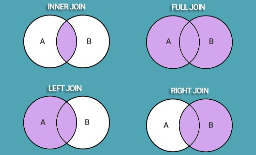

---
<h2>* Вопросы по SQL. Cross-join? Inner join и Outer left join. </h2>

---
<h2>* 4 основных типы соединения в SQL </h2>
Соединение таблиц может быть внутренним (INNER) или внешним (OUTER), причём внешнее соединение может быть левым (LEFT), правым (RIGHT) или полным (FULL).

INNER JOIN — получение записей с одинаковыми значениями в обеих таблицах, т.е. получение пересечения таблиц. 
FULL OUTER JOIN — объединяет записи из обеих таблиц (если условие объединения равно true) и дополняет их всеми записями из обеих таблиц, которые не имеют совпадений. Для записей, которые не имеют совпадений из другой таблицы, недостающее поле будет иметь значение NULL. 
LEFT JOIN — возвращает все записи, удовлетворяющие условию объединения, плюс все оставшиеся записи из внешней (левой) таблицы, которые не удовлетворяют условию объединения. 
RIGHT JOIN — работает точно так же, как и левое объединение, только в качестве внешней таблицы будет использоваться правая. 

NATURAL JOIN - соединение таблиц по столбцам с одинаковыми названиями.  
CROSS JOIN - оператор перекресного соединения, или декартово произведение. 
Аналогичен команде:

      SELECT name_author, name_genre
      FROM author, genre;

---
<h2>* Примеры как создавать Таблицу. CREATE Command. </h2>
* Через обычный CREATE:  

      CREATE TABLE example_table (
         example_id PRIMARY KEY AUTO_INCREMENT, 
         title VARCHAR(30), 
         amount INT, 
         price DECIMAL(8,2)
      ); 
 

* Через CREATE AS SELECT:  

      CREATE TABLE ordering AS
      SELECT author, title, 5 AS amount FROM book 
      WHERE amount < 4; 

---
<h2>* Обновление данных в таблицы. UPDATE Command.</h2>

Пример команды: 

        UPDATE book b
        SET b=amount=b.amount+1, b.price=b.price*1.1
        WHERE b.price<500; 

---
<h2>* Foreign Key. Действия при удалении записи главной таблицы</h2>
C помощью выражения <b>ON DELETE</b> можно установить действия, которые выполняются для записей подчиненной таблицы при удалении связанной строки из главной таблицы. 
 

* CASCADE: автоматически удаляет строки из зависимой таблицы при удалении  связанных строк в главной таблице.
* SET NULL: при удалении  связанной строки из главной таблицы устанавливает для столбца внешнего ключа значение NULL. (В этом случае столбец внешнего ключа должен поддерживать установку NULL).
* SET DEFAULT похоже на SET NULL за тем исключением, что значение  внешнего ключа устанавливается не в NULL, а в значение по умолчанию для данного столбца.
* RESTRICT: отклоняет удаление строк в главной таблице при наличии связанных строк в зависимой таблице.

---
<h2>* Для чего нужен оператор UNION? </h2>
Он используется для объединения полученных данных из двух или более запросов, которые должны иметь одинаковое количество столбцов с одинаковыми типами данных и расположенных в том же порядке.

Пример использования:

<i> SELECT column(s) FROM first_table
UNION
SELECT column(s) FROM second_table;</i>

<h5> Разница между UNION и UNION ALL</h5>
UNION удаляет повторяющиеся записи (где все столбцы в результатах одинаковы), UNION ALL - не удаляет.
При использовании UNION вместо UNION ALL наблюдается снижение производительности , поскольку сервер баз данных должен выполнять дополнительную работу по удалению дубликатов строк, но обычно дубликаты не нужны (особенно при разработке отчетов). 
* UNION выполняет функцию DISTINCT в результирующем наборе, устраняя все повторяющиеся строки. 
* Объединение всех не удаляет дубликатов, а это поэтому быстрее чем UNION.

---
<h2>* Операция Intersect. Отличие от Union</h2>
Операция Intersect возвращает уникальные строки, выводимые левым и правым входными запросами. 
 
Основные правила объединения результирующих наборов двух запросов таковы:
* Количество и порядок столбцов должны быть одинаковыми во всех запросах;
* Типы данных должны быть совместимыми. 
  
Intersect, как и Union объединяет 2 таблицы (Query1 и Query2). 
Только отличие в том, что если Query1 возвращает колонки A,B и Query2 возвращает колонки B,C, то UNION соединяет все колонки и вовращает A,B,C. INTERSECT возвращает только колонку B. 
  
---
<h2>* Операция EXCEPT</h2>
Оператор EXCEPT возвращает уникальные строки из левого входного запроса, которые не выводятся правым входным запросом.

---
<h2>* Что такое нормализация и денормализация данных? </h2>
Нормализация отношений в SQL призвана организовать информацию в базе данных таким образом, чтобы она не занимала много места и с ней было удобно работать. Это удаление избыточных данных, устранение дублей, идентификация наборов связанных данных через PRIMARY KEY, etc.

---
<h2>* Объясните разницу между командами DELETE и TRUNCATE ?</h2>
Команда DELETE — это DML-операция, которая удаляет записи из таблицы, соответствующие заданному условию: 

<table>
<caption>Таблица Delete vs Truncate</caption>
    <tr>
    <th>DELETE</th>
    <th>TRUNCATE</th>
    </tr>
    <tr><td>Используется для удаления строки в таблице</td><td>Используется для удаления всех строк из таблицы</td></tr>
    <tr><td>Вы можете восстановить данные после удаления</td><td>Вы не можете восстановить данные (прим. перевод.: операции логируются по разному, но в SQL Server есть возможность сделать откат) транзакции)</td></tr>
    <tr><td>DML-команда</td><td>DDL-команда</td></tr>
    <tr><td>Медленнее, чем оператор TRUNCATE</td><td>Быстрее</td></tr>
</table>

<i>DELETE FROM table_name WHERE condition;</i>
При этом создаются логи удаления, то есть операцию можно отменить.

А вот команда TRUNCATE — это DDL-операция, которая полностью пересоздаёт таблицу, и отменить такое удаление невозможно:

<i>TRUNCATE TABLE table_name;</i>

---
<h2>* Как найти дубли в поле email? </h2>

<i>SELECT email, COUNT(email) 
FROM customers 
GROUP BY email 
HAVING COUNT(email) > 1; </i>

Функция COUNT() возвращает количество строк из поля email. Оператор HAVING работает почти так же, как и WHERE, вот только применяется не для всех столбцов, а для набора, созданного оператором GROUP BY.

---
<h2>* Замените в таблице зарплату работника на 1000, если она равна 900, и на 1500 в остальных случаях</h2>

Замена значений — одна из наиболее часто встречаемых задач по SQL на собеседованиях. Решить её несложно:

<i>
UPDATE table SET salary =  
CASE 
WHEN salary = 900 THEN 1000 
ELSE 1500 
END; 
</i>

Оператор UPDATE используется для изменения существующих записей. Но ответы на подобные вопросы с собеседований по SQL должны быть более развёрнутыми. Уточните,что после UPDATE следует указать, какие записи должны быть обновлены. В противном случае обновятся все записи в таблице.

В нашем примере условие задаётся через оператор CASE: если текущая зарплата равна 900, изменяем её на 1000, в остальных случаях — на 1500.

---
<h2>* Переименуйте таблицу</h2>
<i>ALTER TABLE first_table RENAME second_table;</i>

С помощью оператора ALTER TABLE можно добавлять, удалять, изменять столбцы, а также изменять название таблицы.

---
<h2>* Из каких подмножеств состоит SQL?</h2>

1) DDL (Data Definition Language, язык описания данных) — позволяет выполнять различные операции с базой данных, такие как CREATE (создание), ALTER (изменение) и DROP (удаление объектов).

2) DML (Data Manipulation Language, язык управления данными) — позволяет получать доступ к данным и манипулировать ими, например, вставлять, обновлять, удалять и извлекать данные из базы данных.

3) DCL (Data Control Language, язык контролирования данных) — позволяет контролировать доступ к базе данных. Пример — GRANT (предоставить права), REVOKE (отозвать права).

---
<h2>* DCL - Data Control Language</h2>
Команды: 
* GRANT (дать разрешение);  
* REVOKE (отзывать разрешение);  
* DENY; (задаем запрет, имеет приоритет над GRANT) 

 
* Grant - предоставляет пользователю или группе разрешения на определенные операции с объектом. 
Пример команды: 

      GRANT SELECT, INSERT, UPDATE, DELETE ON Goods TO TestUser; 

Пример как дать разрешение на запуск процедуры. 

      GRANT EXECUTE ON TestProcedure TO TestUser; 
 
* Revoke - отзывает выданные разрешения. 
Примеры:

      --Отменяем разрешение на удаление данных
      REVOKE DELETE ON Goods To TestUser; 
      

      --Отменяем разрешение на запуск процедуры
      REVOKE EXECUTE ON TestProcedure TO TestUser;

 
* DENY - задает запрет, имеющий приоритет над разрешением. 
 

С помощью DENY мы явно запрещаем выполнение определенных действий даже в том случае, если пользователь состоит в группе или роли, которая имеет разрешение на выполнение этих действий. Таким образом, мы предотвращаем наследование разрешения участником через его членство в группе или роли.
DENY имеет приоритет над всеми разрешениями, но не применяется к владельцам объектов или членам с предопределенной ролью сервера sysadmin, так как им не может быть отказано в разрешениях.

Пример:
DENY EXECUTE ON TestProcedure To TestUser; 

---
<h2>* Транзакции. Виды команд и что значат</h2>
Это последовательность операций, выполняемых в логическом порядке пользователем, либо программой, которая работает с БД. 
Основные концепции транзакции описываются аббревиатурой ACID. 

Для управления транзакциями существуют следующие команды: 
* COMMIT (Сохранение изменений)  
* ROLLBACK (Отмена изменений)  
* SAVEPOINT (создание точки к которой группа транзакций может откатиться)  
* SET TRANSACTION (размещение имени транзакции)  

---
<h2>* Уровни изоляции транзакций. Что такое грязное чтение, что такое фантомное чтение?</h2>

---
<h2>* В чем разница между типом данных CHAR и VARCHAR в SQL?</h2>

И Char, и Varchar служат символьными типами данных, но varchar используется для строк символов переменной длины, тогда как Char используется для строк фиксированной длины. Например, char(10) может хранить только 10 символов и не сможет хранить строку любой другой длины, тогда как varchar(10) может хранить строку любой длины до 10, т.е. например 6, 8 или 2.

---
<h2>* Оконные функции</h2>
Это функции, которые позволяют осуществлять вычисления в заданном диапазоне строк внутри предложения Select.

Синтаксис:

Оконная функция (столбец для вычислений) OVER ([PARTITION BY столбец для группировки] [ORDER BY столбец для сортировки] [ROWS или RANGE выражение для ограничения строк в пределах группы])
sum(amount) - пример оконной функции, partition by id (оконная функции по id). 

---
<h2>* Хранимые процедуры (Stored procedures)</h2>
Это функции которые лежат в БД и могут вызваны разными запросами несколько раз. 

Синтаксис:

CREATE [OR REPLACE] FUNCTION function_name (arguments) 
RETURNS return_datatype AS $variable_name$
   DECLARE
      declaration;
      [...]
   BEGIN
      < function_body >
      [...]
      RETURN { variable_name | value }
   END; LANGUAGE plpgsql;

[OR REPLACE] - модификация существующего метода,

---
<h2>* Функции Row_number(), Partition, Lag</h2>
Row_number - указывает номер строки, 
Partition - для расчета агрегата по определенной колонке, 
Lag - функция лага, для получения доступа к предыдущей строке.   

---
<h2>* Self join</h2>
Объединение таблицы саму на себя. 
Например есть таблица с id работников + id менеджера. 
В случае есть мы хотим получить результат и чтобы там отображалось имя и фамилия менеджера работника необходимо объединить одну и ту же таблицу. 

Пример запроса: 
SELECT emp.employee_id, emp.first_name, emp.last_name, emp.manager_id,
    mgr.first_name, mgr.last_name  
FROM employee emp  
LEFT JOIN ON employee mgr ON emp.manager_id=mgr.employee_id;  

---
<h2>* FOREIGN KEY</h2>
Внешний ключ или FOREIGN KEY также является атрибутом ограничения и обеспечивает связь двух таблиц. По сути, это поле или несколько полей, которые ссылаются на PRIMARY KEY в родительской таблице. 

Пример: 
   
      CREATE TABLE order (
      order_id INT NOT NULL,
      user_id INT,
      PRIMARY KEY (order_id),
      FOREIGN KEY (user_id) REFERENCES users(id)
      );

---
<h2>* NoSQL базы данных</h2>
Преимущества NOSQL баз данных: 
* Гибкость (NoSQl предлагают гибкие схемы, что позволяет осуществлять разработку быстрее и обеспечивать возможность поэтапной реализации).
* Масштабируемость (Рассчитаны на масштабирование с использование распределенных кластеров аппаратного обеспечения)
* Высокая производительность
* Широкие функциональные возможности (Предоставляют API и типы данных с широкой функциональность)
 
  
Типы баз данных NOSQL:
* БД на основе пар "ключ-значение". Пример: Amazon DynamoDB; 
* Документ в формате, подобной на JSON. Пример: MongoDB; 
* Графовые БД. Они упрощают разработку и запуск приложений, работающих с наборами сложносвязанных данных. Типичные примеры использования - соц. сети, сервисы рекомендаций, системы выявления мошенничества и графы знаний. Пример: Amazon Neptune. 
* БД в памяти. Примеры: Amazon ElastiCache.
* Поисковые БД. Примеры: Amazon Elasticsearch. 

---
<h2>* Индексы в SQL. Зачем и где используются?</h2>

Ссылки: 
<a href="https://ru.wikipedia.org/wiki/%D0%98%D0%BD%D0%B4%D0%B5%D0%BA%D1%81_(%D0%B1%D0%B0%D0%B7%D1%8B_%D0%B4%D0%B0%D0%BD%D0%BD%D1%8B%D1%85)">1) Вики</a> 
<a href="https://postgrespro.ru/docs/postgresql/10/indexes-intro">2) Ссылка 2</a> 
<a href="http://postgresguide.com/performance/indexes.html"><a>3) Ссылка 3</a> 
<a href="https://postgrespro.ru/docs/postgresql/9.6/indexes.html">4) Postgres docs</a>

Индексы позволяют достигать большой скорости производительности SQL запросов.  
Индекс ускоряет процесс запроса, предоставляя быстрый доступ к строкам данных в таблице, аналогично тому, как указатель в книге помогает вам быстро найти необходимую информацию. 
 
Индекс состоит из набора страниц, узлов индекса, которые организованы в виде древовидной структуры - сбалансированного дерева. 
 

<b>Преимущество индексов:</b> 
* Индексы сокращают время поиска в абсолютном выражении. 
* Индексы уменьшают алгоритмическую сложность процесса поиска. 

# TODO (нужно детальнее разобрать виды индексов, особенности, когда используются)

<b>Типы индексов</b>:
* Уникальный индекс (Unique index):
* Составной индекс; (состоящий из нескольких колонок). 
* Функциональный индекс (индекс по выражению) - индексация по результатам вычислений. 
* Кластеризованный индекс;
* Некластеризованный индекс;

ПРИМЕР создания индекса: 

    CREATE INDEX idx_salary ON employees(salary);

или составной индекс:

    CREATE INDEX idx_salary ON employees(last_name, salary);

---
<h2>* Использование в запросе нескольких источников записей</h2>
<a href="http://www.sql-tutorial.ru/ru/book_using_multiple_tables_in_query.html">Ссылка</a>

---
<h2>* ACID в базе данных?</h2>

* https://en.wikipedia.org/wiki/ACID

<b>ACID - атомарность Atomicity, согласованность (Consistency), изолированность (Isolation), долговечность (Durability).</b> 

<b>Атомарность</b> - Транзакции состоят из множества последовательности запросов. Атомарность же гарантирует, что транзакция представляет из себя единый запрос/unit. 
То есть транзакция будет либо полностью выполнена или потерпит неудачу.
Это означает, что при сбое одной части любой транзакции, состояние базы данных остается неизменным.
 

<b>Согласованность</b> - Гарантирует, что данные должны соответствовать всем правилам валидации. 
Проще говоря, вы можете сказать, что ваша транзакция никогда не оставит вашу базу данных в недопустимом состоянии. 
Согласованность гарантирует что база данных будет переходит из одного валидного состояния в другое. 

<b>Изолированность</b> - Основной целью изолированности является контроль механизма параллельного изменения данных. 
Как известно транзакции могут происходить в несколько параллельных потоков (то есть множественное чтение и запись данных). 
Изоляция гарантирует, что параллельная обработка транзакций будет аналогична их последовательной обработке.  
 

<b>Долговечность</b> - Долговечность подразумевает, что если транзакция была подтверждена (COMMIT), произошедшие в рамках транзакции изменения сохранятся независимо от того, что может встать у них на пути (например, потеря питания, сбой или ошибки любого рода).
То есть завершенные транзакции никуда не пропадают (даже при отключении электричества), они сохраняются в долговременную память (non-volatile memory). 

# View, Stored View, Stored Procedure. Отличия, примеры, когда использовать
# TODO

---
<h2>* Виды в SQL. Views.</h2>
Вид(View) - это SQL запрос, который хранится в базе данных с определенным именем. Это таблица, которая хранится в форме предопределенного SQL запроса. 
 
Для создания Вида используется команда CREATE VIEW. 
 
      
      CREATE VIEW имя_вида AS
      SELECT колонка1, колонка2.....
      FROM имя_таблицы
      WHERE [условие];

Чтобы вызвать Вид нужно выполнить следующую команду:
 

      SELECT * FROM ViewName;

<h2>* Materialized Views</h2>
Материализованные Виды.  
Это физический объект данных, содержащий результат выполнения запроса. В материализованном представлении уже заранее хранятся вычисленные результаты запроса. 
Поэтому запрос выполняется намного быстрее. 
 
Однако недостатком является то, что данные, которые вы получаете от материализованного view, являются только такими же актуальными, как и в последний раз, когда материализованный view был обновлен. 
Материализованные представления чаще всего используются в приложениях хранилища данных/бизнес-аналитики, где запрос больших таблиц фактов с тысячами миллионов строк приведет к увеличению времени ответа на запрос, что приведет к непригодности приложения. 

---
<h2>Типы данных для полей.</h2>

* INTEGER (INT) - Целое число, могут принимать значения от -2 147 483 648 до 2 147 483 647  
* DECIMAL (NUMERIC) - Вещественное число,  
* VARCHAR - строка длиной не более 255 символов. В скобках указывается максимальная длина строки. 
* DATE - Дата в формате YYYY-MM-DD.  
* DATETIME - Дата в формате YYYY-MM-DD HH:MM:SS  
* TIMESTAMP - TIMESTAMP has a range of 1970-01-01 00:00:01 UTC to 2038-01-19 03:14:07 UTC.  
* TIME - HH:MM:SS format; 

---
<h2>Вложенный запрос, операторы ANY, ALL</h2>
Операторы ANY и ALL используются в SQL для сравнения некоторого значения с результирующим набором вложенного запроса. 

При использовании оператора ANY в результирующую таблицу будут включены все записи, для которых  выражение со знаком отношения верно хотя бы для одного элемента результирующего запроса. Как работает оператор ANY():

Примеры: 
* amount > ANY(10,12) эквивалентно amount>10; 
* amount < ANY(10,12) эквивалентно amount<12; 

При использовании оператора ALL в результирующую таблицу будут включены все записи, для которых  выражение со знаком отношения верно для всех элементов результирующего запроса. Как работает оператор ALL:
* amount > ALL (10, 12) эквивалентно amount > 12  
* amount < ALL (10, 12) эквивалентно amount < 10

<b>Важно! Операторы ALL и ANY можно использовать только с вложенными запросами. </b>

---
<h2>* Query ordering of execution</h2>
Очень важно знать последовательность Команд используемых в SQL запросах  

Последовательность:
* FROM and JOIN
* WHERE
* GROUP BY
* HAVING
* SELECT
* DISTINCT
* ORDER BY
* LIMIT / OFFSET

---
<h2>* Интересные встроенные функции для Дат.</h2>
* DATEDIFF(дата_1, дата_2) - кол-во дней между дата_1 и дата_2;
* MONTH(дата) - получить месяц даты. 
* DAY(дата) - получить день даты. 
* YEAR(дата) - получить год даты. 
* MONTHNAME(дата) - получить название месяца на английском языке. 

---
<h2>* Оптимизация запросов. </h2>

<a href="https://habr.com/ru/post/203320/">1) Ссылка 1</a> 
<a href="https://habr.com/ru/post/203386/">2) Ссылка 2</a> 
<a href="https://habr.com/ru/post/203484/">3) Ссылка 3</a> 

---
<h2>* SEQUENCE В SQL </h2>
SEQUENCE - это объект последовательность, которая генерирует числовые значения в определенной последовательности в соответствии с заданной спецификацией. 

Синтаксис SEQUENCE
        
        CREATE SEQUENCE [schema_name].[sequence_name]
        [ AS [data type] ]
        [ START WITH < value > ]
        [ INCREMENT BY < value > ]
        [ MINVALUE [ < value > ] | NO MINVALUE ]
        [ MAXVALUE [ < value > ] | NO MAXVALUE ]
        [ CYCLE | NO CYCLE ]
        [ CACHE [ < value >] | NO CACHE ];

Примеры создания Sequence:  

* Создание Sequence c начальным значением 10 и увеличением на 5ж 

        CREATE SEQUENCE TestSequence
        START WITH 10
        INCREMENT BY 5;

* Создание SEQUENCE с заданным типом данных

        CREATE SEQUENCE TestSequence
        AS TINYINT
        START WITH 1
        INCREMENT BY 1;

Псевдостолбы NEXTVAL и CURRVAL:  
* NEXTVAL возвращает следующее доступное значение последовательности. Оно возвращает уникальное значение каждый раз, когда на него ссылаются, даже для различных пользователей.
* CURRVAL получает текущее значение последовательности.

---
<h2>* Что такое SQL Injection. Особенности, как поботься. </h2>

# TODO
